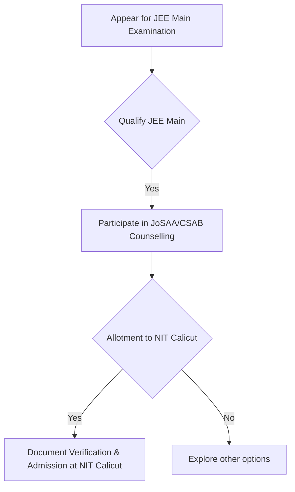
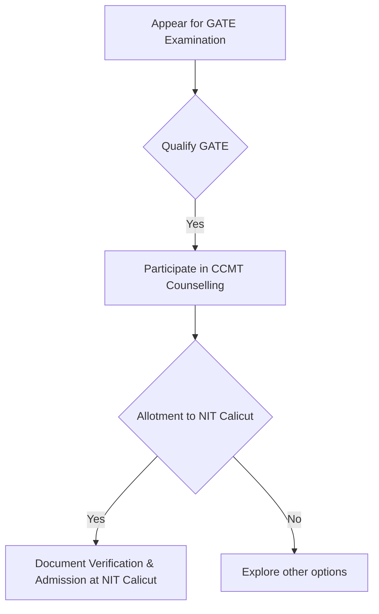
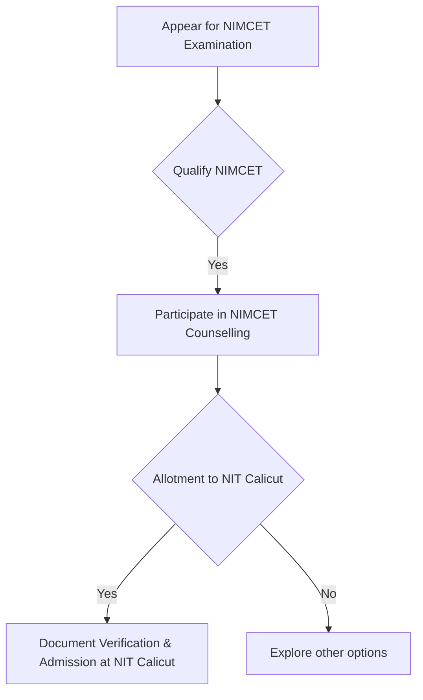
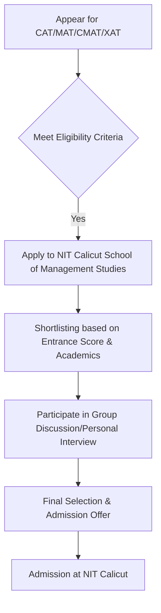

# Academic Programs at NIT Calicut

## Overview

National Institute of Technology Calicut (NIT Calicut), formerly known as Calicut Regional Engineering College (CREC), offers a comprehensive range of academic programs at the undergraduate, postgraduate, and doctoral levels. These programs are designed to provide education and training in various fields of engineering, technology, architecture, management, and sciences, aligning with the institute's mandate as an Institute of National Importance. The curriculum typically integrates theoretical knowledge with practical application, research, and project work.

## Details

NIT Calicut provides academic programs through its various departments and schools. The primary programs offered include:

*   **Undergraduate Programs (B.Tech and B.Arch):**
    *   **Bachelor of Technology (B.Tech):** Offered in multiple engineering disciplines. The curriculum is structured to provide a strong foundation in engineering principles, specialized knowledge in the chosen discipline, and opportunities for interdisciplinary learning.
    *   **Bachelor of Architecture (B.Arch):** A five-year program focusing on architectural design, history, theory, and technology.

*   **Postgraduate Programs (M.Tech, MBA, MCA, M.Plan):**
    *   **Master of Technology (M.Tech):** Offered in various specializations across engineering departments. These programs typically involve advanced coursework, laboratory work, and a research-oriented thesis or project.
    *   **Master of Business Administration (MBA):** Offered through the School of Management Studies, focusing on management principles, business analytics, and leadership skills.
    *   **Master of Computer Applications (MCA):** A postgraduate program designed to provide advanced knowledge and skills in computer science and applications.
    *   **Master of Planning (M.Plan):** Offered in specific planning specializations, typically through the Department of Architecture and Planning.

*   **Doctoral Programs (Ph.D.):**
    *   **Doctor of Philosophy (Ph.D.):** Research programs are available across all departments and schools, allowing candidates to pursue advanced research in their chosen fields under the guidance of faculty supervisors. These programs culminate in the submission and defense of a doctoral thesis.

The specific disciplines and specializations offered under these programs may vary and are updated periodically by the institute.

## History

The academic programs at NIT Calicut have evolved significantly since its establishment as Calicut Regional Engineering College (CREC) in 1961. Initially, CREC offered undergraduate programs in core engineering disciplines. Following its upgrade to a National Institute of Technology (NIT) in 2002, the institute gained greater autonomy and expanded its academic offerings. This transition led to the introduction of new undergraduate and postgraduate programs, an increase in research activities, and the establishment of new departments and centers. The curriculum has been regularly updated to meet contemporary industry demands and advancements in science and technology.

## Facilities

Academic programs at NIT Calicut are supported by various facilities designed to enhance learning, research, and practical experience. These generally include:

*   **Departmental Laboratories:** Each engineering and science department maintains specialized laboratories equipped for practical training, experimentation, and research relevant to their respective disciplines.
*   **Central Library:** A comprehensive collection of books, journals, e-resources, and other learning materials supporting all academic programs.
*   **Computer Centers:** General-purpose computing facilities accessible to students for academic work, programming, and software applications.
*   **Research Facilities:** Dedicated research centers and advanced instrumentation facilities are available to support postgraduate and doctoral research activities.
*   **Lecture Halls and Seminar Rooms:** Equipped with audio-visual aids for teaching and presentations.

Specific details regarding the exact number, capacity, or specialized equipment within each facility are typically available in departmental brochures or on the institute's official website.

## Procedures

Admission to academic programs at NIT Calicut follows established national-level entrance examinations and counseling processes. The general procedures are outlined below:

### Undergraduate Admission (B.Tech/B.Arch)



### Postgraduate Admission (M.Tech)



### Postgraduate Admission (MCA)



### Postgraduate Admission (MBA)



### Doctoral Admission (Ph.D.)

```mermaid
graph TD
    A[Check Departmental Eligibility Criteria] --> B[Submit Online Application to NIT Calicut];
    B --> C[Application Scrutiny & Shortlisting];
    C --> D[Appear for Written Test (if applicable)];
    D --> E[Participate in Interview/Presentation];
    E --> F[Final Selection & Admission Offer];
    F --> G[Admission at NIT Calicut];
```

Specific eligibility criteria, application deadlines, and detailed admission guidelines are published annually on the official NIT Calicut website and through respective counseling authorities.

## References

Information regarding academic programs at NIT Calicut is primarily sourced from:

*   The official website of NIT Calicut (www.nitc.ac.in)
*   Official admission brochures and information bulletins released by NIT Calicut
*   Joint Seat Allocation Authority (JoSAA) and Centralized Counselling for M.Tech/M.Arch/M.Plan/M.Des (CCMT) websites
*   National Institute of Technology Master of Computer Applications Common Entrance Test (NIMCET) website
*   Publicly available academic regulations and curriculum documents of NIT Calicut

## Related Articles
- [Academics at NIT Calicut](academics.md)
- [Departments of NIT Calicut](departments.md)
- [Curriculum and Syllabus at NIT Calicut](curriculum_and_syllabus.md)
