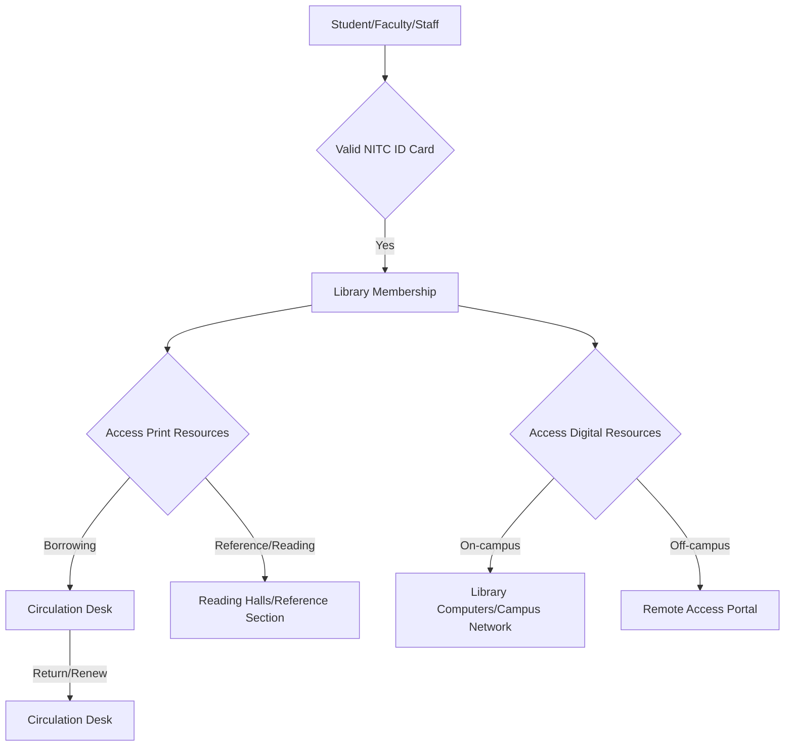
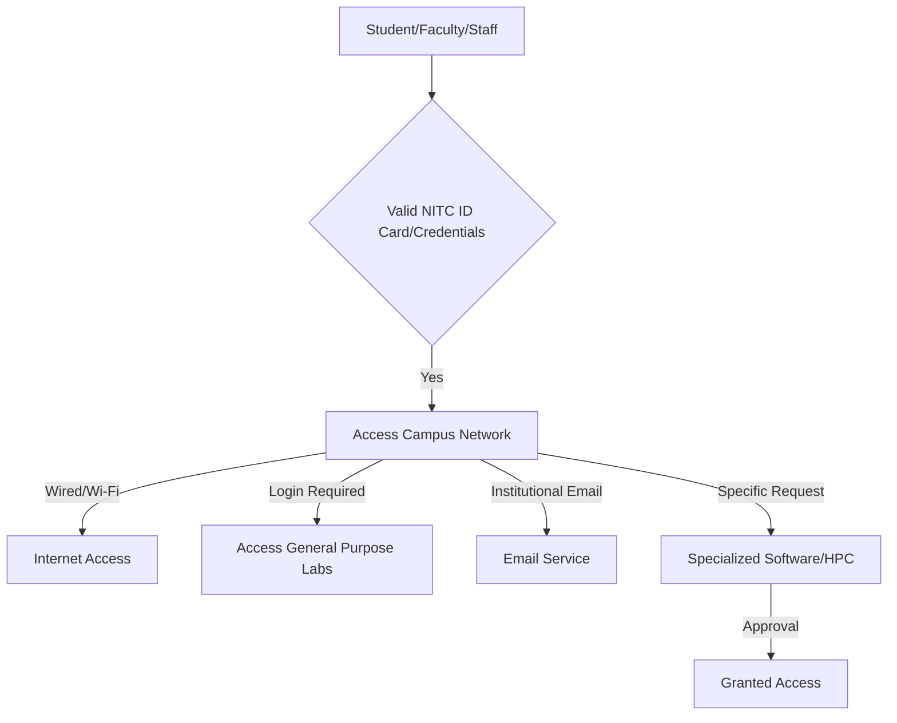
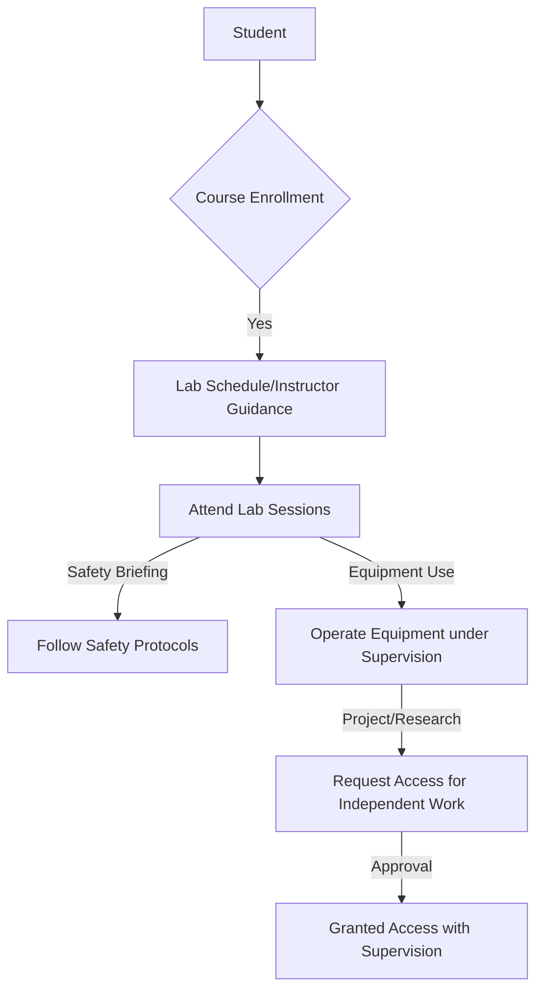

# Academic Resources at NIT Calicut

## Overview

National Institute of Technology Calicut (NITC) provides a range of academic resources designed to support the teaching, learning, and research activities of its students and faculty. These resources encompass physical infrastructure, digital platforms, and specialized facilities across various disciplines, aiming to foster an environment conducive to academic excellence and innovation.

## Details

### Central Library

The Central Library at NIT Calicut serves as a primary academic resource, offering a comprehensive collection of learning materials and services.

*   **Collection:** The library houses a vast collection of print resources, including textbooks, reference books, journals, theses, and project reports. It also provides access to a wide array of digital resources, such as e-journals, e-books, online databases (e.g., IEEE Xplore, ACM Digital Library, SpringerLink, ScienceDirect), and NPTEL video lectures.
*   **Services:** Key services include circulation (borrowing and returning of books), reference services, inter-library loan facilities, digital library access, reprography, and access to institutional repositories.
*   **Accessibility:** The library aims to provide access to its resources for all registered students, faculty, and staff of NIT Calicut.

### Computer Centre

The Computer Centre at NIT Calicut is responsible for managing and maintaining the institute's central computing and network infrastructure.

*   **Network Infrastructure:** It provides campus-wide internet connectivity, Wi-Fi services, and manages the institute's local area network (LAN).
*   **Computing Facilities:** The centre operates general-purpose computer labs equipped with various software applications for academic use. It also manages central servers for email, web hosting, and other institutional services.
*   **Specialized Resources:** The Computer Centre may provide access to specialized software licenses and high-performance computing (HPC) facilities, depending on availability and specific academic requirements.

### Departmental Laboratories

Each academic department at NIT Calicut maintains specialized laboratories equipped with instruments, machinery, and software relevant to its respective engineering discipline or field of study.

*   **Purpose:** These laboratories are integral to the curriculum, providing students with hands-on experience, practical training, and facilities for conducting experiments, projects, and research work.
*   **Variety:** The specific labs vary by department (e.g., Civil Engineering labs, Electrical Engineering labs, Mechanical Engineering workshops, Computer Science programming labs, Chemical Engineering process labs, Electronics & Communication labs, Architecture studios).

### Online Learning Platforms

NIT Calicut utilizes online platforms to supplement traditional classroom instruction and facilitate remote learning.

*   **Learning Management System (LMS):** The institute employs a Learning Management System (LMS), such as Moodle, to host course materials, assignments, quizzes, and facilitate communication between instructors and students.
*   **Other Platforms:** Access to other online educational resources and platforms may be provided or recommended by individual departments or faculty members.

### Research Facilities

Beyond departmental labs, NIT Calicut may host central research facilities or specialized centers equipped with advanced instrumentation to support interdisciplinary research activities.

*   **Availability:** Specific details regarding central research facilities (e.g., Central Instrumentation Facility) are subject to institutional development and public disclosure. Information on such facilities, if available, would typically be found on the institute's research or facilities pages.

## History

### Central Library History

*   **Foundation:** The foundation stone for the Central Library building was laid in 1961.
*   **New Building:** A new, dedicated library building was inaugurated in 2007, significantly expanding its capacity and modernizing its facilities.

### Computer Centre History

*   Specific historical dates regarding the establishment or major upgrades of the Computer Centre are not readily available in public sources. Its development has generally paralleled the growth of computing infrastructure within the institute.

## Facilities

### Central Library Facilities

*   **Reading Halls:** Multiple reading halls, including a dedicated reference section and a separate postgraduate/research scholar reading area.
*   **Digital Library Section:** Equipped with computer terminals for accessing e-resources.
*   **Discussion Rooms:** Spaces for collaborative study and group discussions.
*   **Reprography Section:** Services for photocopying and printing.

### Computer Centre Facilities

*   **General Purpose Computer Labs:** Multiple labs accessible to students, equipped with desktop computers and standard software.
*   **Server Rooms:** Housing the institute's central servers and network equipment.
*   **Network Infrastructure:** Extensive wired and wireless network coverage across the campus.

### Departmental Laboratory Facilities

*   **Specialized Equipment:** Each lab contains equipment specific to its discipline (e.g., universal testing machines, oscilloscopes, CNC machines, chemical reactors, high-performance workstations).
*   **Software:** Access to industry-standard and specialized software packages relevant to the respective fields.

## Procedures

### Central Library Procedures

The general procedure for accessing and utilizing Central Library resources typically involves:

*   **Membership:** All registered students, faculty, and staff are eligible for library membership upon presenting a valid NITC ID card.
*   **Borrowing:** Books can be borrowed for a specified period, subject to institutional policies on loan limits and duration. Overdue items may incur fines.
*   **Digital Access:** E-resources are accessible from within the campus network. Remote access to subscribed e-resources is typically provided through a proxy server or VPN service, requiring institutional login credentials.

### Computer Centre Procedures

Access to Computer Centre facilities and network services generally follows these steps:

*   **Network Access:** Students can connect to the campus Wi-Fi or wired network using their institutional login credentials.
*   **Computer Labs:** General-purpose computer labs are typically accessible during specified hours, often requiring login with institutional credentials.
*   **Specialized Resources:** Access to specialized software or high-performance computing facilities may require specific permissions or project-based requests, often managed by the Computer Centre or relevant departments.

### Departmental Laboratory Procedures

Procedures for using departmental laboratories vary by department and specific lab, but generally involve:

*   **Course-Integrated Labs:** Students access labs as part of their scheduled coursework, guided by faculty and lab technicians.
*   **Safety:** Adherence to safety protocols and guidelines is mandatory in all laboratories.
*   **Independent Work:** For projects or research, students typically need to obtain permission from the concerned faculty member or Head of Department to access labs outside of scheduled hours.

## References

*   National Institute of Technology Calicut Official Website: `nitc.ac.in`
*   NIT Calicut Central Library: `library.nitc.ac.in`
*   NIT Calicut Computer Centre: `cc.nitc.ac.in`
*   NIT Calicut Moodle: `moodle.nitc.ac.in`

## Related Articles
- [Academics at NIT Calicut](academics.md)
- [Departments of NIT Calicut](departments.md)
- [Academic Programs at NIT Calicut](academic_programs.md)
