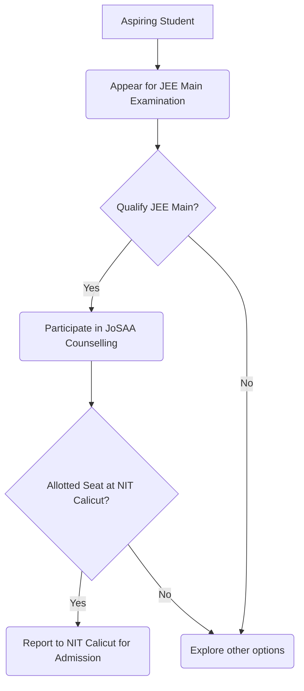
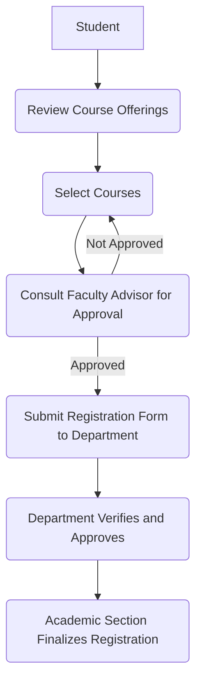

# Academics at NIT Calicut

## Overview

The National Institute of Technology Calicut (NIT Calicut), formerly known as Calicut Regional Engineering College (CREC), is an autonomous institution under the Ministry of Education, Government of India. It functions as an Institute of National Importance and offers a comprehensive range of academic programs in engineering, technology, science, and management.

The academic structure at NIT Calicut is designed to provide education and research opportunities at various levels:
*   **Undergraduate (UG) Programs:** Primarily Bachelor of Technology (B.Tech) degrees in various engineering disciplines.
*   **Postgraduate (PG) Programs:** Including Master of Technology (M.Tech), Master of Business Administration (MBA), Master of Computer Applications (MCA), and Master of Planning (M.Plan).
*   **Doctoral (Ph.D.) Programs:** Research-oriented degrees across all departments.

The institute operates on a credit-based, semester system, emphasizing continuous evaluation and a blend of theoretical knowledge and practical application. Academic activities are managed by various departments, each specializing in a particular field of study.

## Details

### Academic Programs and Departments

NIT Calicut offers programs through its various academic departments. The specific list of departments and their associated programs can be found on the institute's official website. Generally, these include:
*   Engineering disciplines (e.g., Civil, Computer Science, Electrical, Electronics & Communication, Mechanical, Chemical, Materials Science, Architecture & Planning).
*   Science disciplines (e.g., Physics, Chemistry, Mathematics).
*   Humanities and Management.

### Admission Process

Admission to NIT Calicut's academic programs follows national-level entrance examinations and centralized counseling processes.

#### Undergraduate (B.Tech) Admission

Admission to the B.Tech program is based on the rank secured in the Joint Entrance Examination (JEE) Main. The counseling and seat allocation are conducted by the Joint Seat Allocation Authority (JoSAA).



#### Postgraduate (M.Tech/M.Plan) Admission

Admission to M.Tech and M.Plan programs is primarily based on the Graduate Aptitude Test in Engineering (GATE) scores. The admissions are conducted through the Centralized Counselling for M.Tech/M.Arch/M.Plan/M.Des (CCMT).

#### Postgraduate (MBA) Admission

Admission to the MBA program typically requires a valid score in national-level management entrance examinations such as CAT or CMAT, followed by a centralized counseling process (e.g., CMAS).

#### Postgraduate (MCA) Admission

Admission to the MCA program is based on the National Institute of Technology Master of Computer Applications Common Entrance Test (NIMCET), followed by centralized counseling (CCMN).

#### Doctoral (Ph.D.) Admission

Admission to Ph.D. programs is generally based on an institute-level written test and/or interview, often requiring a valid GATE score or UGC/CSIR NET qualification for certain fellowships. Specific criteria vary by department and are announced annually.

### Curriculum and Evaluation

The academic curriculum is structured around a credit system, where each course is assigned a certain number of credits. Students must accumulate a minimum number of credits to be eligible for degree conferral.

*   **Semester System:** The academic year is divided into two semesters (odd and even), with a summer term sometimes available for specific courses or remedial work.
*   **Course Structure:** Programs typically include core courses, elective courses (departmental and open), laboratory courses, project work, and seminars.
*   **Evaluation:** Student performance is assessed through a continuous evaluation system, which may include quizzes, assignments, mid-semester examinations, and end-semester examinations. Practical courses often involve lab reports and viva-voce examinations.
*   **Grading System:** A letter grading system (e.g., S, A, B, C, D, E, F) is used, with corresponding grade points. Academic performance is typically measured by Semester Grade Point Average (SGPA) and Cumulative Grade Point Average (CGPA).

## History

NIT Calicut has a significant history as one of the earliest Regional Engineering Colleges (RECs) established in India.

*   **1961:** Established as Calicut Regional Engineering College (CREC), a joint venture between the Government of India and the Government of Kerala.
*   **1980s-1990s:** Expanded its academic offerings and infrastructure.
*   **2002:** Upgraded to a National Institute of Technology (NIT) and granted deemed university status, becoming NIT Calicut. This upgrade was part of a national initiative to elevate RECs to Institutes of National Importance.
*   **2007:** Declared an Institute of National Importance under the National Institutes of Technology Act.

This transformation brought increased autonomy in academic matters, curriculum design, and research initiatives, aligning its academic framework with other premier technical institutions in the country.

## Facilities

NIT Calicut provides a range of academic facilities to support teaching, learning, and research activities.

*   **Central Library:** A comprehensive collection of books, journals, periodicals, e-resources, and digital databases to support all academic disciplines. It also provides reading spaces and access to computing facilities.
*   **Departmental Laboratories:** Each academic department is equipped with specialized laboratories relevant to its discipline, facilitating practical training, experimentation, and research.
*   **Central Computer Centre:** Provides high-performance computing resources, internet access, and specialized software to students and faculty.
*   **Lecture Halls and Seminar Rooms:** Equipped with audio-visual aids for effective teaching and presentations.
*   **Research Facilities:** Specialized research centers and advanced instrumentation facilities are available to support doctoral and postgraduate research.
*   **Language Lab:** Facilities for improving communication skills and foreign language learning.

## Procedures

### Course Registration

Students are required to register for courses at the beginning of each semester. This process typically involves selecting courses, obtaining necessary approvals, and completing the registration formalities.



### Examination Procedures

Examinations are conducted throughout the semester and at the end of each semester.

*   **Mid-Semester Examinations:** Conducted typically in the middle of the semester to assess ongoing learning.
*   **End-Semester Examinations:** Comprehensive examinations held at the end of each semester, covering the entire syllabus of a course.
*   **Practical Examinations:** For laboratory courses, these may involve hands-on tests, project demonstrations, and viva-voce.
*   **Grading:** After evaluation, grades are awarded based on a predefined grading scheme, and results are published by the academic section.

### Academic Grievance Redressal

NIT Calicut has a mechanism for students to address academic grievances. While specific committees and procedures may vary, a general hierarchy for addressing concerns typically exists.

```mermaid
graph TD
    A[Student with Grievance] --> B(Approach Course Instructor);
    B -- Unresolved --> C(Approach Head of Department (HoD));
    C -- Unresolved --> D(Approach Dean (Academics));
    D -- Unresolved --> E(Academic Senate / Designated Committee);
```

### Degree Requirements

To be eligible for the award of a degree, students must fulfill specific academic requirements:

*   **Credit Accumulation:** Successfully complete all prescribed core courses and accumulate the minimum required credits for the program.
*   **Minimum CGPA:** Maintain a minimum Cumulative Grade Point Average (CGPA) as specified by the institute's academic regulations.
*   **Project/Thesis Completion:** Successfully complete and defend project work (for UG) or a thesis (for PG/Ph.D.) as per program requirements.
*   **No Dues:** Clear all financial and other dues to the institute.

## References

*   National Institute of Technology Calicut Official Website: [https://www.nitc.ac.in/](https://www.nitc.ac.in/)
*   Joint Seat Allocation Authority (JoSAA) Official Website: [https://josaa.nic.in/](https://josaa.nic.in/)
*   Centralized Counselling for M.Tech/M.Arch/M.Plan/M.Des (CCMT) Official Website: [https://ccmt.nic.in/](https://ccmt.nic.in/)
*   National Institute of Technology Master of Computer Applications Common Entrance Test (NIMCET) Official Website: [https://nimcet.nic.in/](https://nimcet.nic.in/)
*   Centralized Counselling for MBA/MCA/M.Plan (CMAS) Official Website (if applicable, specific to NITs for MBA/MCA): *Information on a single centralized portal for NIT MBA/MCA admissions may vary or be integrated into CCMT/CCMN. Refer to NIT Calicut's specific admission brochure.*

## Related Articles
- [Departments of NIT Calicut](departments.md)
- [Academic Programs at NIT Calicut](academic_programs.md)
- [Curriculum and Syllabus at NIT Calicut](curriculum_and_syllabus.md)
