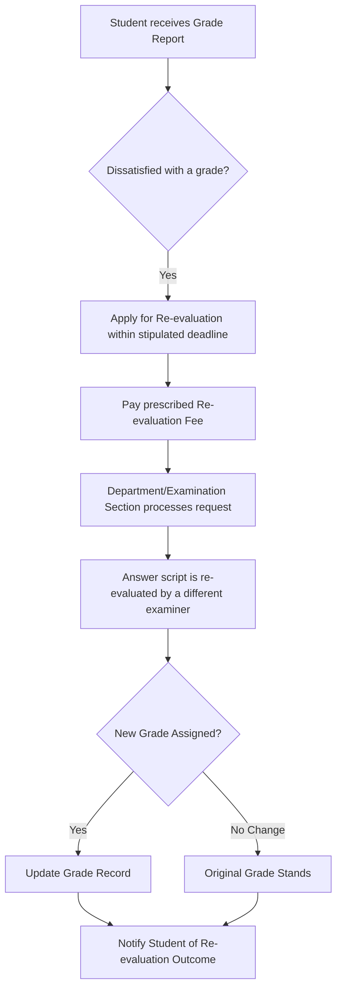

# CGPA and Grading System at NIT Calicut

## Overview

The National Institute of Technology Calicut (NIT Calicut) employs a Credit-Based Grading System for evaluating student performance across its various academic programs, including undergraduate (B.Tech, B.Arch) and postgraduate (M.Tech, MCA, MBA, M.Plan, M.Sc, PhD) courses. This system assigns letter grades to students based on their performance in individual courses, which are then converted into grade points. These grade points are used to calculate the Semester Grade Point Average (SGPA) and the Cumulative Grade Point Average (CGPA), which are the primary indicators of a student's academic standing.

The grading system aims to provide a comprehensive and standardized method for assessing learning outcomes, promoting academic rigor, and facilitating fair evaluation across different disciplines and batches.

## Details

### Grading Scale and Grade Points

NIT Calicut typically uses a 10-point grading scale. The letter grades awarded for each course and their corresponding grade points are generally as follows:

| Letter Grade | Grade Points | Performance Descriptor |
| :----------- | :----------- | :--------------------- |
| S            | 10           | Outstanding            |
| A            | 9            | Excellent              |
| B            | 8            | Very Good              |
| C            | 7            | Good                   |
| D            | 6            | Average                |
| P            | 5            | Pass                   |
| F            | 0            | Fail                   |
| W            | -            | Withdrawal             |
| I            -            | Incomplete             |
| X            | -            | Absent                 |

*   **F (Fail):** A student receiving an 'F' grade in a course must re-register for and pass the course in a subsequent semester or clear it through supplementary examinations, as per specific program regulations.
*   **W (Withdrawal):** Awarded when a student officially withdraws from a course within the stipulated period. It does not affect SGPA/CGPA calculation.
*   **I (Incomplete):** Awarded when a student has not completed all course requirements due to valid reasons approved by the instructor and department. The grade must be converted to a regular grade within a specified timeframe.
*   **X (Absent):** Awarded when a student is absent from the end-semester examination without valid permission.

### Calculation of SGPA and CGPA

The academic performance of a student is measured by the Semester Grade Point Average (SGPA) and the Cumulative Grade Point Average (CGPA).

#### Semester Grade Point Average (SGPA)

The SGPA is a weighted average of the grade points obtained in all courses registered by a student in a particular semester.

**Formula:**
$$ SGPA = \frac{\sum_{i=1}^{n} (C_i \times GP_i)}{\sum_{i=1}^{n} C_i} $$
Where:
*   $C_i$ is the number of credits for the $i^{th}$ course.
*   $GP_i$ is the grade points obtained for the $i^{th}$ course.
*   $n$ is the total number of courses registered in that semester.

#### Cumulative Grade Point Average (CGPA)

The CGPA is a weighted average of the grade points obtained in all courses registered by a student from the first semester up to the current semester.

**Formula:**
$$ CGPA = \frac{\sum_{j=1}^{m} (C_j \times GP_j)}{\sum_{j=1}^{m} C_j} $$
Where:
*   $C_j$ is the number of credits for the $j^{th}$ course across all semesters.
*   $GP_j$ is the grade points obtained for the $j^{th}$ course across all semesters.
*   $m$ is the total number of courses registered up to the current semester.

**Process Flow for Grade Calculation:**

```mermaid
graph TD
    A[Student Performance in Course] --> B{Internal Assessments & End-Semester Exam};
    B --> C[Raw Score];
    C --> D[Conversion to Letter Grade];
    D --> E[Assignment of Grade Points (GP)];
    E --> F{For each course in a semester};
    F --> G[Calculate (Credits * GP) for each course];
    G --> H[Sum (Credits * GP) for all courses in semester];
    G --> I[Sum Credits for all courses in semester];
    H & I --> J[Calculate SGPA = Sum(Credits*GP) / Sum(Credits)];
    J --> K{For all courses across all semesters};
    K --> L[Calculate Cumulative Sum(Credits*GP)];
    K --> M[Calculate Cumulative Sum(Credits)];
    L & M --> N[Calculate CGPA = Cumulative Sum(Credits*GP) / Cumulative Sum(Credits)];
```

### Minimum Academic Requirements

Students are generally required to maintain a minimum SGPA and CGPA to remain in good academic standing and to be eligible for promotion to the next academic year and for the award of their degree. Specific minimum requirements may vary slightly between undergraduate and postgraduate programs, and across different academic regulations published by the institute.

*   **Minimum SGPA for Promotion:** Students typically need to achieve a minimum SGPA (e.g., 5.0 or 6.0) in each semester to be promoted to the next semester without academic probation.
*   **Minimum CGPA for Degree Award:** A minimum CGPA (e.g., 6.0) is generally required for the award of a degree. Students failing to meet this requirement may be given opportunities to improve their CGPA.

## History

Specific historical details regarding the evolution of the grading system at NIT Calicut are not readily available in a consolidated public format. Like many technical institutions in India, NIT Calicut transitioned from a percentage-based marking system to a Credit-Based Grading System, aligning with national educational reforms and the practices of institutions of national importance. This shift aimed to standardize evaluation, provide a more holistic view of student performance, and facilitate academic mobility. The exact dates and phases of these transitions for NIT Calicut specifically are not publicly documented in detail.

## Facilities

The grading system itself does not involve specific physical facilities beyond the general academic infrastructure of the institute.
*   **Academic Departments:** Faculty members within their respective departments are responsible for course delivery, internal assessments, and recommending grades.
*   **Examination Section:** This section manages the conduct of end-semester examinations, processing of results, and generation of grade reports and transcripts.
*   **Computer Centre/IT Services:** Provides the necessary software and infrastructure for managing student data, grade entry, and CGPA/SGPA calculations.
*   **Academic Section:** Oversees the implementation of academic regulations, including those pertaining to grading, and handles student queries related to academic records.

## Procedures

### Re-evaluation and Supplementary Examinations

Students who receive an 'F' grade in a course or wish to improve their grade in certain courses may have options for re-evaluation or supplementary examinations, subject to the institute's academic regulations.

**General Procedure for Re-evaluation (if applicable):**



*   **Re-evaluation:** Typically involves a review of the answer script by another examiner. The outcome can result in an upward revision, downward revision, or no change in the grade.
*   **Supplementary Examinations:** Students failing a course (receiving an 'F' grade) are usually permitted to appear for supplementary examinations in the subsequent semester or during designated periods. Passing a supplementary examination replaces the 'F' grade with a 'P' (Pass) grade, or the actual grade obtained, as per specific regulations, which then impacts the SGPA/CGPA calculation. The maximum grade points awarded for a course cleared through a supplementary examination might be capped (e.g., at 5 or 6 grade points).

### Academic Probation and Discontinuation

Students who consistently fail to meet the minimum SGPA or CGPA requirements may be placed on academic probation. Continued poor academic performance, as defined by the institute's regulations, can lead to warnings, suspension, or even discontinuation from the program. The specific thresholds and procedures for academic probation and discontinuation are detailed in the academic ordinances for each program.

## References

*   National Institute of Technology Calicut - Official Website (www.nitc.ac.in)
*   Academic Ordinances and Regulations for B.Tech/B.Arch Programs (Latest Version, typically available on the Academic Section page of the NITC website)
*   Academic Ordinances and Regulations for M.Tech/M.Sc/MCA/MBA/M.Plan Programs (Latest Version, typically available on the Academic Section page of the NITC website)

*(Note: Specific links to the latest academic regulations documents are subject to change on the official NIT Calicut website. Students are advised to refer to the most current versions published by the Academic Section of NIT Calicut for precise and up-to-date information.)*

## Related Articles
- [Academics at NIT Calicut](academics.md)
- [Departments of NIT Calicut](departments.md)
- [Academic Programs at NIT Calicut](academic_programs.md)
