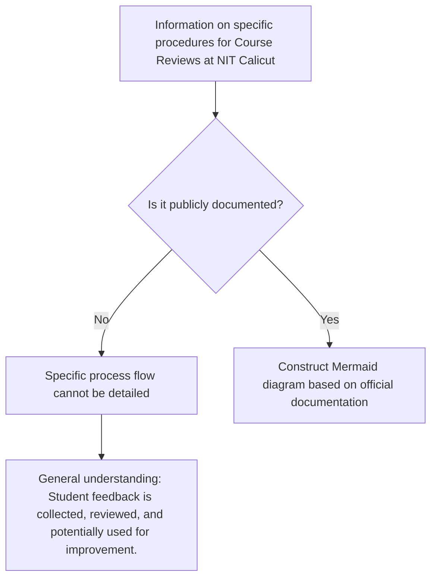

# Course Reviews at NIT Calicut

## Overview

Course reviews are a common practice in higher education institutions, including National Institutes of Technology (NITs), designed to gather feedback from students regarding the quality, content, and delivery of academic courses. This feedback typically serves to inform faculty, departments, and academic administration about areas of strength and potential improvement in the curriculum and teaching methodologies.

Specific details regarding the formal structure, frequency, and impact of course reviews at NIT Calicut are not extensively detailed in publicly accessible official documents. However, it is generally understood that student feedback mechanisms are an integral part of academic quality assurance processes within such institutions.

## Details

Specific details regarding the methodology, criteria, and specific forms used for course reviews at NIT Calicut are not readily available in public domain documents. Information such as the exact questions asked, the rating scales employed, or the specific aspects of a course (e.g., syllabus coverage, teaching effectiveness, assessment methods, resource availability) that are evaluated are typically internal to the institution.

## History

Publicly available information detailing the specific history or evolution of course review systems at NIT Calicut is not readily accessible. The implementation of student feedback mechanisms is a standard practice that has evolved across Indian higher education over time, often influenced by national accreditation bodies and internal academic quality initiatives.

## Facilities

There are no specific physical "facilities" designated solely for the purpose of course reviews at NIT Calicut that are publicly documented. Course reviews, when conducted, typically utilize existing institutional infrastructure, which may include:
*   **Online Platforms:** Digital learning management systems (LMS) or dedicated institutional portals for surveys.
*   **Physical Classrooms/Halls:** For distribution and collection of paper-based feedback forms, if applicable.
*   **Departmental Offices:** For processing and storage of feedback data.

The specific platforms or methods used for conducting course reviews are not publicly detailed.

## Procedures

The specific, step-by-step procedures for conducting course reviews at NIT Calicut, including the roles of students, faculty, and administrative bodies, are not publicly documented in detail. Therefore, a comprehensive Mermaid diagram illustrating the exact process cannot be accurately constructed based on verifiable public sources.

Generally, course review processes in similar institutions might involve stages such as:
1.  **Distribution of Feedback Forms:** Students receive forms (physical or digital) towards the end of a course or semester.
2.  **Student Submission:** Students complete and submit the forms.
3.  **Data Collection and Aggregation:** Feedback data is collected, anonymized, and compiled.
4.  **Review by Faculty/Department:** Compiled feedback is reviewed by individual faculty members and/or departmental committees.
5.  **Action/Feedback Loop:** Feedback may inform changes in course content, teaching methods, or curriculum design.

However, without specific official documentation from NIT Calicut, these general steps cannot be confirmed as the exact procedure followed by the institute.

## References

Specific official documents from NIT Calicut detailing the comprehensive policy, procedures, and outcomes of course reviews are not readily available in the public domain. General information about academic regulations and quality assurance at NIT Calicut can typically be found on the institute's official website, but these do not usually include granular details of internal feedback mechanisms.

## Related Articles
- [Academics at NIT Calicut](academics.md)
- [Departments of NIT Calicut](departments.md)
- [Academic Programs at NIT Calicut](academic_programs.md)
