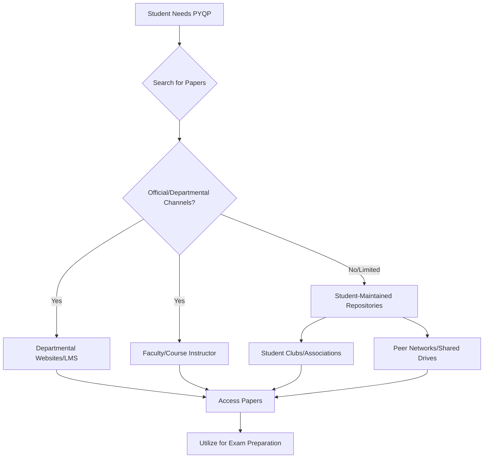

# Previous Year Question Papers of NIT Calicut

## Overview

Previous Year Question Papers (PYQPs) are collections of examination questions from past academic sessions at the National Institute of Technology Calicut (NIT Calicut). These papers serve as a resource for current students to understand examination patterns, question formats, and the scope of syllabi for various courses. While not official study material, they are commonly utilized by students as a supplementary aid for exam preparation.

## Details

PYQPs at NIT Calicut typically encompass question papers from end-semester examinations and, in some cases, mid-semester examinations. The availability of papers can vary by department, course, and academic year. Common formats include scanned copies of original question papers, often compiled into digital archives.

The content of these papers reflects the curriculum and examination styles prevalent during the respective academic years. Students often seek PYQPs for core engineering subjects, departmental electives, and foundational science courses. The collection and distribution of these papers are often facilitated through a combination of student initiatives and, in some instances, departmental archives.

## History

Specific historical details regarding the formal establishment or evolution of a centralized, officially maintained archive of all previous year question papers at NIT Calicut are not widely documented in public sources. Historically, the collection and sharing of question papers have often been a student-driven initiative, evolving from physical copies shared among batches to digital repositories maintained by student bodies or informal networks. The transition to digital formats has significantly increased the accessibility and ease of sharing these resources over time.

## Facilities

There is no widely publicized, dedicated physical facility at NIT Calicut solely for the purpose of accessing previous year question papers. However, students may find access to such papers through various channels:

*   **Departmental Offices/Notice Boards:** Some departments may maintain physical or digital archives of their respective course papers, occasionally made available to students.
*   **Central Library:** While the Central Library primarily houses academic texts and journals, it may, in some instances, have limited collections of past examination papers, particularly for older records.
*   **Student Association Rooms:** Student organizations and departmental clubs often maintain their own collections, typically compiled through contributions from current and past students.

For digital access, platforms such as departmental websites, course management systems (if faculty choose to upload them), or student-maintained online repositories are common.

## Procedures

Access to Previous Year Question Papers at NIT Calicut typically follows a multi-faceted approach, often involving both informal student networks and, occasionally, more structured departmental provisions.

**Explanation of Procedure:**

1.  **Student Needs PYQP:** A student identifies the need for previous year question papers for a specific course or examination.
2.  **Search for Papers:** The student initiates a search for available papers.
3.  **Official/Departmental Channels?:** The student first considers if official or departmental sources are available.
    *   **Departmental Websites/LMS:** Some departments or individual faculty members may upload PYQPs to their official departmental websites or the institute's Learning Management System (LMS).
    *   **Faculty/Course Instructor:** Students may inquire directly with their course instructors or departmental staff, who might provide access to relevant papers.
4.  **Student-Maintained Repositories:** If official channels are limited or unavailable, students commonly turn to student-maintained resources.
    *   **Student Clubs/Associations:** Various student clubs, particularly departmental ones, often maintain archives of PYQPs collected over years from their members.
    *   **Peer Networks/Shared Drives:** Students frequently share papers among themselves through informal peer networks, cloud storage drives, or dedicated messaging groups.
5.  **Access Papers:** Once a source is identified, the student accesses the available papers.
6.  **Utilize for Exam Preparation:** The papers are then used as a study aid to understand exam patterns, question types, and important topics.

The process of adding new papers to these collections is largely driven by student contributions, where students share their current examination papers with their peers or student organizations to be archived for future batches.

## References

Specific official university policies or publicly accessible, centralized archives for all previous year question papers of NIT Calicut are not widely documented or referenced in public sources. The information presented herein is based on common practices observed in academic institutions and the typical methods of resource sharing among students.

## Related Articles
- [Academics at NIT Calicut](academics.md)
- [Departments of NIT Calicut](departments.md)
- [Academic Programs at NIT Calicut](academic_programs.md)
