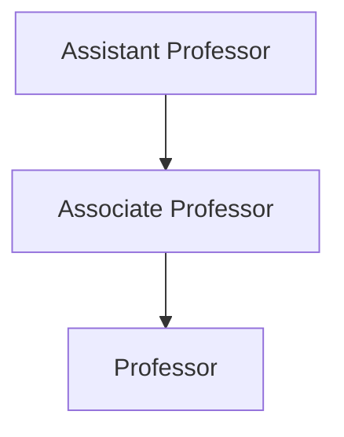

# Professors at NIT Calicut

## Overview

Professors at the National Institute of Technology Calicut (NITC) are integral members of the academic community, responsible for teaching, research, and administrative duties. As a centrally funded technical institution, NIT Calicut adheres to the academic and administrative frameworks set by the Ministry of Education (MoE), Government of India, and the All India Council for Technical Education (AICTE). The faculty body, including professors, contributes to the institute's mission of providing quality technical education and fostering research and innovation.

## Details

### Academic Ranks and Structure

The faculty at NIT Calicut typically comprises academic ranks consistent with the Indian higher education system. These generally include:

*   **Assistant Professor:** Entry-level faculty position, typically requiring a Ph.D. and relevant experience.
*   **Associate Professor:** A mid-career position, requiring significant teaching, research, and administrative experience beyond the Assistant Professor level.
*   **Professor:** The senior-most academic rank, awarded based on extensive experience, substantial contributions to research, teaching excellence, and leadership.

Professors are generally affiliated with one of the institute's academic departments or schools, specializing in various engineering, science, humanities, and management disciplines.

### Roles and Responsibilities

The responsibilities of professors at NIT Calicut encompass a broad range of academic and institutional activities:

*   **Teaching:** Delivering lectures, conducting laboratory sessions, developing course materials, and evaluating student performance for undergraduate, postgraduate, and doctoral programs.
*   **Research and Development:** Engaging in original research, publishing findings in peer-reviewed journals and conferences, securing research grants, and collaborating with industry and other academic institutions.
*   **Student Supervision:** Mentoring and guiding undergraduate projects, postgraduate theses, and doctoral dissertations.
*   **Curriculum Development:** Participating in the design, review, and update of academic curricula to ensure relevance and alignment with industry standards and educational objectives.
*   **Administration:** Serving on various institutional committees, contributing to academic governance, departmental administration, and other institutional development activities.
*   **Consultancy and Outreach:** Providing expert consultancy services to industry and government organizations, and participating in outreach programs.

### Qualifications

Appointment to faculty positions, including that of Professor, generally requires a doctoral degree (Ph.D.) in a relevant discipline from a recognized university or institution, along with a strong academic record and requisite teaching and research experience as per MoE/AICTE norms.

## History

Specific consolidated public information detailing the historical evolution of the professoriate at NIT Calicut, such as the growth in faculty numbers over specific periods, significant policy changes affecting professors, or notable collective achievements, is not readily available in a centralized public format. The institute, established in 1961 as Calicut Regional Engineering College (CREC) and upgraded to NIT in 2002, has continuously evolved its academic structure and faculty strength in line with its growth and national educational policies.

## Facilities

Professors at NIT Calicut have access to various institutional facilities to support their academic and research activities:

*   **Office Spaces:** Individual or shared office spaces within their respective departments.
*   **Laboratories and Research Facilities:** Access to departmental and central research laboratories equipped with specialized instruments and computing resources.
*   **Central Library:** Access to a comprehensive collection of books, journals, e-resources, and databases.
*   **Computing Infrastructure:** Access to high-performance computing facilities and institutional network resources.
*   **Conference and Seminar Halls:** Facilities for conducting academic events, workshops, and presentations.

Dedicated facilities solely for professors, beyond standard academic and research infrastructure, are not publicly detailed.

## Procedures

### Faculty Recruitment Process

The recruitment of professors and other faculty members at NIT Calicut generally follows a structured process aligned with guidelines from the Ministry of Education, Government of India.

```mermaid
graph TD
    A[Vacancy Advertisement (NITC Website/National Dailies)] --> B{Application Submission (Online/Offline)}
    B --> C{Scrutiny and Shortlisting of Candidates}
    C --> D[Interview by Selection Committee]
    D --> E[Recommendation to Board of Governors]
    E --> F[Issuance of Appointment Offer]
    F --> G[Joining and Onboarding]
```

### Academic Hierarchy and Promotion Path

The career progression for faculty members at NIT Calicut typically involves movement through the academic ranks based on performance, experience, research output, and adherence to institutional and MoE/AICTE guidelines for promotion.


*Note: Promotion to higher academic ranks is subject to fulfilling specific eligibility criteria, including years of service, research publications, teaching effectiveness, administrative contributions, and successful evaluation by selection committees.*

### Faculty Evaluation

Specific internal procedures for the periodic evaluation of professors' performance, beyond general academic appraisal mechanisms, are not publicly detailed. However, faculty members are generally assessed based on their contributions to teaching, research, administrative duties, and professional development.

## References

*   National Institute of Technology Calicut Official Website: [https://www.nitc.ac.in/](https://www.nitc.ac.in/)
*   Ministry of Education (MoE), Government of India guidelines for National Institutes of Technology.
*   All India Council for Technical Education (AICTE) norms and regulations for faculty qualifications and promotions.

*Note: This wiki page is compiled based on general information available in the public domain regarding National Institutes of Technology and their faculty structure. Specific internal policies, statistics, or detailed historical accounts unique to NIT Calicut that are not publicly published are not included.*

## Related Articles
- [Academics at NIT Calicut](academics.md)
- [Departments of NIT Calicut](departments.md)
- [Academic Programs at NIT Calicut](academic_programs.md)
