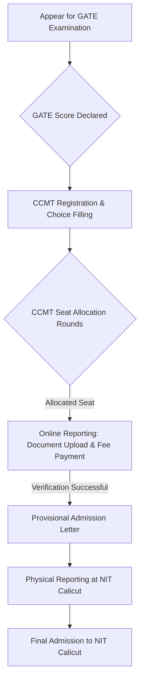

# Admissions to NIT Calicut

## Overview

Admissions to the National Institute of Technology Calicut (NIT Calicut), a public technical university located in Kozhikode, Kerala, India, are primarily conducted through national-level entrance examinations and subsequent centralized counseling processes. The institute offers undergraduate, postgraduate, and doctoral programs across various engineering, architecture, science, and management disciplines. The admission procedures are standardized and governed by policies set by the Ministry of Education, Government of India, and the respective counseling authorities.

## Details

### Undergraduate Admissions (B.Tech and B.Arch)

Admission to the four-year Bachelor of Technology (B.Tech) and five-year Bachelor of Architecture (B.Arch) programs at NIT Calicut is based on the performance in the Joint Entrance Examination (JEE) Main.

*   **Eligibility Criteria:** Candidates must have passed the 10+2 (or equivalent) examination with specific subjects (Physics, Chemistry, Mathematics for B.Tech; Physics, Chemistry, Mathematics, and aptitude test for B.Arch) and typically meet a minimum aggregate percentage or rank in their qualifying examination as prescribed by the Joint Seat Allocation Authority (JoSAA) or Central Seat Allocation Board (CSAB).
*   **Entrance Examination:** JEE Main, conducted by the National Testing Agency (NTA).
*   **Counseling Process:** Seats are allocated through JoSAA, followed by CSAB Special Rounds for any vacant seats. This process ensures centralized allocation to NITs, IIITs, and other Centrally Funded Technical Institutes (CFTIs).
*   **Reservation Policy:** Admissions adhere to the reservation policies of the Government of India, including quotas for Scheduled Castes (SC), Scheduled Tribes (ST), Other Backward Classes (OBC-NCL), Economically Weaker Sections (EWS), and Persons with Disabilities (PwD). Additionally, seats are reserved for candidates from the Home State (Kerala) and Other States, and a certain percentage of seats are supernumerary for female candidates.

### Postgraduate Admissions

NIT Calicut offers various postgraduate programs, including Master of Technology (M.Tech), Master of Planning (M.Plan), Master of Computer Applications (MCA), Master of Business Administration (MBA), and Master of Science (M.Sc).

*   **Master of Technology (M.Tech) and Master of Planning (M.Plan):**
    *   **Eligibility:** A Bachelor's degree in Engineering/Technology or Architecture/Planning from a recognized university with a valid GATE (Graduate Aptitude Test in Engineering) score in the relevant discipline.
    *   **Entrance Examination:** GATE.
    *   **Counseling Process:** Centralized Counselling for M.Tech/M.Plan/M.Arch (CCMT).
*   **Master of Computer Applications (MCA):**
    *   **Eligibility:** A Bachelor's degree with Mathematics as a subject at 10+2 level or at graduation level.
    *   **Entrance Examination:** NIMCET (NIT MCA Common Entrance Test).
    *   **Counseling Process:** NIMCET counseling.
*   **Master of Business Administration (MBA):**
    *   **Eligibility:** A Bachelor's degree in any discipline from a recognized university.
    *   **Entrance Examinations:** Scores from national-level management aptitude tests such as CAT, MAT, CMAT, XAT, or GMAT are generally considered.
    *   **Selection Process:** Typically involves shortlisting based on entrance exam scores, followed by a group discussion and/or personal interview conducted by the institute.
*   **Master of Science (M.Sc):**
    *   **Eligibility:** A Bachelor's degree in a relevant science discipline.
    *   **Entrance Examination:** Joint Admission Test for M.Sc (JAM) or an institute-level entrance examination, depending on the program.
    *   **Counseling Process:** Centralized Counselling for M.Sc/M.Sc (Tech) (CCMN) for JAM qualified candidates, or institute-level counseling for other admissions.

### Doctoral Admissions (Ph.D)

NIT Calicut offers Doctor of Philosophy (Ph.D) programs in various engineering, science, and humanities disciplines.

*   **Eligibility:** A Master's degree in the relevant discipline with a consistently good academic record. Candidates with a valid GATE score or UGC/CSIR NET qualification may be preferred or required for certain fellowships.
*   **Selection Process:** Typically involves an application review, a written aptitude test, and a personal interview conducted by the respective departments at NIT Calicut. The selection criteria may vary based on the department and specific research area.
*   **Admission Cycles:** Admissions are generally conducted twice a year, usually in the odd and even semesters.

## History

The admission process for NIT Calicut, formerly known as Regional Engineering College (REC) Calicut, has evolved significantly since its establishment in 1961. Initially, admissions to RECs were managed at the state level, often involving state-specific entrance examinations and quotas.

With the transformation of RECs into National Institutes of Technology (NITs) in 2002, and their designation as Institutes of National Importance, the admission process became centralized and nationalized. The Joint Entrance Examination (JEE) was introduced as the primary entrance test for undergraduate engineering programs, which later evolved into JEE Main. Similarly, the Graduate Aptitude Test in Engineering (GATE) became the standard for postgraduate engineering admissions, leading to centralized counseling processes like JoSAA, CSAB, and CCMT, which streamline admissions across all NITs and other CFTIs. This shift aimed to ensure uniformity, transparency, and access to a broader pool of national talent.

## Facilities

NIT Calicut provides administrative and IT infrastructure to support the admission process. This includes:

*   **Online Application Portals:** Digital platforms for submitting applications, uploading documents, and tracking application status for institute-level admissions (e.g., MBA, Ph.D).
*   **Counseling Centers:** Designated facilities on campus that may be utilized during physical document verification or reporting for admitted students, particularly during centralized counseling rounds if NIT Calicut is chosen as a reporting center.
*   **Information Technology Infrastructure:** Network and computing resources to facilitate online communication, result dissemination, and administrative tasks related to admissions.

Specific dedicated "admission facilities" beyond these general administrative and IT supports are not separately detailed in public domain information.

## Procedures

### Undergraduate Admission Flow (B.Tech/B.Arch via JoSAA/CSAB)

```mermaid
graph TD
    A[Appear for JEE Main Examination] --> B{JEE Main Rank Declared};
    B --> C[JoSAA Registration & Choice Filling];
    C --> D{JoSAA Seat Allocation Rounds (Rounds 1-6)};
    D -- Allocated Seat --> E[Online Reporting: Document Upload & Fee Payment];
    E -- Verification Successful --> F[Provisional Admission Letter];
    D -- No Seat / Not Satisfied --> G{CSAB Special Rounds (if applicable)};
    G -- Allocated Seat --> H[Online Reporting: Document Upload & Fee Payment];
    H -- Verification Successful --> I[Provisional Admission Letter];
    F & I --> J[Physical Reporting at NIT Calicut];
    J --> K[Final Admission to NIT Calicut];
```

### Postgraduate Admission Flow (M.Tech/M.Plan via CCMT)



### Doctoral Admission Flow (Ph.D)

```mermaid
graph TD
    A[NIT Calicut Ph.D Application Portal Open] --> B[Applicant Submits Online Application];
    B --> C{Application Scrutiny & Shortlisting};
    C -- Shortlisted --> D[Written Test (if applicable)];
    D --> E[Personal Interview];
    E --> F{Final Selection List Declared};
    F -- Selected --> G[Offer of Admission];
    G --> H[Document Verification & Fee Payment];
    H --> I[Final Admission to Ph.D Program];
```

## References

*   National Institute of Technology Calicut Official Website: [https://www.nitc.ac.in/](https://www.nitc.ac.in/)
*   Joint Seat Allocation Authority (JoSAA) Official Website: [https://josaa.nic.in/](https://josaa.nic.in/)
*   Central Seat Allocation Board (CSAB) Official Website: [https://csab.nic.in/](https://csab.nic.in/)
*   Centralized Counselling for M.Tech/M.Plan/M.Arch (CCMT) Official Website: [https://ccmt.nic.in/](https://ccmt.nic.in/)
*   NIT MCA Common Entrance Test (NIMCET) Official Website: [https://nimcet.nic.in/](https://nimcet.nic.in/)
*   Joint Admission Test for M.Sc (JAM) Official Website: [https://jam.iitm.ac.in/](https://jam.iitm.ac.in/)
*   Centralized Counselling for M.Sc/M.Sc (Tech) (CCMN) Official Website: [https://ccmn.nic.in/](https://ccmn.nic.in/)
*   National Testing Agency (NTA) - JEE Main: [https://jeemain.nta.nic.in/](https://jeemain.nta.nic.in/)
*   Graduate Aptitude Test in Engineering (GATE) Official Website: [https://gate.iisc.ac.in/](https://gate.iisc.ac.in/) (or current organizing institute)

## Related Articles
- [B.Tech Admissions at NIT Calicut](b.tech_admissions.md)
- [M.Tech Admissions at NIT Calicut](m.tech_admissions.md)
- [MBA Admissions at NIT Calicut](mba_admissions.md)
