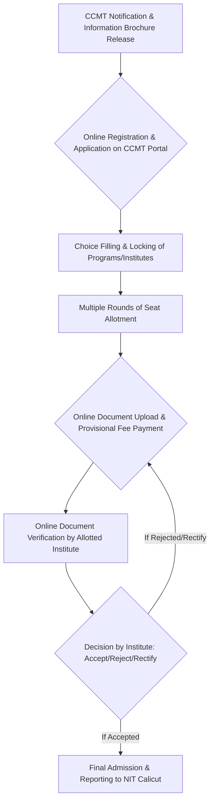

# M.Tech Admissions at NIT Calicut

## Overview

M.Tech (Master of Technology) admissions at the National Institute of Technology Calicut (NIT Calicut) facilitate entry into postgraduate engineering programs. These programs are designed for graduates seeking advanced specialization in various engineering disciplines. The primary mode of admission for Indian nationals is through the Centralized Counselling for M.Tech/M.Arch/M.Plan (CCMT), which considers valid Graduate Aptitude Test in Engineering (GATE) scores. NIT Calicut offers M.Tech programs across its engineering departments, providing opportunities for advanced study and research.

## Details

### Eligibility Criteria
Candidates applying for M.Tech programs at NIT Calicut generally must meet the following criteria:
*   **Qualifying Degree:** A Bachelor's degree in Engineering/Technology (B.E./B.Tech.) or an equivalent degree from a recognized university/institute. Specific disciplines required for eligibility vary by the M.Tech specialization.
*   **GATE Score:** A valid GATE score is typically mandatory for admission through CCMT. The minimum qualifying GATE score varies by program and category and is subject to change annually.
*   **Academic Performance:** A minimum percentage or Cumulative Grade Point Average (CGPA) in the qualifying degree is required. This is generally 60% or 6.5 CGPA (on a 10-point scale) for General/OBC/EWS candidates and 55% or 6.0 CGPA for SC/ST/PwD candidates.
*   **Age Limit:** There is generally no age limit for M.Tech admissions.

### Specializations
NIT Calicut offers M.Tech programs in various specializations across its engineering departments. The specific programs offered and their intake capacity are subject to change each academic year. Examples of departments offering M.Tech programs include, but are not limited to:
*   Civil Engineering
*   Mechanical Engineering
*   Electrical Engineering
*   Electronics & Communication Engineering
*   Computer Science & Engineering
*   Chemical Engineering
*   Materials Science and Engineering
*   Architecture and Planning (M.Plan/M.Arch)

For an exhaustive and current list of specializations, candidates are advised to refer to the official NIT Calicut academic prospectus or the CCMT information brochure for the relevant admission year.

### Admission Categories
Admissions are typically conducted under various categories:
*   **GATE Qualified Candidates:** The majority of admissions are for candidates with a valid GATE score, processed through CCMT.
*   **Sponsored Candidates:** Candidates sponsored by government organizations, public sector undertakings, or reputed private industries may be admitted, often requiring relevant work experience and a No Objection Certificate (NOC) from their employer. Specific criteria for sponsored candidates are published annually.
*   **Part-Time Candidates:** Some programs may offer part-time admission for candidates working in nearby organizations, subject to specific eligibility and selection criteria.
*   **Foreign Nationals/DASA:** Admissions for foreign nationals or candidates under the Direct Admission of Students Abroad (DASA) scheme are handled separately, often through specific international admission procedures or DASA guidelines.

## History

NIT Calicut, formerly known as Regional Engineering College (REC) Calicut, was established in 1961. Postgraduate programs, including M.Tech, have been a part of its academic offerings for a significant period, evolving with the institute's growth and academic advancements. The centralized admission process for M.Tech programs, CCMT, was introduced to streamline admissions across NITs and other centrally funded technical institutions, replacing individual institute-level admission processes for GATE-qualified candidates. Specific historical details regarding the exact commencement dates of individual M.Tech programs or the precise timeline of admission policy changes are not readily available in a consolidated public source.

## Facilities

The admission process for M.Tech programs at NIT Calicut is primarily managed through online platforms. While there isn't a dedicated physical "admissions facility" distinct from the general administrative offices, the process leverages:
*   **Online Application Portals:** The CCMT portal serves as the primary interface for application, choice filling, and seat allotment.
*   **NIT Calicut Website:** Provides program-specific information, eligibility updates, and institutional guidelines.
*   **Administrative Offices:** The Academic Section and respective departments at NIT Calicut handle post-allotment procedures, document verification, and student registration.

## Procedures

The M.Tech admission procedure for GATE-qualified candidates at NIT Calicut is primarily conducted through the Centralized Counselling for M.Tech/M.Arch/M.Plan (CCMT).

### CCMT Admission Process

The general steps involved in the CCMT process are as follows:

1.  **Notification Release:** The CCMT committee releases an information brochure and schedule on its official website, detailing eligibility, participating institutions, programs, and important dates.
2.  **Online Registration and Application:** Candidates register on the CCMT portal, fill in their personal and academic details, and pay the registration fee.
3.  **Choice Filling and Locking:** Candidates select their preferred M.Tech programs and institutions (including NIT Calicut) in order of priority. Choices must be locked before the deadline.
4.  **Seat Allotment Rounds:** Based on GATE scores, choices filled, and seat availability, seats are allotted in multiple rounds.
5.  **Provisional Admission and Fee Payment:** Allotted candidates must accept the seat (freeze/float options available) and pay a provisional admission fee online.
6.  **Online Document Verification:** Candidates upload required documents to the CCMT portal for verification by the allotted institute (NIT Calicut).
7.  **Reporting to NIT Calicut:** After successful document verification and payment of the remaining fees, candidates must physically report to NIT Calicut on the specified dates for final admission formalities and registration.

### Documents Required for Verification
Candidates are typically required to produce the following documents (original and photocopies) during the verification process:
*   GATE Scorecard (of the relevant year)
*   Provisional Allotment Letter (from CCMT)
*   Degree/Provisional Certificate of Qualifying Examination
*   Mark Sheets of all semesters/years of the qualifying examination
*   Class 10th and 12th Mark Sheets and Certificates
*   Category Certificate (OBC-NCL/SC/ST/EWS/PwD), if applicable, in the prescribed format
*   Transfer Certificate (TC)
*   Migration Certificate
*   Conduct Certificate
*   Passport-size photographs
*   Proof of Identity (Aadhaar Card/Passport/Driving License)

### Direct Admission Procedures (Sponsored/Part-Time/Foreign Nationals)
For categories like sponsored candidates, part-time candidates, or foreign nationals, the admission process is typically handled directly by NIT Calicut. This usually involves:
*   Application submission directly to NIT Calicut.
*   Fulfilling specific eligibility criteria unique to the category (e.g., work experience, sponsorship letter).
*   Possible written test and/or interview conducted by the respective department at NIT Calicut.
*   Merit list preparation and direct offer of admission.

Specific details for these categories are published separately on the NIT Calicut official website.

## References

*   **National Institute of Technology Calicut Official Website:** [https://www.nitc.ac.in/](https://www.nitc.ac.in/) (Refer to the "Academics" and "Admissions" sections for current M.Tech program details and admission notifications.)
*   **Centralized Counselling for M.Tech/M.Arch/M.Plan (CCMT) Official Website:** [https://ccmt.nic.in/](https://ccmt.nic.in/) (For information brochures, schedules, and the online application portal for GATE-qualified candidates.)

## Related Articles
- [Admissions to NIT Calicut](admissions_to_nit_calicut.md)
- [B.Tech Admissions at NIT Calicut](b.tech_admissions.md)
- [MBA Admissions at NIT Calicut](mba_admissions.md)
