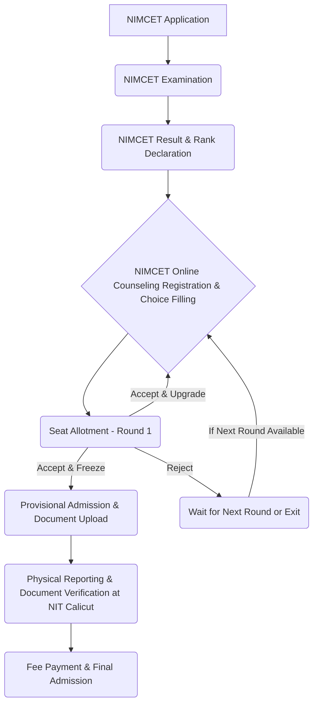

# MCA Admissions at NIT Calicut

## Overview

The Master of Computer Applications (MCA) program at the National Institute of Technology Calicut (NIT Calicut) is a postgraduate course designed to provide students with advanced knowledge and skills in computer applications. Admissions to the MCA program at NIT Calicut are primarily conducted through the National Institute of Technology MCA Common Entrance Test (NIMCET). The program is administered by the Department of Computer Science and Engineering.

## Details

*   **Program Name:** Master of Computer Applications (MCA)
*   **Administering Department:** Department of Computer Science and Engineering (CSE)
*   **Duration:** The MCA program typically spans two academic years, divided into four semesters.
*   **Eligibility Criteria:**
    *   Candidates must hold a Bachelor's degree of minimum three years duration in any discipline from a recognized University.
    *   The candidate must have studied Mathematics or Statistics as one of the subjects at 10+2 level or at graduation level.
    *   A minimum aggregate percentage or CGPA in the qualifying degree is usually required, as specified in the annual NIMCET information brochure.
    *   Specific eligibility criteria, including minimum marks, are subject to change and are published annually by the NIMCET conducting body.
*   **Sanctioned Intake:** The number of seats available for the MCA program at NIT Calicut varies annually. The exact sanctioned intake is published in the official NIMCET information brochure and on the NIT Calicut website for the respective academic year.

## History

The exact date of establishment of the Master of Computer Applications (MCA) program at NIT Calicut is not readily available in public domain sources without specific historical archives. However, the program has been a part of the institute's offerings for a significant period, contributing to the institute's postgraduate education portfolio. Admissions have consistently been routed through a national-level entrance examination process, primarily NIMCET, since its inception.

## Facilities

Facilities available to MCA students at NIT Calicut are generally shared with other postgraduate students within the Department of Computer Science and Engineering. These typically include:

*   **Computer Laboratories:** Equipped with modern hardware and software, providing access to programming environments, development tools, and high-speed internet.
*   **Departmental Library:** A collection of textbooks, reference materials, journals, and research papers relevant to computer science and applications.
*   **Lecture Halls and Seminar Rooms:** Equipped with audio-visual aids for teaching and presentations.
*   **High-Speed Internet Connectivity:** Campus-wide Wi-Fi and wired network access.
*   **Central Computing Facilities:** Access to the institute's central computing resources.

Specific facilities exclusively designated for MCA students are not explicitly detailed in publicly available information.

## Procedures

Admissions to the MCA program at NIT Calicut are conducted through a centralized process based on the NIMCET examination. The general procedure is as follows:

**Detailed Steps:**

1.  **NIMCET Application:** Prospective candidates must apply for the NIMCET examination online through the official NIMCET website during the specified application period.
2.  **NIMCET Examination:** Candidates appear for the NIMCET examination, which is a national-level entrance test assessing analytical ability, mathematical aptitude, computer awareness, and general English.
3.  **NIMCET Result & Rank Declaration:** NIMCET results are declared, and candidates are assigned an All India Rank (AIR) based on their performance.
4.  **NIMCET Online Counseling Registration & Choice Filling:** Qualified candidates register for online counseling on the official NIMCET counseling portal. During this phase, they fill in their preferred choices of NITs and MCA programs in order of priority.
5.  **Seat Allotment:** Based on NIMCET rank, eligibility, and choices filled, seats are allotted in various rounds of counseling.
6.  **Provisional Admission & Document Upload:** Candidates who are allotted a seat must accept the seat (with options to freeze or upgrade) and complete the provisional admission formalities, which typically involve uploading required documents and paying a partial admission fee online.
7.  **Physical Reporting & Document Verification:** After the counseling rounds, candidates who have accepted a seat at NIT Calicut must physically report to the institute on the specified dates. This involves verification of original documents, including academic certificates, NIMCET scorecard, category certificates (if applicable), and proof of identity.
8.  **Fee Payment & Final Admission:** Upon successful document verification, candidates complete the remaining fee payment to finalize their admission to the MCA program at NIT Calicut.

## References

Information regarding MCA admissions at NIT Calicut is primarily sourced from:

*   The official website of NIT Calicut (www.nitc.ac.in)
*   The official website for the NIMCET examination (nimcet.in)
*   Annual NIMCET Information Brochures and Counseling Guidelines.

## Related Articles
- [Admissions to NIT Calicut](admissions_to_nit_calicut.md)
- [B.Tech Admissions at NIT Calicut](b.tech_admissions.md)
- [M.Tech Admissions at NIT Calicut](m.tech_admissions.md)
