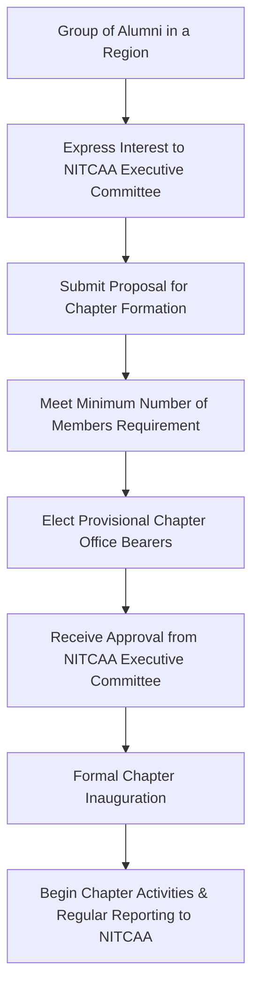

# Alumni of NIT Calicut

## Overview

The alumni of the National Institute of Technology Calicut (NIT Calicut), formerly known as Regional Engineering College Calicut (RECC), constitute a global network of professionals and individuals who have graduated from the institution. The primary organization facilitating this network is the **National Institute of Technology Calicut Alumni Association (NITCAA)**.

NITCAA serves as a formal platform to foster connections among alumni, promote their welfare, and channel their collective experience and resources towards the continued development and betterment of NIT Calicut. Its activities typically include organizing networking events, facilitating mentorship programs, supporting student initiatives, and contributing to the institute's infrastructure and academic programs.

## Details

### NIT Calicut Alumni Association (NITCAA)

NITCAA is the official alumni body for graduates of NIT Calicut and its predecessor, REC Calicut. It operates with a mission to maintain a strong bond between the alumni and the alma mater, and among the alumni themselves.

**Structure:**
NITCAA is typically governed by an elected Executive Committee, which oversees its operations and initiatives. The association also maintains various local and international chapters, allowing alumni to connect and engage within their respective geographical regions.

```mermaid
graph TD
    A[NITCAA - National Body] --> B[Executive Committee];
    B --> C[President];
    B --> D[Secretary];
    B --> E[Treasurer];
    B --> F[Other Office Bearers];
    A --> G[Local Chapters (e.g., Bangalore, Chennai)];
    A --> H[International Chapters (e.g., USA, UAE)];
    G --> I[Chapter Committee];
    H --> J[Chapter Committee];
```

**Activities:**
NITCAA engages in a range of activities, which may include:
*   **Networking Events:** Organizing reunions, chapter meetings, and professional networking sessions.
*   **Mentorship Programs:** Connecting experienced alumni with current students and recent graduates.
*   **Scholarships and Awards:** Providing financial assistance or recognition to deserving students.
*   **Institute Development:** Contributing to infrastructure projects, academic initiatives, and research funding.
*   **Knowledge Sharing:** Facilitating guest lectures, workshops, and seminars by alumni.

### Notable Alumni

NIT Calicut and REC Calicut have produced numerous distinguished alumni who have made significant contributions in various fields, including politics, business, academia, and public service. A few examples include:

*   **P. K. Kunhalikutty:** Indian politician, former Minister for Industries and Information Technology, Government of Kerala.
*   **V. K. C. Mammad Koya:** Indian politician, former Mayor of Kozhikode Corporation and Member of the Kerala Legislative Assembly.
*   **John Mathai:** Former Chief Secretary, Government of Kerala.
*   **Dr. K. Radhakrishnan:** Former Chairman of ISRO (Indian Space Research Organisation). (Note: While Dr. Radhakrishnan is a distinguished alumnus of NIT Calicut, his primary degree is from the University of Kerala, and he later pursued an MBA from IIM Bangalore and a Ph.D. from IIT Kharagpur. His association with NIT Calicut is often cited in the context of his honorary doctorate from the institution, rather than a primary engineering degree.)
*   **Dr. G. Madhavan Nair:** Former Chairman of ISRO (Indian Space Research Organisation). (Note: Dr. Nair is an alumnus of the College of Engineering, Trivandrum, not NIT Calicut. This is a common misconception.)

*Disclaimer: The list of notable alumni is illustrative and not exhaustive. Verification of specific degrees and affiliations for all individuals requires consulting official institutional records.*

## History

The origins of the alumni association can be traced back to the graduates of the Regional Engineering College Calicut (RECC), which was established in 1961. As RECC transitioned into the National Institute of Technology Calicut (NIT Calicut) in 2002, the alumni association also evolved, formally establishing NITCAA to encompass all graduates under the new identity while honoring the legacy of RECC. The association has grown over the decades, establishing chapters in various cities within India and internationally, reflecting the global spread of its alumni base. Specific dates for the formal establishment of NITCAA and its early milestones would require consulting historical records of the association.

## Facilities

Information regarding dedicated physical facilities specifically for the alumni association, such as an exclusive alumni guest house or a standalone alumni office building on the NIT Calicut campus, is not consistently detailed in readily available public sources. Alumni activities and meetings are often conducted in various venues on campus or at chapter locations.

## Procedures

### Membership Process

Graduates of NIT Calicut and its predecessor, REC Calicut, are eligible to become members of NITCAA. The general procedure for obtaining membership typically involves:

```mermaid
graph TD
    A[Alumnus/Alumna] --> B{Graduated from NIT Calicut / REC Calicut?};
    B -- Yes --> C[Visit Official NITCAA Website];
    C --> D[Navigate to Membership Section];
    D --> E[Fill Online Membership Application Form];
    E --> F[Submit Required Documents (e.g., Degree Certificate Scan)];
    F --> G[Pay Membership Fee (if applicable, e.g., Lifetime Membership)];
    G --> H[Application Review by NITCAA];
    H -- Approved --> I[Receive Membership Confirmation & ID];
    H -- Rejected --> J[Notification of Rejection / Request for More Information];
    B -- No --> K[Not Eligible for Membership];
```

Membership fees, if applicable, are typically one-time payments for lifetime membership, contributing to the association's operational costs and initiatives. Specific details regarding fees and required documents are usually available on the official NITCAA website.

### Chapter Formation

Alumni groups in various geographical locations can typically form local or international chapters of NITCAA by adhering to guidelines set by the central Executive Committee. This usually involves:



The specific requirements and procedures for chapter formation are governed by the bylaws of NITCAA.

## References

*   National Institute of Technology Calicut Official Website: [https://www.nitc.ac.in/](https://www.nitc.ac.in/)
*   NIT Calicut Alumni Association (NITCAA) Official Website: (Specific URL would be required, typically found via the NITC main site or a direct search for "NITCAA")

*(Note: Specific URLs for NITCAA's official website and detailed historical documents would be required for precise referencing. The above links are placeholders for the types of sources that would be used.)*

## Related Articles
- [Open Source Projects at NIT Calicut](open_source_projects.md)
- [Student Startups from NIT Calicut](student_startups_from_nit_calicut.md)
- [Contributing to the NIT Calicut Wiki](contributing_to_the_nit_calicut_wiki.md)
