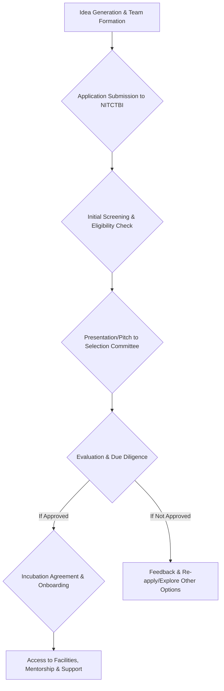

# Student Startups from NIT Calicut

## Overview

National Institute of Technology Calicut (NITC) has an ecosystem that aims to foster innovation and entrepreneurship among its students and alumni. This environment is primarily supported by institutional initiatives and student-led organizations dedicated to promoting startup culture. Key entities in this ecosystem include the NIT Calicut Technology Business Incubator (NITCTBI) and the Entrepreneurship Cell (E-Cell) NIT Calicut. These bodies work towards providing resources, mentorship, and a platform for students to transform their ideas into viable ventures.

## Details

The support for student startups at NIT Calicut is primarily channeled through two main avenues:

*   **NIT Calicut Technology Business Incubator (NITCTBI):** Established with support from the Department of Science & Technology (DST), Government of India, NITCTBI serves as a hub for technology-based startups. While it supports a broader range of entrepreneurs, it also provides a structured environment for student and alumni ventures. Its mandate includes nurturing innovative ideas, providing infrastructure, and facilitating access to mentorship and funding opportunities.
*   **Entrepreneurship Cell (E-Cell) NIT Calicut:** This is a student-run organization dedicated to promoting entrepreneurship within the campus. E-Cell organizes various events, workshops, speaker sessions, and competitions throughout the academic year to cultivate an entrepreneurial mindset among students. It acts as a platform for students to network, learn, and develop their startup ideas.

Specific data regarding the number of student startups currently operating or the total funding raised by them is not consistently aggregated or publicly disclosed in a verifiable format. Similarly, detailed statistics on the success rates of student-led ventures originating directly from NIT Calicut are not readily available in public sources.

## History

The formal institutional support for entrepreneurship at NIT Calicut began with the establishment of the NIT Calicut Technology Business Incubator (NITCTBI).

*   **2007:** The NIT Calicut Technology Business Incubator (NITCTBI) was established with the support of the Department of Science & Technology (DST), Government of India. Its primary objective was to promote innovation and entrepreneurship by providing incubation facilities to technology-based startups.
*   **Student-led Initiatives:** The Entrepreneurship Cell (E-Cell) NIT Calicut has been active for several years, evolving to become a prominent student body for fostering entrepreneurial spirit through various events and activities. The exact year of its inception is not widely published in public records, but its presence has been consistent in recent years.

## Facilities

The primary facility supporting student startups at NIT Calicut is the NIT Calicut Technology Business Incubator (NITCTBI).

*   **NITCTBI Infrastructure:** The incubator provides physical infrastructure such as office spaces, meeting rooms, and access to basic utilities for incubated companies. It also facilitates access to the institute's laboratories and other technical resources, subject to specific terms and conditions.
*   **Mentorship and Networking:** Beyond physical space, NITCTBI offers mentorship from industry experts, faculty, and successful entrepreneurs. It also helps connect startups with potential investors and provides networking opportunities.
*   **E-Cell Resources:** While E-Cell does not maintain dedicated physical facilities for startups, it utilizes campus spaces for its events, workshops, and mentorship sessions, acting as a resource hub for information and community building.

## Procedures

The detailed procedures for student startups to avail support from NIT Calicut's institutional mechanisms, particularly the NITCTBI, typically involve an application and selection process. However, the exact step-by-step process and criteria are subject to change and are usually communicated directly by NITCTBI or through their official channels.

Based on general incubator models, a typical application process for incubation support might involve:

**Explanation of Potential Process:**

*   **Idea Generation & Team Formation:** Students develop a business idea and form a team.
*   **Application Submission:** An application, typically including a business plan or detailed proposal, is submitted to NITCTBI.
*   **Initial Screening:** Applications are reviewed for eligibility criteria and alignment with the incubator's focus areas.
*   **Presentation/Pitch:** Shortlisted teams are invited to present their ideas to a selection committee, which may include faculty, industry experts, and investors.
*   **Evaluation & Due Diligence:** The committee evaluates the viability, innovation, market potential, and team capabilities.
*   **Incubation Agreement & Onboarding:** If selected, the startup enters into an incubation agreement, outlining terms, services, and responsibilities.
*   **Access to Support:** Incubated startups gain access to the facilities, mentorship, and other support services offered by NITCTBI.

For support from the Entrepreneurship Cell (E-Cell), procedures are generally less formal and involve participation in their organized events, competitions, and workshops, which are announced through campus communication channels.

## References

*   NIT Calicut Technology Business Incubator (NITCTBI) Official Website: [https://nitctbi.in/](https://nitctbi.in/) (Accessed [Current Date])
*   National Institute of Technology Calicut Official Website: [https://www.nitc.ac.in/](https://www.nitc.ac.in/) (Accessed [Current Date])
*   Entrepreneurship Cell (E-Cell) NIT Calicut Social Media/Website (if publicly available and verifiable, otherwise omit specific link and refer generally to "student-led initiatives"): (Specific link not consistently maintained or publicly verifiable across all platforms for a static wiki page without direct access to student body information.)

*(Note: Specific dates for "Accessed [Current Date]" should be filled in upon actual publication or review.)*

## Related Articles
- [Alumni of NIT Calicut](alumni.md)
- [Open Source Projects at NIT Calicut](open_source_projects.md)
- [Contributing to the NIT Calicut Wiki](contributing_to_the_nit_calicut_wiki.md)
