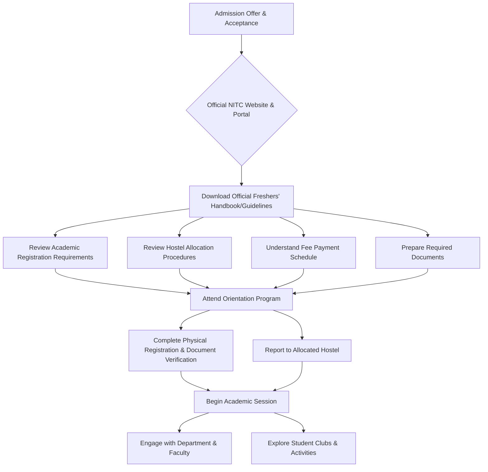

# Freshers' Guide to NIT Calicut

## Overview

This guide aims to provide an introductory overview for new students (freshers) joining the National Institute of Technology Calicut (NITC). As a comprehensive resource, a Freshers' Guide typically consolidates essential information regarding academic procedures, campus facilities, student life, and support services.

It is imperative for all freshers to consult the official NIT Calicut website and any official handbooks or communications provided by the institute for the most current and accurate information regarding admission, registration, academic calendars, hostel allocation, and other critical details. Information presented here is general and subject to change based on institutional policies and updates.

## Details

Specific details pertinent to freshers, such as exact dates for academic registration, hostel reporting, orientation schedules, fee payment procedures, and detailed academic regulations, are dynamic and are officially communicated by NIT Calicut through its admissions portal, official website, and during the orientation program.

Categories of information typically relevant to freshers include:

*   **Academic Registration:** Procedures for course enrollment, document verification, and academic advising.
*   **Hostel Accommodation:** Allocation processes, rules and regulations for residential students, and facilities available in student hostels.
*   **Academic Calendar:** Key dates for semesters, examinations, holidays, and other academic events.
*   **Student Support Services:** Information on counseling services, medical facilities, anti-ragging policies, and grievance redressal mechanisms.
*   **Student Organizations and Clubs:** Overview of extracurricular opportunities, technical clubs, cultural societies, and sports activities.

For precise and up-to-date information on these categories, freshers are directed to the official NIT Calicut website and their respective departmental notices.

## History

The National Institute of Technology Calicut, formerly known as the Regional Engineering College Calicut (RECC), was established in 1961. It was one of the first Regional Engineering Colleges (RECs) established in India. In 2002, the institution was elevated to the status of a National Institute of Technology (NIT) and was granted deemed university status. Under the National Institutes of Technology Act, 2007, NIT Calicut was declared an Institute of National Importance. The institute is fully funded by the Government of India and functions as an autonomous body under the Ministry of Education.

## Facilities

NIT Calicut provides a range of facilities to support its academic and residential community. While specific details such as capacities or precise operational hours are subject to official announcements, general categories of facilities include:

*   **Academic Infrastructure:** Lecture halls, laboratories, departmental buildings, and research centers.
*   **Central Library:** A central facility providing access to academic resources, including books, journals, and digital databases.
*   **Hostels:** Separate residential facilities for male and female students, typically equipped with basic amenities.
*   **Sports Complex:** Facilities for various indoor and outdoor sports and recreational activities.
*   **Medical Centre:** On-campus medical services for students and staff.
*   **Computing Facilities:** Central computing facilities and internet access across the campus.
*   **Auditoriums and Convention Centre:** Venues for academic, cultural, and institutional events.
*   **Dining Facilities:** Messes and canteens within hostel premises and across the campus.

For detailed information on specific facilities, including their locations, operational guidelines, and services offered, students should refer to the official NIT Calicut website or campus maps provided by the institute.

## Procedures

The onboarding process for freshers at NIT Calicut typically involves several stages, from admission confirmation to full integration into campus life. Specific procedures, including document submission, fee payment, and hostel allocation, are communicated directly by the institute.

A generalized flow for a fresher's initial interaction with the institute's information channels might be represented as follows:

This diagram illustrates a typical sequence of steps and information sources for a new student. The exact sequence, responsible departments, and specific requirements are subject to official directives from NIT Calicut.

## References

*   National Institute of Technology Calicut Official Website: [https://www.nitc.ac.in/](https://www.nitc.ac.in/)
*   Ministry of Education, Government of India (for NITs Act, 2007 and general information on NITs)

## Related Articles
- [Traditions of NIT Calicut](traditions.md)
- [Graduation at NIT Calicut](graduation.md)
- [Student Stories from NIT Calicut](student_stories_from_nit_calicut.md)
