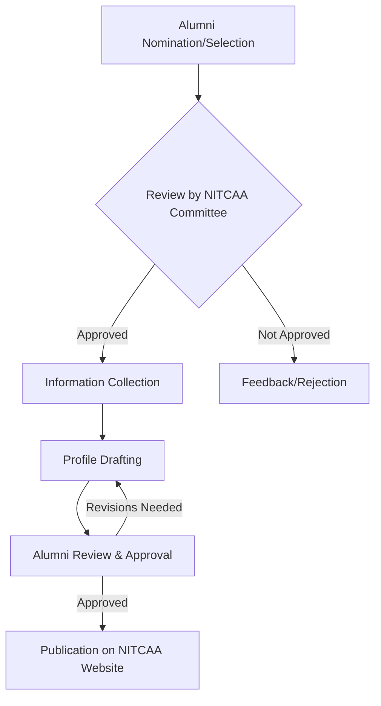

# Student Stories from NIT Calicut

## Overview
This page outlines the mechanisms and platforms through which student and alumni experiences, achievements, and narratives are typically shared and documented within the National Institute of Technology Calicut (NITC) ecosystem. While a single, centralized, formal program specifically titled "Student Stories" may not be explicitly documented, various channels contribute to the collection and dissemination of these narratives. These stories generally encompass academic journeys, extracurricular engagements, professional achievements, and personal reflections.

## Details
Student stories at NIT Calicut primarily manifest through the following channels:

*   **Alumni Profiles:** The NIT Calicut Alumni Association (NITCAA) website features profiles of distinguished alumni, detailing their careers, contributions, and experiences since graduation. These profiles serve as narratives of post-graduation journeys and achievements, offering insights into various professional fields and personal development.
*   **Institutional News and Achievements:** The official NIT Calicut website frequently publishes news articles and announcements highlighting significant achievements of current students. These include successes in national and international competitions, research breakthroughs, entrepreneurial ventures, and other notable accomplishments. Such articles often include brief accounts of the students' efforts, experiences, and the impact of their work.
*   **Departmental and Club Activities:** Individual academic departments and various student clubs and organizations within NIT Calicut occasionally document and share the experiences of their members. This occurs through their respective newsletters, social media channels, event reports, and annual magazines. These platforms provide insights into specific academic projects, extracurricular activities, social events, and the overall student life within particular groups.

Information regarding a dedicated, institution-wide platform for current students to formally submit personal stories for publication is not readily available in public sources.

## History
The practice of documenting and sharing alumni achievements and profiles has been an integral part of the NIT Calicut Alumni Association's activities since its inception. The NITCAA website, established to connect alumni globally, has consistently featured profiles of its members, evolving with digital platforms to make these stories accessible. Specific historical milestones related to a formal "Student Stories" initiative for current students, distinct from general news or alumni profiles, are not publicly documented.

## Facilities
There are no specific, dedicated physical facilities at NIT Calicut explicitly designated for the collection, archiving, or production of "Student Stories" as a standalone program. General institutional resources such as IT infrastructure, departmental laboratories, and communication offices support the broader dissemination of news and information, including student achievements and alumni profiles.

## Procedures
Formal, institution-wide procedures for current students to submit personal "stories" for official publication are not publicly documented.

However, the process for featuring **Alumni Profiles** on the NITCAA website generally involves a structured approach:

**Explanation of the Alumni Profile Procedure:**
1.  **Alumni Nomination/Selection:** Alumni may be nominated by peers, faculty, or selected by the NITCAA committee based on their notable achievements and contributions to their respective fields or society.
2.  **Review by NITCAA Committee:** The NITCAA committee assesses the nominations based on established criteria, which are not publicly detailed.
3.  **Information Collection:** For approved candidates, relevant information, including career trajectory, significant achievements, and personal insights, is collected. This may involve direct submissions from the alumnus or interviews conducted by NITCAA representatives.
4.  **Profile Drafting:** A biographical profile is drafted based on the collected information, adhering to NITCAA's editorial guidelines.
5.  **Alumni Review & Approval:** The drafted profile is shared with the alumnus for review, factual verification, and final approval to ensure accuracy and consent for publication.
6.  **Publication on NITCAA Website:** Upon receiving final approval from the alumnus, the profile is published on the official NITCAA website, typically under sections such as "Distinguished Alumni" or similar categories.

Procedures for featuring student achievements in institutional news are typically managed by the Public Relations or Media Cell of NIT Calicut, often initiated by departmental recommendations or direct reporting of significant accomplishments. Specific detailed procedures for this are not publicly available.

## References
*   National Institute of Technology Calicut Official Website: [https://nitc.ac.in/](https://nitc.ac.in/)
*   NIT Calicut Alumni Association (NITCAA) Official Website: [https://nitcalumni.in/](https://nitcalumni.in/)

## Related Articles
- [Traditions of NIT Calicut](traditions.md)
- [Freshers' Guide to NIT Calicut](freshers_guide_to_nit_calicut.md)
- [Graduation at NIT Calicut](graduation.md)
