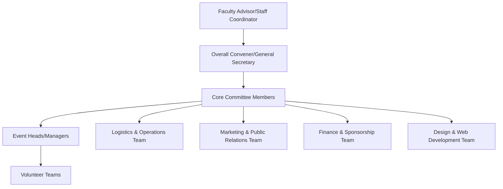

# Traditions of NIT Calicut

## Overview

National Institute of Technology Calicut (NIT Calicut) fosters a vibrant student culture, characterized by a range of long-standing events and practices that have evolved into traditions. These traditions primarily revolve around annual student-organized festivals, academic ceremonies, and community-building activities, contributing significantly to the campus experience and identity of its students. While many informal traditions exist within student groups and hostels, this page focuses on institution-wide or widely recognized traditions that are publicly documented or commonly understood within the NIT Calicut community.

## Details

The core traditions at NIT Calicut are largely centered around its major annual festivals and academic milestones.

### Major Annual Festivals

NIT Calicut hosts three prominent annual festivals, each with a rich history and established practices:

*   **Ragam:** The annual inter-collegiate cultural festival of NIT Calicut. It is one of the largest cultural festivals in South India, featuring a wide array of events including music, dance, drama, literary arts, fine arts, and various informal competitions. A key tradition of Ragam is its "Pro-Shows," which involve performances by renowned artists and bands, attracting large audiences from across the region. The festival is entirely student-organized, involving extensive planning and execution by various student committees.
*   **Tathva:** The annual inter-collegiate technical festival of NIT Calicut. Tathva serves as a platform for students to showcase technical prowess, engage in workshops, participate in competitions, and attend guest lectures by experts from various fields. Traditional events include robotics competitions, coding challenges, design contests, and exhibitions of innovative projects. Like Ragam, Tathva is a student-led initiative, fostering organizational and technical skills among participants.
*   **Horizons:** The annual inter-NIT sports festival. Horizons brings together students from various National Institutes of Technology across India to compete in a wide range of sports and games. It promotes sportsmanship, healthy competition, and inter-institutional camaraderie. The festival typically includes events such as football, basketball, volleyball, cricket, athletics, and indoor games.

### Academic and Institutional Traditions

*   **Orientation and Freshers' Welcome:** Annually, new batches of students are welcomed to the institute through an orientation program. This often includes formal addresses by faculty and administration, introductions to campus facilities, and informal welcome events organized by senior students, which serve as a traditional rite of passage for new entrants.
*   **Convocation Ceremony:** The formal graduation ceremony where degrees are conferred upon graduating students. This is a significant academic tradition, marked by academic regalia, speeches, and the awarding of medals and certificates.
*   **Department Days/Fests:** Many academic departments organize their own annual events or "days" which often include technical talks, project exhibitions, cultural performances, and alumni interactions specific to their discipline. These events foster a sense of community within departments.

## History

The history of traditions at NIT Calicut is closely tied to the evolution of the institution itself.

*   **Founding of Major Festivals:**
    *   **Ragam:** The cultural festival Ragam has been an annual event for several decades, evolving from smaller cultural gatherings into a large-scale inter-collegiate festival. Specific founding year details are not consistently available in public records, but it has been a prominent fixture of the campus calendar for a significant period.
    *   **Tathva:** Similarly, Tathva has grown over the years to become a major technical festival. Its origins trace back to student initiatives aimed at promoting technical knowledge and innovation.
    *   **Horizons:** The inter-NIT sports festival is a more recent addition compared to Ragam and Tathva, established to foster sports culture and inter-NIT relations.

*   **Evolution of Campus Culture:** Over the years, the student body has played a crucial role in shaping and preserving these traditions, passing down organizational knowledge and cultural practices from one batch to the next. The student-run nature of the major festivals is a testament to this continuous legacy.

## Facilities

Several campus facilities are traditionally associated with the execution of these events and traditions:

*   **Open Air Theatre (OAT):** A central venue for large-scale cultural performances, concerts, and major events during Ragam.
*   **Main Academic Building (NAB):** Often used for technical workshops, lectures, and exhibitions during Tathva.
*   **Institute Stadium and Sports Complex:** The primary venues for various sports events during Horizons and other inter-hostel competitions.
*   **Hostel Auditoriums and Common Rooms:** Used for smaller-scale cultural events, meetings, and preparatory activities for festivals.
*   **Various Lecture Halls and Seminar Halls:** Utilized for technical talks, paper presentations, and workshops during Tathva.

## Procedures

The organization of major student festivals like Ragam and Tathva follows a structured, hierarchical procedure, primarily managed by student committees under faculty guidance. This structure ensures continuity and efficient execution of these large-scale events.

**Explanation of the Organizational Hierarchy:**

*   **Faculty Advisor/Staff Coordinator:** Provides institutional oversight, guidance, and approval.
*   **Overall Convener/General Secretary:** The primary student leader responsible for the entire festival, overseeing all aspects and coordinating with the faculty.
*   **Core Committee Members:** A group of senior students responsible for strategic planning, decision-making, and managing specific portfolios (e.g., cultural, technical, sports, logistics, finance).
*   **Event Heads/Managers:** Students responsible for specific events or competitions within the festival, managing their respective teams.
*   **Volunteer Teams:** A large body of students who execute tasks on the ground, manage participants, and ensure smooth functioning of events.
*   **Logistics & Operations Team:** Manages venue setup, equipment, accommodation, and general operational needs.
*   **Marketing & Public Relations Team:** Handles promotion, outreach, media relations, and branding.
*   **Finance & Sponsorship Team:** Manages budgeting, fundraising, and securing sponsorships.
*   **Design & Web Development Team:** Responsible for the festival's visual identity, website, and digital presence.

This procedural framework is a tradition in itself, passed down through successive batches of students, ensuring the successful continuation of these annual events.

## References

*   NIT Calicut Official Website (www.nitc.ac.in)
*   Official Ragam Website (ragam.org.in - *example, actual URL may vary annually*)
*   Official Tathva Website (tathva.org - *example, actual URL may vary annually*)
*   Official Horizons Website (*if available, actual URL may vary annually*)
*   General public knowledge and historical accounts within the NIT Calicut community.

## Related Articles
- [Freshers' Guide to NIT Calicut](freshers_guide_to_nit_calicut.md)
- [Graduation at NIT Calicut](graduation.md)
- [Student Stories from NIT Calicut](student_stories_from_nit_calicut.md)
