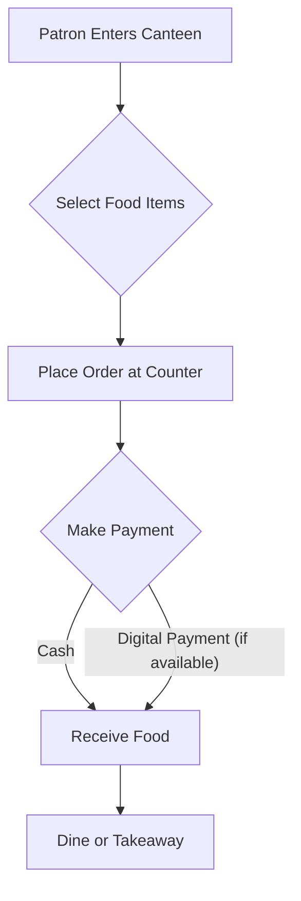

# Canteens at NIT Calicut

## Overview

Canteens at the National Institute of Technology Calicut (NIT Calicut) serve as essential facilities providing food and refreshments to students, faculty, and staff members within the campus. These establishments are an integral part of campus life, offering various meal options and snacks throughout the day. While specific details regarding the exact number, names, and operational specifics of all canteens may vary and are not always extensively documented in public sources, they generally aim to cater to diverse dietary preferences and schedules.

## Details

NIT Calicut, like most large educational institutions, operates multiple food service points in addition to the main hostel messes. These typically include:

*   **General Canteens:** Offering a range of breakfast, lunch, dinner, and snack items, often including South Indian, North Indian, and fast-food options.
*   **Specialty Outlets:** Some campuses may feature smaller kiosks or cafes specializing in specific items like beverages, bakery products, or quick snacks.

Information regarding the specific names, exact menus, pricing, and precise operating hours for each individual canteen at NIT Calicut is not consistently available in public domain sources. These details are often communicated internally within the campus community or through notice boards.

**Management:**
The canteens are generally managed by external contractors or vendors, operating under the supervision and guidelines set by the institute's administration. This oversight typically involves committees or departments responsible for student welfare, such as the Student Affairs Council or a dedicated Canteen Committee, to ensure quality, hygiene, and service standards. Specific details of the management structure are not publicly available.

## History

Specific historical details regarding the establishment, evolution, or significant milestones of individual canteens at NIT Calicut are not widely published in public sources. The presence of canteens and food outlets has been a continuous feature of the institute's infrastructure, adapting over time to meet the needs of the growing student and staff population.

## Facilities

The facilities available at canteens typically include:

*   **Seating Areas:** Providing space for patrons to dine.
*   **Serving Counters:** For ordering and collecting food.
*   **Kitchen Areas:** For food preparation.
*   **Washroom Facilities:** Often available nearby or within the canteen premises.

Specific details regarding amenities such as air conditioning, Wi-Fi availability, or seating capacity for individual canteens are not publicly available. Emphasis is generally placed on maintaining hygiene and cleanliness within the premises.

## Procedures

**Ordering and Payment:**
The typical procedure for obtaining food at canteens involves counter service. Patrons select their desired items, place an order, and make payment.

Payment methods commonly accepted include:
*   Cash
*   Digital payment platforms (e.g., UPI, mobile wallets) – specific availability varies by canteen and vendor.

Information regarding a standardized, institute-wide payment system or specific digital payment options for all canteens is not publicly available.

**Feedback and Grievance Mechanism:**
Institutions generally provide channels for students and staff to provide feedback or lodge complaints regarding food quality, hygiene, service, or pricing. However, the specific, detailed procedure for submitting and resolving grievances related to canteens at NIT Calicut is not publicly documented.

*Note: This diagram illustrates a generic canteen ordering and payment process. Specific details regarding accepted payment methods may vary by individual canteen.*

## References

Specific public references detailing the operational policies, menus, or management structures of individual canteens at NIT Calicut are not readily available. Information regarding canteen services is typically disseminated through internal campus communications, student handbooks, or notice boards within the institute.

## Related Articles
- [Food and Dining at NIT Calicut](food_and_dining.md)
- [Messes at NIT Calicut](messes.md)
- [Cafés at NIT Calicut](cafés.md)
