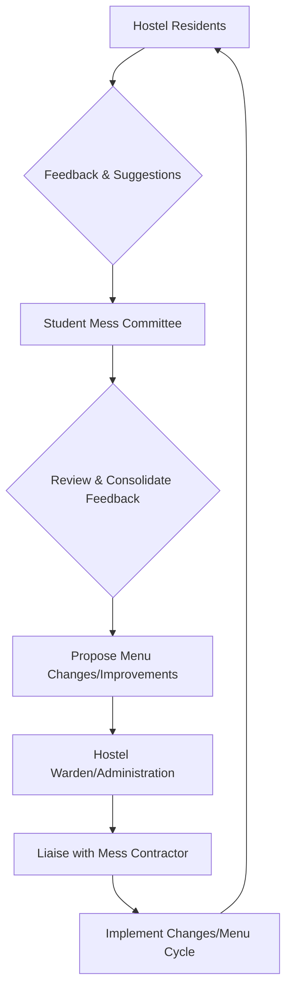

# Food and Dining at NIT Calicut

## Overview

National Institute of Technology Calicut (NIT Calicut) provides various food and dining facilities to cater to the needs of its students, faculty, and staff. The primary dining provisions for resident students are managed through hostel messes, supplemented by canteens and other food outlets located across the campus. These facilities aim to offer a range of meal options, including breakfast, lunch, and dinner, along with snacks and refreshments.

## Details

### Hostel Messes

Each hostel or a cluster of hostels at NIT Calicut typically operates a dedicated mess facility. These messes are the primary source of daily meals for resident students, providing vegetarian and, on specific days, non-vegetarian options.

*   **Meal Timings:** Specific meal timings for breakfast, lunch, and dinner are generally communicated internally to hostel residents and may vary slightly between messes or academic sessions.
*   **Menu:** Menus are designed to offer a variety of dishes, often incorporating both North Indian and South Indian cuisines. Menu cycles are typically planned to ensure variety and nutritional balance. Detailed daily or weekly menus are usually displayed within the respective mess premises and are not widely available in public sources.
*   **Student Involvement:** Student representatives, often part of a Mess Committee, are typically involved in providing feedback on food quality, hygiene, and menu planning.

### Canteens and Cafeterias

In addition to hostel messes, NIT Calicut campus hosts several canteens and cafeterias that offer a wider range of food items, snacks, beverages, and light meals. These outlets serve students, faculty, staff, and visitors.

*   **Offerings:** These facilities typically provide a la carte options, including fast food, regional snacks, beverages, and sometimes full meals, outside of the regular mess timings.
*   **Payment:** Transactions at canteens and cafeterias are generally on a pay-as-you-go basis.

### Other Food Outlets

Information regarding other specific, officially recognized food outlets or shops on campus beyond the main canteens and hostel messes is not widely available in public sources.

## History

Specific historical details regarding the evolution of food and dining facilities at NIT Calicut, including significant changes in infrastructure, policies, or service providers over time, are not widely available in public sources.

## Facilities

The following types of dining facilities are generally available on the NIT Calicut campus:

*   **Hostel Messes:** Located within or adjacent to student hostels. The exact number corresponds to the number of operational messes serving the various hostels.
*   **Central Canteen(s):** One or more central canteens are typically present, serving the broader campus community.
*   **Cafeterias/Snack Bars:** Smaller outlets providing quick bites and refreshments.

Specific names and precise locations of all individual messes, canteens, or other food outlets are generally detailed in campus maps or internal student guides.

## Procedures

### Mess Operations and Management

The management of hostel messes typically involves a collaboration between the institute's administration (e.g., Hostel Affairs, Warden), external contractors (for food preparation and service), and student representatives.

*   **Payment for Mess:** Mess charges are typically included as part of the hostel fees, payable at the beginning of each academic semester or year.
*   **Guest Meals:** Procedures for guests to dine in hostel messes, including payment and prior intimation, are generally communicated internally by hostel authorities.
*   **Hygiene and Quality Control:** The institute administration, often through the Hostel Affairs office and student committees, is responsible for overseeing hygiene standards, food quality, and contractor performance.

### Canteen and Cafeteria Operations

Canteens and cafeterias operate on a commercial basis, with payment typically made directly at the counter for items purchased. Specific operational hours are set by the respective vendors and are usually displayed at the outlets.

## References

*   National Institute of Technology Calicut Official Website (www.nitc.ac.in) - General information regarding campus facilities and student life.
    *   *Note: Specific detailed policies, menus, and operational procedures for food and dining are often communicated internally to students and may not be extensively published on the public website.*

## Related Articles
- [Messes at NIT Calicut](messes.md)
- [Canteens at NIT Calicut](canteens.md)
- [Cafés at NIT Calicut](cafés.md)
