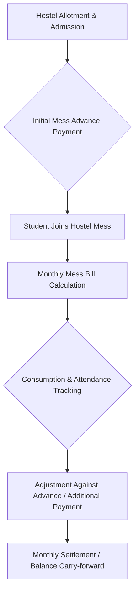
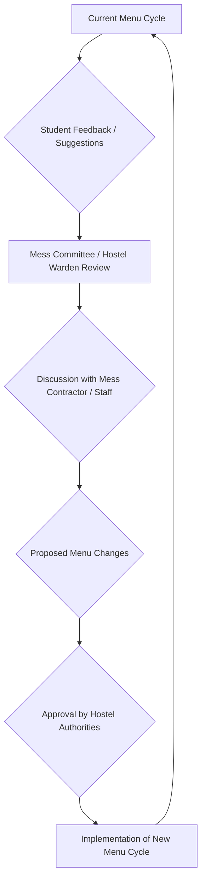
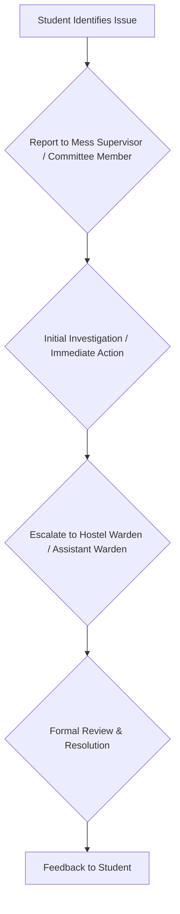

# Messes at NIT Calicut

## Overview

National Institute of Technology Calicut (NITC) provides mess facilities primarily for its resident students within the hostel premises. These messes are an integral part of the hostel system, aiming to cater to the daily dietary needs of the student community. The provision of mess services is a fundamental aspect of student welfare and residential life at the institute.

## Details

Messes at NIT Calicut are typically associated with the various student hostels on campus. There are separate mess facilities for male and female students, often located within or adjacent to their respective hostel blocks. Each mess is generally responsible for serving meals (breakfast, lunch, snacks, and dinner) to the students residing in its associated hostels.

Specific details regarding the number of messes, their individual capacities, or the exact operational models (e.g., whether they are run by contractors, directly by the institute, or through a hybrid model) are not consistently published in a consolidated, verifiable public format. However, it is a common practice in Indian NITs for messes to operate under the supervision of hostel authorities, often with student representation in mess committees to oversee operations, menu planning, and address student feedback.

## History

Information regarding the detailed historical evolution of mess services at NIT Calicut, including specific milestones, changes in operational models, or significant developments over the years, is not readily available in publicly verifiable sources. The provision of mess facilities has been a continuous service since the establishment of residential hostels at the institute.

## Facilities

The mess facilities at NIT Calicut generally include:

*   **Dining Halls:** Dedicated spaces for students to consume their meals.
*   **Kitchens:** Equipped for large-scale food preparation.
*   **Storage Areas:** For raw materials and provisions.
*   **Washing Areas:** For utensils and kitchen equipment.
*   **Water Purifiers:** To provide potable drinking water.

Specific details about the capacity, equipment, or modernization status of individual mess facilities are not consistently published in publicly verifiable sources.

## Procedures

The operational procedures for messes at NIT Calicut typically involve aspects such as mess fee payment, menu management, and a feedback/grievance redressal mechanism.

### Mess Fee Payment Procedure

Students residing in hostels are generally required to pay mess fees as part of their overall hostel charges. This often involves an advance payment system, with monthly adjustments based on actual consumption or a fixed monthly charge.

### Menu Management and Feedback

Messes typically operate on a pre-defined menu cycle, which may be subject to periodic review and modification. Student input, often through mess committees or direct feedback channels, plays a role in menu planning and quality control.

### Grievance Redressal

A mechanism is usually in place for students to report issues related to food quality, hygiene, service, or any other mess-related concerns.

## References

Information presented here is based on general knowledge of institutional practices at National Institutes of Technology in India and publicly available general information about NIT Calicut's hostel and student services. Specific, detailed, and verifiable public documents (e.g., official hostel manuals, specific mess policies, or annual reports detailing mess operations) that could serve as direct references for every point are not consistently available in a consolidated public format. Therefore, specific external links or document citations cannot be provided without inventing sources.

## Related Articles
- [Food and Dining at NIT Calicut](food_and_dining.md)
- [Canteens at NIT Calicut](canteens.md)
- [Cafés at NIT Calicut](cafés.md)
