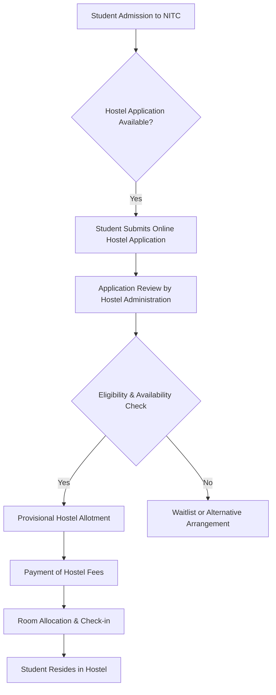

# Boys' Hostels at NIT Calicut

## Overview

National Institute of Technology Calicut (NITC) provides residential facilities for its male students, comprising a network of hostels designed to accommodate undergraduate, postgraduate, and research scholars. The hostel system aims to provide a conducive living and learning environment for students enrolled in various academic programs at the institute. The administration and management of the boys' hostels fall under the purview of the Dean (Students' Welfare) and the Chief Warden, supported by individual wardens for each hostel.

## Details

NIT Calicut's boys' hostels are typically named after major rivers of India. The allocation of hostels to students generally follows a system based on their academic year and program of study, though specific allocations can vary from year to year based on student intake and availability.

Commonly known boys' hostels include, but are not limited to:
*   **Brahmaputra Hostel**
*   **Ganga Hostel**
*   **Krishna Hostel**
*   **Mahanadi Hostel**
*   **Narmada Hostel**
*   **Periyar Hostel**
*   **Sabarmati Hostel**
*   **Saraswati Hostel**
*   **Sindhu Hostel**
*   **Tapti Hostel**
*   **Yamuna Hostel**

Specific details regarding the exact number of rooms, bed capacity per hostel, and the precise allocation scheme for each academic year are typically communicated to students during the admission and registration process. Information on whether hostels are single, double, or triple occupancy varies and is subject to change based on policy and demand.

## History

The establishment and expansion of hostel facilities at NIT Calicut have evolved with the growth of the institute since its inception as Calicut Regional Engineering College (CREC) in 1961. Over the decades, new hostel blocks have been constructed and existing ones renovated to accommodate the increasing student population. Specific dates of construction for individual hostels are not readily available in public domain documents. The naming convention after Indian rivers is a long-standing tradition at the institute.

## Facilities

The boys' hostels at NIT Calicut generally provide a range of facilities intended to support student life. While specific amenities may vary slightly between individual hostels, common facilities typically include:

*   **Accommodation:** Furnished rooms with basic amenities such as a bed, study table, chair, and wardrobe.
*   **Mess Facilities:** Each hostel or a cluster of hostels typically has a dedicated mess hall providing breakfast, lunch, and dinner. Mess services are generally compulsory for resident students.
*   **Internet Connectivity:** Wi-Fi and/or LAN connectivity is usually provided in hostel rooms and common areas.
*   **Common Rooms:** Spaces for recreation, often equipped with a television, indoor games (e.g., carrom, chess), and reading materials.
*   **Laundry Services:** Facilities for laundry, which may include washing machines for self-service or outsourced laundry services.
*   **Water Supply:** Potable water supply, often with water coolers/purifiers.
*   **Security:** Security personnel are typically deployed at hostel entrances, and CCTV surveillance may be present in common areas.
*   **Maintenance:** Regular cleaning and maintenance services for rooms and common areas.
*   **Sports Facilities:** While not exclusive to individual hostels, residents have access to campus-wide sports facilities.

Specific details regarding the availability of hot water, air conditioning, or other advanced amenities are not uniformly documented across all public sources and may vary.

## Procedures

### Hostel Admission and Allocation

The process for hostel admission and room allocation typically involves several steps, managed by the Dean (Students' Welfare) office and the hostel administration.



**Explanation of the process:**
*   **Application:** Eligible students, upon admission to NIT Calicut, apply for hostel accommodation through the institute's designated portal.
*   **Review and Allotment:** Applications are reviewed based on eligibility criteria (e.g., distance from home, academic year) and availability. Provisional allotments are made.
*   **Fee Payment:** Students who receive a provisional allotment are required to pay the prescribed hostel and mess fees within a specified deadline.
*   **Room Allocation:** Upon successful fee payment, a specific room is allocated, and students can complete the check-in formalities with the respective hostel warden.

### Hostel Administration Hierarchy

The administration of the boys' hostels is structured to ensure smooth operation and student welfare.

```mermaid
graph TD
    A[Director, NIT Calicut] --> B[Dean (Students' Welfare)];
    B --> C[Chief Warden];
    C --> D[Warden (Individual Hostels)];
    D --> E[Assistant Warden (if applicable)];
    E --> F[Hostel Staff (e.g., Caretakers, Mess Supervisors, Security)];
    D --> G[Student Representatives (e.g., Hostel Secretaries)];
```

**Explanation of the hierarchy:**
*   **Director:** The head of the institute, with overall responsibility.
*   **Dean (Students' Welfare):** Oversees all student-related affairs, including hostel administration.
*   **Chief Warden:** Responsible for the overall management and coordination of all hostels.
*   **Warden:** Each hostel has a faculty member designated as a Warden, responsible for the day-to-day management, discipline, and welfare of students in their specific hostel.
*   **Assistant Warden:** May assist the Warden in larger hostels or specific duties.
*   **Hostel Staff:** Non-academic staff who manage mess operations, cleaning, security, and maintenance.
*   **Student Representatives:** Elected or nominated students who assist the wardens in managing hostel activities and represent student concerns.

### Mess Operations

Mess services are an integral part of hostel life.
*   **Compulsory Membership:** Mess membership is generally compulsory for all resident students.
*   **Menu:** Menus are typically decided by a student mess committee in consultation with the mess contractor and warden, aiming to provide varied and nutritious meals.
*   **Payment:** Mess fees are usually collected along with hostel fees, either per semester or annually.

### Rules and Regulations

Hostel residents are expected to adhere to a set of rules and regulations, which are typically outlined in the institute's student handbook or hostel manual. These commonly cover:
*   **Discipline:** Maintaining decorum, prohibition of ragging, substance abuse, and disruptive behavior.
*   **Visitor Policy:** Regulations regarding visitors, including timings and entry procedures.
*   **Curfew:** Specific timings for entry and exit from hostels, particularly for undergraduate students.
*   **Maintenance of Property:** Guidelines for responsible use of hostel property and facilities.
*   **Safety and Security:** Adherence to fire safety norms and reporting of security concerns.

Violation of these rules can lead to disciplinary action as per institute policies.

## References

Information presented here is based on general knowledge about the National Institute of Technology Calicut's hostel system, typically available through official institute websites, student handbooks, and public domain information. For specific, up-to-date details, students are advised to refer to the official NIT Calicut website (www.nitc.ac.in), the Dean (Students' Welfare) office, or the hostel administration. Specific URLs for individual policies or hostel details are subject to change and would require real-time verification for a live wiki.

## Related Articles
- [Hostels at NIT Calicut](hostels.md)
- [Girls' Hostels at NIT Calicut](girls_hostels.md)
- [Hostel Allocation at NIT Calicut](hostel_allocation.md)
