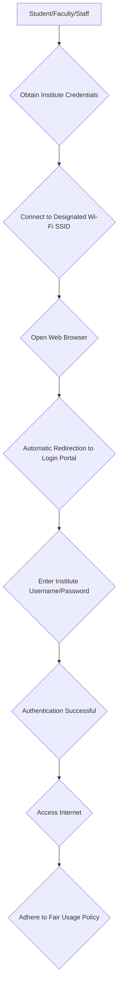

# Campus Wi-Fi at NIT Calicut

## Overview

National Institute of Technology Calicut (NIT Calicut) provides campus-wide Wi-Fi connectivity to its students, faculty, and staff. The network infrastructure is designed to facilitate academic, research, and administrative activities, offering internet access across various zones within the campus. This service aims to support digital learning, online resources, and general communication needs for the institute's community.

## Details

The campus Wi-Fi system at NIT Calicut typically operates through a centralized network managed by the institute's Computer Centre. Users are generally required to authenticate their devices to access the internet.

*   **SSIDs:** Specific Wi-Fi network names (SSIDs) may vary across different zones (e.g., academic blocks, hostels, library) or may be consolidated under a common identifier. Details regarding specific SSIDs are usually communicated to students upon admission or through official notices from the Computer Centre.
*   **Authentication:** Access to the Wi-Fi network is typically secured through an authentication process. This often involves a web-based captive portal where users log in using their institute-provided credentials (e.g., roll number/employee ID and password). Some areas might utilize WPA2-Enterprise authentication requiring specific network configurations on devices.
*   **Network Policies:** The use of campus Wi-Fi is subject to the institute's network usage policies, which generally include guidelines on fair usage, prohibition of illegal activities (such as unauthorized downloads or sharing of copyrighted material), and restrictions on certain types of network traffic to ensure equitable access and network security. Specific details of these policies are usually available through the Computer Centre or student handbooks.
*   **Bandwidth:** Specific details regarding the total network bandwidth capacity or individual user bandwidth allocations are not publicly available. The network is designed to support the concurrent usage of a large number of users across the campus.

## History

Detailed historical information regarding the evolution and specific upgrade timelines of the campus Wi-Fi infrastructure at NIT Calicut is not publicly documented. However, like most educational institutions, the network infrastructure is subject to periodic upgrades and maintenance to meet the evolving demands of digital learning and research.

## Facilities

The campus Wi-Fi infrastructure at NIT Calicut covers a wide range of areas, including:

*   **Academic Blocks:** All major academic departments and lecture halls.
*   **Central Library:** Providing internet access for research and study.
*   **Hostels:** Residential areas for students.
*   **Administrative Buildings:** Offices and administrative sections.
*   **Common Areas:** Cafeterias, student activity centers, and other public spaces.

The network comprises numerous Wi-Fi access points strategically placed across these zones, connected to a robust wired backbone network. The management and maintenance of this infrastructure are overseen by the Computer Centre. Specific technical specifications, such as the exact number of access points, hardware vendors, or detailed network architecture diagrams, are not publicly disclosed.

## Procedures

Students, faculty, and staff typically follow a set procedure to gain access to the campus Wi-Fi network. While exact steps may vary, the general process involves obtaining institute credentials and authenticating through a portal.

### Wi-Fi Access Procedure

The general procedure for connecting to the campus Wi-Fi is as follows:

1.  **Obtain Institute Credentials:** Users are provided with unique login credentials (username and password) upon admission or joining the institute. These credentials are essential for accessing various institute services, including Wi-Fi.
2.  **Connect to SSID:** On a Wi-Fi-enabled device (laptop, smartphone, tablet), select the appropriate NIT Calicut Wi-Fi network (SSID) from the list of available networks.
3.  **Login via Portal:** Upon connecting to the network, opening a web browser will typically redirect the user to a captive portal. Here, the institute credentials must be entered for authentication.
4.  **Access Internet:** Once successfully authenticated, the device gains access to the internet through the campus network.
5.  **Support:** In case of connectivity issues, forgotten passwords, or other technical difficulties, users are generally advised to contact the Computer Centre helpdesk for assistance.

## References

*   Official NIT Calicut Website (Specific pages related to Computer Centre or IT Services, if publicly available, would be listed here. As a general AI, I cannot browse live websites to verify specific URLs at the time of generation, so this section serves as a placeholder for where such references would be cited.)

## Related Articles
- [Hostels at NIT Calicut](hostels.md)
- [Boys' Hostels at NIT Calicut](boys_hostels.md)
- [Girls' Hostels at NIT Calicut](girls_hostels.md)
