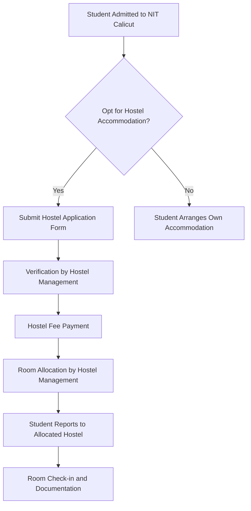

# Girls' Hostels at NIT Calicut

## Overview
The National Institute of Technology Calicut (NIT Calicut) provides residential accommodation for its female students. These hostels are designed to offer a secure and supportive living environment conducive to academic pursuits and personal development. The hostel system operates under the administration of the Institute, typically overseen by a Chief Warden and a team of Wardens.

## Details
NIT Calicut operates dedicated hostel facilities for its female student population. These facilities are generally grouped into a complex often referred to as the Ladies' Hostel or Mega Ladies' Hostel.

*   **Names:** The specific names of individual blocks within the Ladies' Hostel complex are not consistently published on the main public website. However, the collective facility is commonly known as the "Ladies' Hostel" or "Mega Ladies' Hostel."
*   **Capacity:** Specific, verifiable figures for the total capacity of the girls' hostels are not readily available in public domain sources.
*   **Room Types:** Information regarding the exact types of rooms (e.g., single, double, triple occupancy) and their distribution across different blocks is not consistently published in public sources. Room allocation typically depends on the academic year and availability.
*   **Allocation:** Hostel accommodation is generally provided to all admitted female students who opt for it, subject to availability and Institute policies. The allocation process is managed by the Hostel Management.

## History
Specific dates for the establishment of each individual girls' hostel block are not widely published in public records. However, the provision of dedicated residential facilities for female students has been an integral part of NIT Calicut's infrastructure development since its inception as a Regional Engineering College (REC Calicut) and its subsequent upgrade to NIT Calicut. The "Mega Ladies' Hostel" complex represents a significant expansion of these facilities over time to accommodate the growing student population.

## Facilities
The girls' hostels at NIT Calicut are equipped with various facilities designed to support student life. While specific details may vary between blocks or be subject to upgrades, common facilities generally include:

*   **Accommodation:** Furnished rooms typically include beds, study tables, chairs, and wardrobes.
*   **Mess:** Centralized dining facilities providing meals (breakfast, lunch, dinner) are usually available within or adjacent to the hostel complex.
*   **Common Rooms:** Areas for recreation, television, and social interaction.
*   **Reading Rooms:** Dedicated spaces for academic study.
*   **Internet Connectivity:** Wi-Fi and/or LAN connectivity is typically provided throughout the hostel premises.
*   **Laundry:** Facilities for washing clothes, which may include washing machines or designated areas for manual washing.
*   **Security:** 24/7 security personnel, CCTV surveillance, and controlled entry/exit points are generally in place.
*   **Medical Aid:** Basic first-aid facilities and access to the Institute's health center.
*   **Water Supply:** Potable water supply.
*   **Power Backup:** Generator backup for essential services during power outages.

## Procedures
The procedures for hostel admission, allocation, and daily operations are governed by the Hostel Management of NIT Calicut. These procedures are typically outlined in a comprehensive Hostel Manual or Rules and Regulations document provided to residents upon admission.

### Hostel Admission and Allocation Process
The general process for hostel admission and room allocation for new students typically follows these steps:



### Leave and Outing Procedures
Students residing in the girls' hostels are typically required to follow specific procedures for leaving the hostel premises or taking leave from the Institute. These procedures are generally in place for student safety and record-keeping.

```mermaid
graph TD
    A[Student Wishes to Leave Hostel/Campus] --> B{Short Outing (Day Leave)?};
    B -- Yes --> C[Record Entry/Exit in Register/System];
    C --> D[Return to Hostel by Designated Time];
    B -- No (Longer Leave/Outstation) --> E[Submit Leave Application to Warden/Authority];
    E --> F{Warden/Authority Approval?};
    F -- Yes --> G[Inform Parents/Guardians (if required)];
    G --> H[Record Departure in Register/System];
    H --> I[Student Leaves Hostel];
    I --> J[Student Returns to Hostel];
    J --> K[Record Return in Register/System];
    F -- No --> L[Leave Denied];
```

## References
*   National Institute of Technology Calicut Official Website: [https://www.nitc.ac.in/](https://www.nitc.ac.in/)
*   NIT Calicut Hostel Management Section (specific link may vary or be embedded within student affairs pages): [https://www.nitc.ac.in/](https://www.nitc.ac.in/)

## Related Articles
- [Hostels at NIT Calicut](hostels.md)
- [Boys' Hostels at NIT Calicut](boys_hostels.md)
- [Hostel Allocation at NIT Calicut](hostel_allocation.md)
