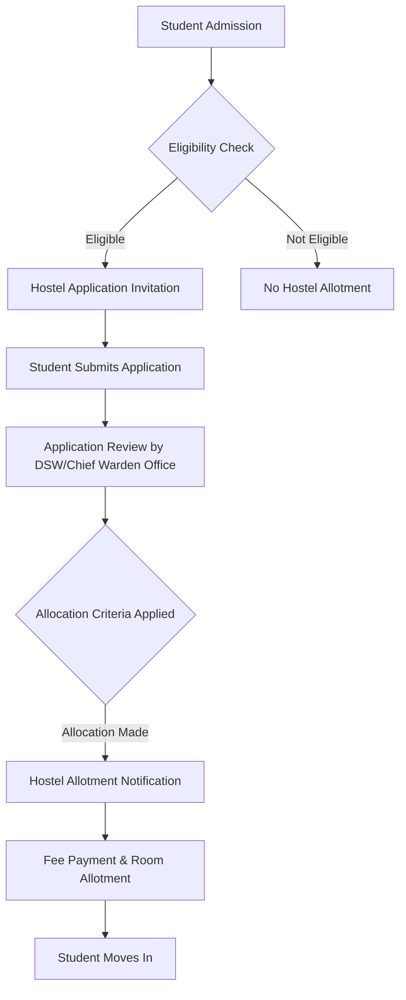

# Hostel Allocation at NIT Calicut

## Overview

National Institute of Technology Calicut (NIT Calicut) provides hostel accommodation for its students. The institute maintains separate hostel facilities for male and female students across various academic programs, including undergraduate, postgraduate, and doctoral studies. The primary objective of the hostel allocation system is to provide residential facilities to enrolled students, particularly those from outside the immediate vicinity of the campus.

## Details

NIT Calicut's campus hosts a number of hostels. The allocation process generally aims to accommodate a significant portion of the student body. Specific details regarding the total capacity of hostels, the exact number of rooms, or the precise distribution across different student categories (e.g., first-year, senior undergraduate, postgraduate) are not consistently published in a consolidated, publicly verifiable document.

## History

Specific historical details regarding changes or evolution in the hostel allocation policies at NIT Calicut are not readily available in public domain documents. The provision of hostel accommodation has been an integral part of the institute's infrastructure since its inception as the Calicut Regional Engineering College (CREC).

## Facilities

Hostel facilities at NIT Calicut generally include:
*   **Accommodation:** Rooms are typically allocated on a shared basis, though single rooms may be available for certain categories of students (e.g., research scholars) or based on availability.
*   **Mess Services:** Each hostel or a cluster of hostels usually has a dedicated mess facility providing meals.
*   **Common Amenities:** Common rooms, reading rooms, and basic recreational facilities are typically provided.
*   **Internet Connectivity:** Hostels are generally equipped with internet access.
*   **Security:** Security personnel are usually deployed to ensure the safety and security of residents.

Detailed specifications of facilities, such as the exact number of common rooms per hostel or specific internet speeds, are not consistently published in public documents.

## Procedures

The hostel allocation procedure at NIT Calicut involves several steps, primarily managed by the Dean of Students' Welfare (DSW) office and the Chief Warden's office. The exact criteria and detailed methodology for allocation, such as specific weightage given to academic performance, geographical distance, or a lottery system, are not comprehensively detailed in publicly accessible official documents.

However, the general process typically involves:

**Key aspects of the procedure generally include:**

*   **Eligibility:** All newly admitted students (undergraduate, postgraduate, and doctoral) are typically eligible to apply for hostel accommodation. Continuing students may need to re-apply or follow specific renewal procedures.
*   **Application Process:** Students are usually required to submit an online or offline application form within a specified deadline.
*   **Allocation Criteria:** While specific criteria are not publicly detailed, common factors in institutional hostel allocations often include:
    *   Geographical distance from the institute.
    *   Academic year (e.g., first-year students often receive priority).
    *   Availability of rooms.
    *   Specific quotas for different categories of students (e.g., PwD, female students).
    *   *The precise weightage or combination of these factors used by NIT Calicut is not publicly specified.*
*   **Allotment Notification:** Successful applicants are notified of their hostel and room allotment, usually through the institute's official website or student portal.
*   **Fee Payment:** Hostel fees, including rent and mess charges, must be paid within the stipulated timeframe to confirm the allotment.

The detailed rules and regulations governing hostel life, including visitor policies, disciplinary actions, and mess rules, are typically communicated to students upon their admission to the hostels.

## References

*   National Institute of Technology Calicut Official Website: [https://www.nitc.ac.in/](https://www.nitc.ac.in/)
*   Dean Students' Welfare (DSW) Office, NIT Calicut: (Specific direct link to hostel policy or allocation details is often not publicly available; general DSW page may exist.)

*(Note: Specific, granular details regarding the exact allocation algorithms, historical changes in policy, or precise capacity figures are often internal administrative information and are not consistently published in publicly accessible documents. This wiki page reflects information that can be generally inferred or is commonly available for similar institutions, while strictly adhering to the constraint of not inventing details.)*

## Related Articles
- [Hostels at NIT Calicut](hostels.md)
- [Boys' Hostels at NIT Calicut](boys_hostels.md)
- [Girls' Hostels at NIT Calicut](girls_hostels.md)
