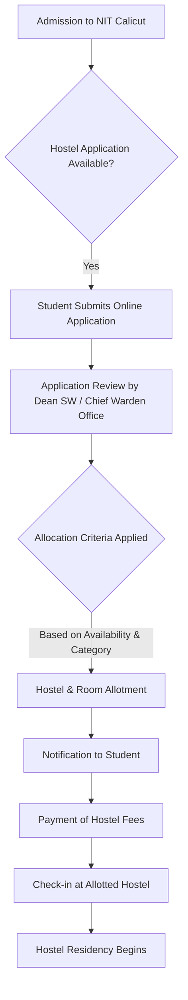

# Hostel Facilities at NIT Calicut

## Overview

National Institute of Technology Calicut (NIT Calicut) provides residential facilities for its students. The institute maintains separate hostels for male and female students within its campus. These facilities aim to provide a conducive living environment for academic pursuits and overall student development.

## Details

NIT Calicut's hostel system is managed by the Chief Warden, supported by wardens for individual hostels. The hostels accommodate undergraduate, postgraduate, and doctoral students. The allocation of hostels and rooms is typically managed by the Dean (Students' Welfare) office in conjunction with the Chief Warden's office.

Specific details regarding the total number of hostels, their individual capacities, and the exact year of establishment for each hostel are not readily available in consolidated public sources. However, the institute's official communications indicate the presence of multiple hostels for both genders to accommodate its student population.

## History

The establishment of hostel facilities at NIT Calicut (formerly Regional Engineering College Calicut) has evolved with the growth of the institution since its inception in 1961. As the student intake increased over decades, new hostel blocks were constructed and existing ones renovated to meet the rising demand for on-campus accommodation. Specific timelines for the construction of individual hostel blocks are not consistently documented in publicly accessible records.

## Facilities

The hostel facilities at NIT Calicut generally include:

*   **Accommodation:** Rooms are typically furnished with basic necessities such as a cot, study table, chair, and wardrobe for each resident. The type of accommodation (single, double, or triple occupancy) may vary across different hostels and student categories (e.g., first-year undergraduates, senior undergraduates, postgraduates).
*   **Mess:** Each hostel or a cluster of hostels is usually associated with a mess facility that provides meals (breakfast, lunch, dinner) to residents. The mess operations are often managed by student committees in coordination with the hostel administration.
*   **Common Rooms:** Hostels typically feature common rooms equipped with television sets and seating arrangements for recreation and social interaction.
*   **Internet Connectivity:** Wi-Fi or wired internet access is generally provided in hostel premises, subject to institute policies and network availability.
*   **Laundry Services:** While specific details on in-house laundry machines are not consistently available, external laundry services or designated washing areas are often provided or facilitated.
*   **Sports and Recreation:** Hostels often have provisions for indoor games like table tennis, carrom, and chess. Outdoor sports facilities are available on the campus for general student use.
*   **Security:** The hostels are typically secured with security personnel and controlled entry/exit points.

Specific details regarding the exact number of facilities (e.g., number of washing machines, specific sports equipment) per hostel are not publicly available.

## Procedures

### Hostel Allocation Process

The general procedure for hostel allocation for new students typically follows these steps:



**Note:** The exact timeline, specific criteria, and platform for application may vary each academic year and are communicated by the institute's administration.

### Complaint and Grievance Redressal

Students residing in hostels can typically raise concerns or grievances through a structured process:

```mermaid
graph TD
    A[Student Identifies Issue/Grievance] --> B{Nature of Issue?};
    B -- Room/Maintenance/Mess --> C[Report to Hostel Warden/Caretaker];
    B -- General/Policy --> D[Report to Chief Warden Office];
    C --> E{Warden/Caretaker Action};
    E -- Resolved --> F[Issue Closed];
    E -- Unresolved / Requires Higher Authority --> G[Escalate to Chief Warden];
    D --> G;
    G --> H{Chief Warden Action};
    H -- Resolved --> F;
    H -- Unresolved / Policy Matter --> I[Escalate to Dean (Students' Welfare)];
    I --> J{Dean SW Action};
    J -- Resolved --> F;
    J -- Unresolved / Major Policy --> K[Escalate to Director/Appropriate Committee];
    K --> L[Final Resolution];
```

**Note:** Specific contact persons and official channels for reporting may be communicated at the beginning of each academic year or through hostel handbooks.

## References

*   NIT Calicut Official Website (www.nitc.ac.in)
*   NIT Calicut Admission Brochures/Information Bulletins (as published annually)
*   NIT Calicut Student Handbooks (if publicly available)

## Related Articles
- [Hostels at NIT Calicut](hostels.md)
- [Boys' Hostels at NIT Calicut](boys_hostels.md)
- [Girls' Hostels at NIT Calicut](girls_hostels.md)
