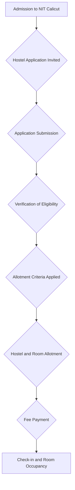
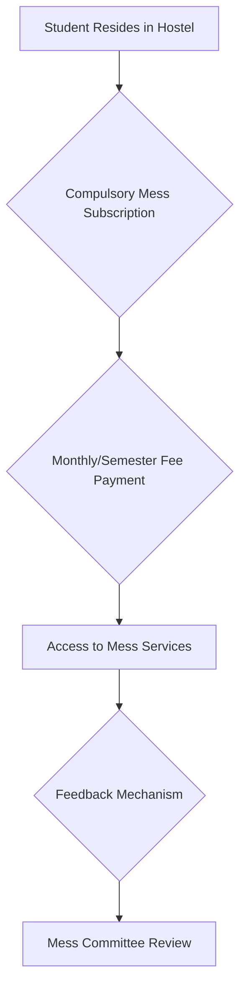

# Hostels at NIT Calicut

## Overview

Hostels are an integral part of the residential campus experience at the National Institute of Technology Calicut (NITC). They provide accommodation for a significant portion of the student body, including undergraduate (B.Tech), postgraduate (M.Tech, MBA, MCA, M.Sc.), and doctoral (Ph.D.) students. The institute maintains separate hostel facilities for male and female students. The hostel system aims to provide a conducive environment for academic pursuits and holistic development, fostering a sense of community among residents.

## Details

NIT Calicut operates a number of hostels to accommodate its diverse student population. These hostels are typically categorized to house students based on their academic year or program of study.

*   **Gender Segregation:** Separate hostels are designated for male and female students.
*   **Academic Year/Program Based Allotment:** Students may be allotted hostels based on their year of study (e.g., first-year students often have dedicated hostels) or their academic program (e.g., postgraduate students).
*   **Number of Hostels:** The exact number and names of all hostels may vary over time due to new constructions, renovations, or administrative re-designations. A comprehensive, publicly verifiable list of all current hostels and their specific capacities is not consistently available in a single public document.
*   **Room Types:** Rooms typically include single, double, or triple occupancy, varying by hostel and availability.

## History

The establishment and expansion of hostel facilities at NIT Calicut have generally paralleled the growth and development of the institute itself since its inception as Calicut Regional Engineering College (CREC) in 1961. As student intake increased and new academic programs were introduced, additional hostel blocks were constructed to meet the growing demand for on-campus accommodation. Specific dates for the construction of individual hostel blocks are generally documented in internal institute records rather than widely published public sources.

## Facilities

Hostel facilities at NIT Calicut are designed to cater to the basic needs of resident students. While specific amenities may vary slightly between different hostels, common facilities typically include:

*   **Accommodation:** Furnished rooms with basic furniture such as a cot, study table, chair, and wardrobe.
*   **Mess/Dining:** Each hostel or a cluster of hostels usually has a dedicated mess facility providing breakfast, lunch, and dinner. Mess services are generally compulsory for residents.
*   **Common Rooms:** Spaces for recreation and interaction, often equipped with televisions, indoor games, and reading areas.
*   **Internet Connectivity:** Wi-Fi and/or wired LAN internet access is typically provided in hostel premises.
*   **Laundry:** Laundry services are generally available, either through external service providers operating within the hostel premises or self-service options.
*   **Water Supply:** Potable water supply, often including filtered drinking water facilities.
*   **Security:** 24/7 security personnel, CCTV surveillance in common areas, and controlled entry/exit points.
*   **Maintenance:** Regular cleaning and maintenance of common areas and basic room repairs.
*   **Medical Aid:** Access to basic first aid and proximity to the institute's health center.

## Procedures

### Hostel Admission and Allotment

The process for hostel admission and room allotment typically follows a structured procedure, primarily managed by the Dean (Students' Welfare) office and the Chief Warden/Wardens.

**Explanation of Flow:**

*   **Admission to NIT Calicut:** Eligibility for hostel accommodation is contingent upon admission to an academic program at NIT Calicut.
*   **Hostel Application Invited:** The institute's administration, usually through the Dean (Students' Welfare) office, announces the application period for hostel accommodation.
*   **Application Submission:** Eligible students submit their applications, often through an online portal.
*   **Verification of Eligibility:** Applications are screened to ensure applicants meet the criteria for hostel residency.
*   **Allotment Criteria Applied:** Allotment is typically based on factors such as academic year, program, gender, and sometimes distance from home or specific quotas.
*   **Hostel and Room Allotment:** Students are assigned to a specific hostel and room.
*   **Fee Payment:** Hostel and mess fees must be paid as per the institute's schedule.
*   **Check-in and Room Occupancy:** Upon successful payment and completion of formalities, students can check into their allotted rooms.

### Mess Operations

Mess services are generally compulsory for hostel residents.

**Explanation of Flow:**

*   **Student Resides in Hostel:** All students residing in hostels are typically required to subscribe to the mess services.
*   **Monthly/Semester Fee Payment:** Mess fees are collected along with hostel fees, either monthly or per semester.
*   **Access to Mess Services:** Residents are provided meals (breakfast, lunch, dinner) as per the mess schedule.
*   **Feedback Mechanism:** Students often have avenues to provide feedback on food quality and services.
*   **Mess Committee Review:** A student-faculty mess committee typically reviews feedback and oversees mess operations.

### Rules and Regulations

Hostel residents are expected to adhere to a set of rules and regulations designed to maintain discipline, safety, and a conducive living environment. These typically cover aspects such as:

*   **Timings:** Entry and exit timings, especially for female hostels.
*   **Visitors:** Regulations regarding visitors to hostel rooms and common areas.
*   **Discipline:** Prohibitions against ragging, substance abuse, noise pollution, and any disruptive behavior.
*   **Maintenance of Property:** Guidelines for the proper use and care of hostel property.
*   **Safety:** Adherence to fire safety norms and other security protocols.

Detailed rules and regulations are typically provided to students upon admission to the hostel and are available on the institute's official website or hostel notice boards.

## References

*   Official website of National Institute of Technology Calicut (www.nitc.ac.in)
    *   *Note: Specific pages related to hostels, rules, and procedures are generally found under the "Students" or "Academics" sections of the official website and are subject to updates by the institute administration.*

## Related Articles
- [Boys' Hostels at NIT Calicut](boys_hostels.md)
- [Girls' Hostels at NIT Calicut](girls_hostels.md)
- [Hostel Allocation at NIT Calicut](hostel_allocation.md)
