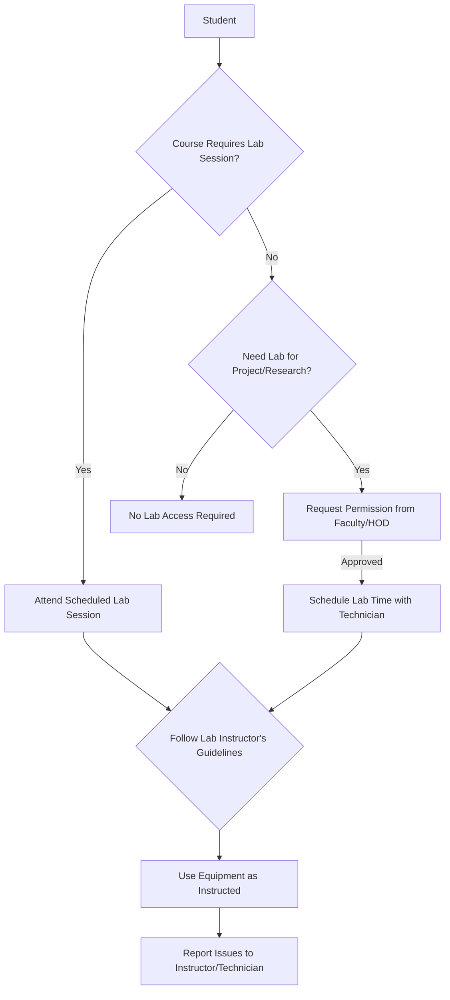

# Academic Buildings at NIT Calicut

## Overview

The National Institute of Technology Calicut (NITC) campus houses a range of academic buildings designed to support its various engineering, architecture, and management departments, as well as central academic services. These buildings provide spaces for classrooms, laboratories, faculty offices, research facilities, and administrative functions essential for the institute's educational and research mandates. The academic infrastructure is distributed across the campus, facilitating specialized learning and interdisciplinary collaboration.

## Details

The academic infrastructure at NIT Calicut primarily consists of dedicated buildings for each academic department, along with central facilities that serve the entire student and faculty community.

**Departmental Buildings:**
Each major academic department at NIT Calicut typically occupies a dedicated building or a significant portion of a multi-departmental block. These buildings house classrooms, specialized laboratories, faculty cabins, departmental offices, and seminar halls relevant to their respective disciplines.

*   **Department of Architecture:** Houses studios, labs, and lecture halls specific to architectural education.
*   **Department of Chemical Engineering:** Contains chemical process labs, research facilities, and classrooms.
*   **Department of Civil Engineering:** Features structural engineering labs, transportation labs, environmental engineering labs, and surveying facilities.
*   **Department of Computer Science and Engineering:** Includes various computer labs, research labs, and lecture halls.
*   **Department of Electrical Engineering:** Equipped with electrical machinery labs, power systems labs, electronics labs, and research facilities.
*   **Department of Electronics and Communication Engineering:** Houses communication labs, VLSI labs, signal processing labs, and embedded systems labs.
*   **Department of Mechanical Engineering:** Contains workshops, thermal engineering labs, fluid mechanics labs, manufacturing labs, and design studios.
*   **Department of Materials Science and Engineering:** Features materials characterization labs, processing labs, and research facilities.
*   **Department of Mathematics:** Primarily houses faculty offices, classrooms, and computational labs.
*   **Department of Physics:** Includes optics labs, solid-state physics labs, and general physics labs.
*   **Department of Chemistry:** Features organic, inorganic, and physical chemistry labs.
*   **School of Management Studies (SOMS):** Dedicated facilities for management education, including lecture halls, discussion rooms, and computer labs.

**Central Academic Facilities:**

*   **Central Library:** A multi-storey building housing a vast collection of books, journals, e-resources, and digital learning facilities. It includes reading halls, discussion rooms, and computer terminals for accessing online databases.
*   **Computer Centre:** Provides centralized computing facilities, high-speed internet access, and specialized software for academic and research purposes. It typically houses multiple computer labs accessible to students.
*   **Lecture Hall Complex (LHC):** A dedicated complex comprising multiple large lecture halls equipped with audio-visual aids, designed to accommodate large batches of students for common courses and institute-level events.
*   **Central Research Facility (CRF):** Houses advanced research equipment and instrumentation shared across various departments to facilitate interdisciplinary research.
*   **Centre for Innovation, Entrepreneurship & Venture Development (CIEVD):** Provides incubation facilities, co-working spaces, and mentorship for student and faculty startups.

Specific construction dates, exact square footage, or detailed architectural specifications for individual academic buildings are generally not publicly disseminated by the institute.

## History

The National Institute of Technology Calicut, formerly known as Calicut Regional Engineering College (CREC), was established in 1961. The initial academic infrastructure was developed to support the foundational engineering disciplines. Over the decades, as the institute grew in stature and expanded its academic offerings, new departmental buildings and central facilities were added.

*   **1961:** Establishment of Calicut Regional Engineering College (CREC). Initial academic blocks were constructed to house the core engineering departments.
*   **1980s - 1990s:** Expansion of departmental facilities and establishment of central amenities like the Central Library and Computer Centre to cater to increasing student intake and new programs.
*   **2002:** Upgradation to National Institute of Technology (NIT) status, leading to further infrastructure development and modernization to meet the demands of a national-level institution.
*   **2000s - Present:** Continuous development and renovation of academic buildings, including the establishment of new departments (e.g., Materials Science and Engineering) and specialized research centers, as well as the construction of facilities like the Lecture Hall Complex and Central Research Facility to enhance teaching and research capabilities.

The evolution of academic buildings at NIT Calicut reflects the institute's growth from a regional engineering college to a premier national technical institution.

## Facilities

Academic buildings at NIT Calicut are equipped with a range of facilities to support teaching, learning, and research. While specific facilities vary by department and building, common provisions include:

*   **Classrooms:** Equipped with blackboards/whiteboards, projectors, and seating arrangements. Many are smart classrooms with advanced audio-visual equipment.
*   **Laboratories:** Specialized labs for practical sessions, experiments, and research, tailored to the requirements of each engineering discipline (e.g., CAD labs, VLSI labs, fluid mechanics labs, chemistry labs).
*   **Faculty Offices:** Individual or shared offices for faculty members.
*   **Seminar Halls/Conference Rooms:** Spaces for presentations, workshops, and departmental meetings.
*   **Computer Labs:** General-purpose computer labs with internet access and specialized software.
*   **Research Facilities:** Dedicated spaces for advanced research, often housing sophisticated equipment.
*   **Departmental Libraries:** Smaller collections of books and journals specific to the department's discipline.
*   **Student Common Rooms:** Designated areas for students to relax or collaborate.

Detailed, building-specific lists of all facilities, including specific equipment models or room numbers, are not publicly available.

## Procedures

Access and usage procedures for academic buildings and their facilities are generally managed at the departmental or central facility level. These procedures are typically communicated to students and faculty through internal channels, departmental notices, or facility-specific guidelines.

**General Access to Academic Buildings:**
Academic buildings are generally accessible during working hours on weekdays. Access outside these hours, especially to specialized labs or research facilities, may require specific permissions.

**Procedure for Accessing Central Library Resources:**

```mermaid
graph TD
    A[Student/Faculty Member] --> B{Possess Valid NITC ID Card?};
    B -- Yes --> C[Enter Library Premises];
    C --> D{Locate Resource (Book/Journal/Computer)};
    D -- Book/Journal --> E[Issue/Return at Circulation Desk];
    D -- Computer/E-resource --> F[Use Designated Terminals/Access Online Databases];
    E --> G[Adhere to Library Rules];
    F --> G;
    B -- No --> H[Obtain Valid ID Card];
    H --> A;
```

**Procedure for Lab Usage (General Example):**



Specific procedures for booking seminar halls, accessing specialized research equipment, or using departmental computer labs are typically managed by the respective department or facility in-charge and are communicated internally.

## References

*   National Institute of Technology Calicut Official Website: [https://www.nitc.ac.in/](https://www.nitc.ac.in/)
    *   (Specific sections like "Departments," "Infrastructure," "About Us," and "Central Facilities" provide general information.)

## Related Articles
- [Buildings at NIT Calicut](buildings.md)
- [Lecture Halls at NIT Calicut](lecture_halls.md)
- [Laboratories at NIT Calicut](laboratories.md)
