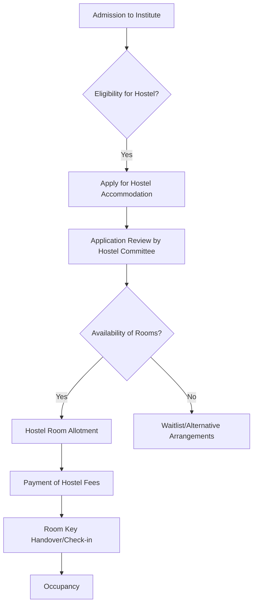

# Buildings at NIT Calicut

## Overview

The National Institute of Technology Calicut (NIT Calicut), formerly known as Regional Engineering College Calicut (RECC), is situated on a sprawling campus in Chathamangalam, Kerala. The campus infrastructure comprises a diverse range of buildings designed to support academic, administrative, residential, recreational, and support services for students, faculty, and staff. The architecture generally reflects a blend of functional design with consideration for the local climate and environment, often incorporating green spaces and open areas.

The buildings are broadly categorized by their primary function:
*   **Academic Blocks:** Housing departments, lecture halls, laboratories, and research facilities.
*   **Administrative Blocks:** Containing offices for the Director, Registrar, various administrative departments, and financial services.
*   **Residential Blocks:** Primarily student hostels, but also includes faculty and staff quarters, and a guest house.
*   **Central Facilities:** Such as the Central Library, Computer Centre, Auditorium, and Health Centre.
*   **Recreational and Support Facilities:** Including the Students' Activity Centre, sports complex, canteens, and essential services.

## Details

Specific details regarding the exact number, names, and precise specifications of every building are extensive and often maintained internally by the institute's estate office. However, the campus features several key categories of structures:

*   **Academic Buildings:** Each major engineering and science department typically has its own dedicated block or shares facilities within larger academic complexes. These include specialized laboratories for various disciplines (e.g., civil engineering labs, mechanical workshops, electrical machines labs, computer labs, chemistry labs, physics labs), lecture theatres, seminar halls, and faculty offices.
*   **Administrative Building:** Houses the main administrative offices, including the Director's office, Registrar's office, academic section, examination section, finance and accounts, and other support services crucial for the institute's operation.
*   **Central Library:** A multi-storey building providing access to a vast collection of books, journals, periodicals, and digital resources. It typically includes reading rooms, reference sections, and computer terminals for accessing e-resources.
*   **Hostels:** Separate hostel complexes are provided for male and female students. Each complex usually consists of multiple blocks, often named (e.g., A, B, C, D, etc., or by specific names). Hostels typically include individual rooms or shared accommodation, common rooms, study areas, and mess facilities.
*   **Auditorium/Convention Centre:** A large facility used for convocations, cultural events, conferences, and major institute gatherings.
*   **Health Centre:** Provides basic medical services, first aid, and consultation for students and staff.
*   **Sports Complex:** Includes facilities for indoor games (e.g., badminton, table tennis, gymnasium) and access to outdoor sports grounds (e.g., football, cricket, basketball, volleyball courts).
*   **Guest House:** Provides accommodation for visiting faculty, guests, and parents.
*   **Shopping Complex/Canteens:** Facilities for daily necessities, stationery, and various food outlets.

## History

NIT Calicut was established in 1961 as Regional Engineering College Calicut (RECC), making it one of the earliest Regional Engineering Colleges in India. The initial campus development and construction of its foundational buildings began shortly after its inception. Over the decades, the institute has undergone significant expansion and modernization.

*   **Early Phases (1960s-1980s):** The initial academic blocks, administrative offices, and student hostels were constructed to establish the core infrastructure of the college. These buildings often reflected the architectural styles prevalent during that period for educational institutions in India.
*   **Growth and Expansion (1990s-2000s):** With increasing student intake and the introduction of new academic programs, further construction phases added more departmental blocks, research facilities, and residential units. The institute was upgraded to a National Institute of Technology (NIT) in 2002, which spurred further infrastructure development to meet the demands of its new status.
*   **Modernization (2010s-Present):** Recent years have seen the construction of modern facilities, renovation of older blocks, and emphasis on sustainable building practices. This includes new academic centres, advanced laboratories, and improved residential and recreational amenities.

Detailed construction timelines and architectural specifics for individual buildings are generally documented in the institute's archives and are not always publicly consolidated.

## Facilities

The buildings at NIT Calicut are equipped with various facilities to support the academic and residential needs of the community:

*   **Classrooms and Lecture Halls:** Equipped with audio-visual aids, projectors, and seating arrangements suitable for lectures and interactive sessions.
*   **Laboratories:** Specialized labs for each engineering and science discipline, housing equipment relevant to practical coursework, research, and project work.
*   **Computer Centres:** Providing access to high-performance computing resources, software, and internet connectivity.
*   **Library:** Offers extensive print and digital collections, including access to online databases, e-journals, and research tools. Reading rooms are available for individual and group study.
*   **Hostel Amenities:** Hostels typically provide furnished rooms, common rooms with recreational facilities (e.g., TV, indoor games), Wi-Fi connectivity, laundry services, and mess facilities offering daily meals.
*   **Sports Facilities:** Indoor stadiums, gymnasiums, and outdoor courts for various sports.
*   **Health Centre:** Equipped for basic medical examinations, first aid, and dispensing common medicines.
*   **Auditorium/Seminar Halls:** Equipped with sound systems and projection facilities for events, presentations, and workshops.
*   **Accessibility:** Efforts are made to ensure accessibility for persons with disabilities in newer constructions and through modifications in older buildings, though specific details on universal design implementation across all buildings are not publicly consolidated.

## Procedures

Procedures related to buildings primarily involve maintenance, allocation, and usage. While specific forms and departmental contacts may vary, the general processes are outlined below.

### Building Maintenance Request Process

Students, faculty, or staff encountering issues with building infrastructure (e.g., electrical faults, plumbing issues, structural damage) typically follow a defined procedure to report and resolve them.

```mermaid
graph TD
    A[Identify Maintenance Issue] --> B{Is it an emergency?};
    B -- Yes --> C[Contact Estate Office/Security Immediately];
    B -- No --> D[Submit Online/Offline Maintenance Request Form];
    D --> E[Request Received by Estate Office];
    E --> F{Prioritization and Assignment};
    F --> G[Maintenance Team Dispatched];
    G --> H[Issue Rectified];
    H --> I[Verification/Feedback (if applicable)];
    I --> J[Request Closed];
```

**Explanation:**
1.  **Identify Maintenance Issue:** An individual notices a problem with a building or its facilities.
2.  **Emergency Check:** Determine if the issue requires immediate attention (e.g., major water leak, electrical short circuit, fire hazard).
3.  **Emergency Contact:** For emergencies, the Estate Office or campus security is contacted directly for rapid response.
4.  **Submit Request:** For non-emergency issues, a formal request is submitted, often through an online portal or a physical form at the Estate Office.
5.  **Request Received:** The Estate Office logs the request.
6.  **Prioritization and Assignment:** The request is assessed, prioritized based on urgency and impact, and assigned to the relevant maintenance team (e.g., electrical, plumbing, civil).
7.  **Team Dispatched:** The maintenance team visits the location to address the issue.
8.  **Issue Rectified:** The problem is resolved.
9.  **Verification/Feedback:** In some cases, the requester may be asked to verify the resolution or provide feedback.
10. **Request Closed:** The maintenance request is formally closed.

### Hostel Allotment Process (General)

The process for allocating hostel rooms to students is typically managed by the Dean (Students' Welfare) office or a dedicated Hostel Affairs Committee.



**Explanation:**
1.  **Admission to Institute:** Students are first admitted to NIT Calicut.
2.  **Eligibility Check:** Students verify their eligibility for hostel accommodation (e.g., distance from home, specific quotas).
3.  **Apply for Accommodation:** Eligible students submit an application for hostel accommodation, usually online.
4.  **Application Review:** The Hostel Committee or relevant authority reviews applications based on established criteria.
5.  **Room Availability:** The committee assesses the availability of rooms.
6.  **Allotment:** If rooms are available and the student meets criteria, a hostel room is allotted.
7.  **Waitlist/Alternatives:** If rooms are unavailable, students may be placed on a waitlist or advised on alternative arrangements.
8.  **Fee Payment:** Allotted students proceed with the payment of hostel fees.
9.  **Check-in:** Upon fee payment, students are provided with room keys and complete the check-in formalities.
10. **Occupancy:** Students move into their allotted rooms.

## References

Information regarding the buildings at NIT Calicut is primarily derived from:

*   The official website of NIT Calicut (www.nitc.ac.in).
*   Annual reports and institutional documents published by NIT Calicut.
*   Publicly available campus maps and infrastructure development plans.
*   News archives and press releases related to campus development.

Specific detailed blueprints, construction timelines, or internal operational manuals for individual buildings are typically not publicly disseminated.

## Related Articles
- [Academic Buildings at NIT Calicut](academic_buildings.md)
- [Lecture Halls at NIT Calicut](lecture_halls.md)
- [Laboratories at NIT Calicut](laboratories.md)
