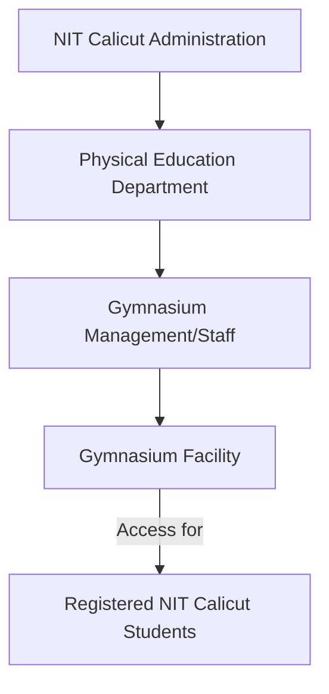

# Gymnasium at NIT Calicut

## Overview
The Gymnasium at the National Institute of Technology Calicut (NIT Calicut) is a facility provided for the physical well-being and fitness of the institute's students. It is part of the broader sports infrastructure available on campus, aimed at promoting a healthy lifestyle and providing opportunities for physical exercise.

## Details
The gymnasium operates under the purview of the Physical Education Department of NIT Calicut, which oversees the institute's sports and fitness facilities. It is intended to serve both male and female students of the institute. Specific operational details such as daily timings, peak hours, or detailed management policies are not publicly detailed on the official NIT Calicut website.

## History
Specific historical details regarding the establishment date of the gymnasium or significant renovation timelines are not publicly available on the official NIT Calicut website.

## Facilities
The gymnasium is officially described as "well-equipped with modern equipment for both boys and girls." While the official website confirms the presence of modern equipment, a detailed inventory of specific machines (e.g., treadmills, elliptical trainers, weightlifting stations, free weights) is not publicly listed.

## Procedures
Specific procedures for accessing the gymnasium, including membership requirements, registration processes, or detailed usage rules, are not publicly detailed on the official NIT Calicut website. Access is generally understood to be available to registered students of the institute.

Information regarding the hierarchy of management for the gymnasium is not explicitly detailed on the official website. However, it falls under the general administration of the Physical Education Department.

## References
*   National Institute of Technology Calicut – Sports Facilities. [https://nitc.ac.in/student-life/sports-facilities](https://nitc.ac.in/student-life/sports-facilities)

## Related Articles
- [Buildings at NIT Calicut](buildings.md)
- [Academic Buildings at NIT Calicut](academic_buildings.md)
- [Lecture Halls at NIT Calicut](lecture_halls.md)
