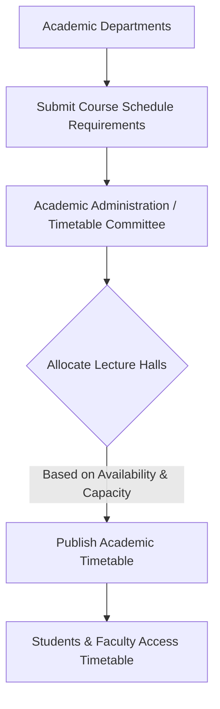

# Lecture Halls at NIT Calicut

## Overview

Lecture halls at the National Institute of Technology Calicut (NITC) serve as primary venues for academic instruction, including lectures, tutorials, and seminars for undergraduate and postgraduate programs. These facilities are distributed across various academic blocks and departmental buildings throughout the campus, supporting the diverse educational needs of the institute's numerous departments.

## Details

NIT Calicut's academic infrastructure includes a network of lecture halls designed to accommodate various class sizes. These halls are typically located within the main academic complex and individual departmental blocks.

Specific details regarding the exact number of lecture halls across the entire campus, their precise seating capacities, or individual specifications for every hall are not comprehensively detailed in publicly available official documents. However, it is understood that each academic department generally maintains dedicated or shared lecture spaces within its respective building.

Key locations housing lecture halls include:
*   **Main Academic Block:** Contains a significant number of general-purpose lecture halls.
*   **Departmental Blocks:** Each engineering and architecture department (e.g., Civil Engineering, Mechanical Engineering, Electrical Engineering, Electronics & Communication Engineering, Computer Science & Engineering, Chemical Engineering, Architecture, Biotechnology, Materials Science and Engineering, etc.) typically houses lecture halls specific to its academic programs.
*   **School of Management Studies (SOMS) Block:** Includes lecture facilities for management courses.

## History

The development of lecture hall facilities at NIT Calicut is intrinsically linked to the overall growth and expansion of the institute's academic infrastructure since its establishment as Calicut Regional Engineering College (CREC) in 1961 and its subsequent elevation to NIT status in 2002.

New academic blocks and departmental buildings have been constructed periodically to accommodate increasing student intake and the introduction of new academic programs. Each new construction or major renovation project often includes the integration or upgrade of lecture hall facilities. Specific dates for the construction or renovation of individual lecture halls are not publicly documented.

## Facilities

Lecture halls at NIT Calicut are generally equipped with standard academic presentation and teaching aids. While specific amenities may vary between older and newer facilities, common provisions typically include:

*   **Projection Systems:** Most lecture halls are equipped with LCD projectors and screens for digital presentations.
*   **Writing Surfaces:** Whiteboards or blackboards are standard features.
*   **Seating:** Fixed or movable seating arrangements are provided, varying in capacity.
*   **Audio Systems:** Basic public address systems with microphones are common in larger halls.
*   **Internet Connectivity:** Access to the campus Wi-Fi network is generally available within academic buildings.

The availability of advanced facilities such as air conditioning, interactive smart boards, or specialized audio-visual equipment may vary by hall, with newer or renovated halls often featuring more modern amenities. Comprehensive, publicly verifiable details on the specific facilities of every lecture hall are not available.

## Procedures

The primary use of lecture halls at NIT Calicut is for scheduled academic classes as per the institute's academic timetable.

**Class Scheduling Process:**
The allocation of lecture halls for regular academic courses follows an internal scheduling process managed by the academic administration, often in coordination with individual departments. This process ensures that all courses have designated spaces and times.

**Ad-hoc Usage:**
For events such as guest lectures, workshops, or student club activities, lecture halls may be booked on an ad-hoc basis. The specific procedure for requesting and booking lecture halls for non-scheduled events typically involves submitting a formal request to the relevant departmental head or the academic administration. Detailed, publicly verifiable procedures for students or external entities to book specific lecture halls are not readily available. It is generally understood that such requests are subject to availability and approval by the competent authority.

## References

*   National Institute of Technology Calicut Official Website: [https://www.nitc.ac.in/](https://www.nitc.ac.in/)
*   (Further specific references to official documents detailing lecture hall facilities would be listed here if available.)

## Related Articles
- [Buildings at NIT Calicut](buildings.md)
- [Academic Buildings at NIT Calicut](academic_buildings.md)
- [Laboratories at NIT Calicut](laboratories.md)
