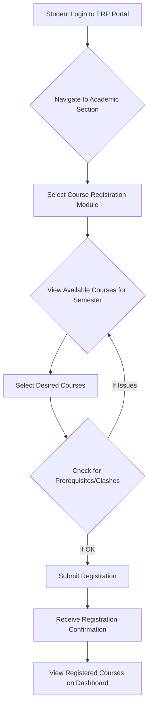
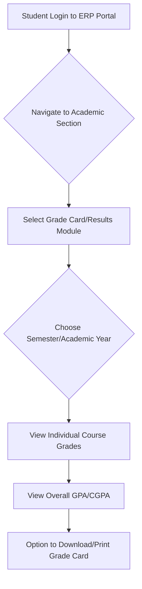

# ERP Portal of NIT Calicut

## Overview

The ERP (Enterprise Resource Planning) Portal of the National Institute of Technology Calicut (NIT Calicut) is a centralized online system designed to manage and integrate various academic and administrative functions of the institute. It serves as a digital interface for students, faculty, and administrative staff to access and manage information related to their respective roles within the institution. The portal aims to streamline operations, enhance communication, and provide efficient access to essential services.

## Details

The ERP Portal at NIT Calicut functions as a comprehensive platform, consolidating data and processes that were traditionally handled manually or through disparate systems. Its primary objective is to create a unified digital environment for the institute's stakeholders.

**Access:**
The portal is typically accessed via a web browser using a dedicated URL provided by the institute. Users are required to log in with their unique credentials (e.g., roll number/employee ID and password) to gain access to personalized dashboards and functionalities.

**Core Functions (General):**
While specific module names and functionalities may vary and are subject to internal configuration, the ERP portal is generally understood to facilitate a range of functions common to educational ERP systems. These typically include:
*   **Academic Management:** Course registration, timetable viewing, grade card access, academic calendar, attendance tracking.
*   **Student Services:** Fee payment, hostel application and allocation, personal profile management, grievance submission.
*   **Faculty Services:** Course management, grade entry, attendance marking, leave applications.
*   **Administrative Services:** Human resources, finance, inventory management (backend operations, not always directly accessible to students).

**Technology Platform:**
Specific details regarding the underlying technology platform or vendor (e.g., in-house development, commercial off-the-shelf software) used for the NIT Calicut ERP Portal are not publicly disclosed.

## History

Specific historical details regarding the exact implementation date of the ERP Portal at NIT Calicut, the vendor selection process, or previous systems it replaced are not publicly available in detailed form. Educational institutions typically adopt ERP systems as part of ongoing efforts to modernize their administrative and academic infrastructure.

## Facilities

The ERP Portal provides a suite of digital facilities to its users, categorized by their primary function:

**For Students:**
*   **Academic Records:** Access to current and past semester grades, academic transcripts, and attendance records.
*   **Course Management:** Online course registration, viewing of registered courses, and access to course materials (if integrated).
*   **Financial Services:** Online fee payment gateway, viewing of fee statements, and financial transaction history.
*   **Personal Information Management:** Updating contact details, viewing personal profile information.
*   **Hostel Management:** Application for hostel accommodation, viewing of hostel allocation details.
*   **Communication:** Access to official announcements and notices from the institute.

**For Faculty:**
*   **Course Administration:** Managing courses taught, uploading study materials, and communicating with students.
*   **Grade Management:** Online entry and submission of student grades.
*   **Attendance Management:** Recording and tracking student attendance.
*   **Leave Management:** Applying for and tracking leave requests.

**For Staff:**
*   **HR Functions:** Managing employee profiles, payroll information, and leave applications.
*   **Administrative Tasks:** Various departmental administrative functions depending on roles and permissions.

## Procedures

The ERP Portal streamlines several key procedures for students and faculty. While the exact sequence of steps and interface elements may vary, the general workflow for common tasks is as follows:

### Student Course Registration Procedure



### Student Grade Viewing Procedure



### Online Fee Payment Procedure

```mermaid
graph TD
    A[Student Login to ERP Portal] --> B{Navigate to Finance/Fee Section};
    B --> C[Select "Pay Fees" Option];
    C --> D{View Outstanding Dues};
    D --> E[Select Payment Method];
    E --> F[Redirect to Payment Gateway];
    F --> G[Complete Transaction];
    G -- Success --> H[Receive Payment Confirmation];
    G -- Failure --> E;
    H --> I[Update Fee Status on Portal];
```

## References

*   National Institute of Technology Calicut Official Website: [https://www.nitc.ac.in/](https://www.nitc.ac.in/)
*   (Specific direct links to the ERP portal login page or detailed user manuals are typically internal and require authentication, hence not provided as public references here.)

## Related Articles
- [Technology Services at NIT Calicut](technology_services.md)
- [Learning Management System of NIT Calicut](learning_management_system.md)
- [Email Services at NIT Calicut](email_services.md)
