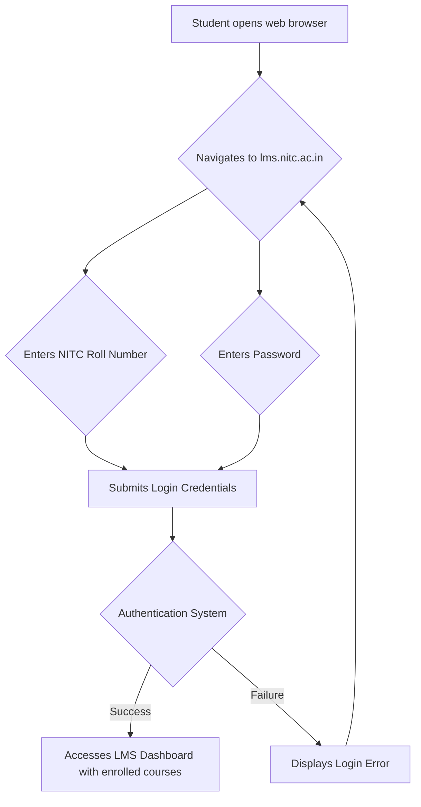

# Learning Management System of NIT Calicut

## Overview

The National Institute of Technology Calicut (NIT Calicut) utilizes a Learning Management System (LMS) to facilitate and support its academic and educational activities. This system serves as a centralized online platform for students and faculty to interact with course materials, submit assignments, participate in discussions, and manage various aspects of their learning and teaching processes. The specific platform employed by NIT Calicut for its LMS is Moodle.

## Details

The Learning Management System at NIT Calicut is built upon the Moodle platform, an open-source web-based learning environment. It is designed to provide a comprehensive suite of tools for online education.

**Platform:** Moodle (Modular Object-Oriented Dynamic Learning Environment)

**Access:**
The LMS is accessible via a dedicated web portal.
*   **URL:** `lms.nitc.ac.in`
*   **Login:** Users typically log in using their official NIT Calicut credentials, which usually consist of their Roll Number (for students) or Employee ID (for faculty/staff) and an associated password.

**Key Features:**
The NIT Calicut LMS, leveraging Moodle's capabilities, generally provides the following functionalities:

*   **Course Material Distribution:** Faculty can upload and organize various course resources, including lecture notes, presentations, reading materials, videos, and external links.
*   **Assignment Management:** Students can submit assignments online, and faculty can grade them, provide feedback, and track submission statuses.
*   **Quizzes and Examinations:** The platform supports the creation and administration of online quizzes, tests, and examinations, with various question types and automated grading options.
*   **Discussion Forums:** Integrated forums allow students and faculty to engage in asynchronous discussions, ask questions, and collaborate on course-related topics.
*   **Announcements:** Faculty can post important announcements and updates relevant to their courses, which are often delivered to students via email notifications.
*   **Gradebook:** A centralized gradebook allows students to view their grades for assignments, quizzes, and other graded activities.
*   **Communication Tools:** Features for private messaging between users and group communication are typically available.
*   **Activity Tracking:** The system can track student activity within courses, providing insights into engagement with course materials and activities.

## History

Information regarding the specific implementation timeline, previous systems, or detailed history of the Learning Management System at NIT Calicut is not publicly available in a verifiable format.

## Facilities

The term "facilities" in the context of an LMS refers to the digital infrastructure and services it provides rather than physical spaces. The NIT Calicut LMS offers:

*   **Centralized Digital Repository:** A single point of access for all course-related digital content.
*   **Anytime, Anywhere Access:** The web-based nature of the LMS allows students and faculty to access course materials and participate in activities from any location with internet connectivity, using various devices (desktops, laptops, tablets, smartphones).
*   **Secure Environment:** Access is restricted to authorized users through institutional login credentials, ensuring data privacy and security for academic content and personal information.

## Procedures

### Student Login Procedure

Students access the NIT Calicut LMS by navigating to the designated web address and authenticating with their institutional credentials.

### Course Enrollment

Typically, students are automatically enrolled in courses on the LMS based on their academic registration for a given semester. In some cases, faculty may provide an enrollment key for specific courses, or manual enrollment by an administrator might be required.

### Assignment Submission

Students generally follow these steps to submit assignments:
1.  Navigate to the specific course on the LMS dashboard.
2.  Locate the assignment activity.
3.  Follow instructions to upload the required file(s) or input text directly.
4.  Confirm submission.

### Viewing Grades

Students can view their grades by:
1.  Logging into the LMS.
2.  Navigating to the relevant course.
3.  Accessing the "Grades" section within the course or the user profile.

## References

*   NIT Calicut Learning Management System Portal: [lms.nitc.ac.in](https://lms.nitc.ac.in/)
*   National Institute of Technology Calicut Official Website: [www.nitc.ac.in](https://www.nitc.ac.in/)
*   Moodle Official Website: [moodle.org](https://moodle.org/)

## Related Articles
- [Technology Services at NIT Calicut](technology_services.md)
- [ERP Portal of NIT Calicut](erp_portal.md)
- [Email Services at NIT Calicut](email_services.md)
