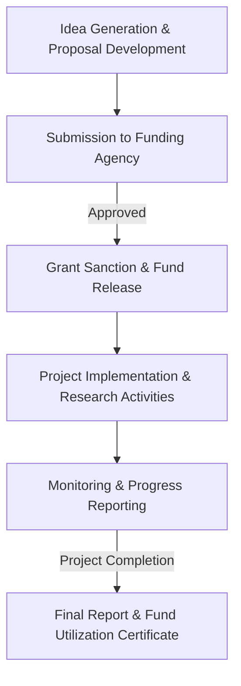

# Research at NIT Calicut

## Overview

The National Institute of Technology Calicut (NIT Calicut), an Institute of National Importance, places significant emphasis on research as a core component of its academic mission. Alongside teaching and consultancy, research activities aim to foster innovation, contribute to scientific and technological advancements, and address societal challenges. Research at NIT Calicut involves faculty members, research scholars (Ph.D. and M.Tech by Research students), and often includes participation from undergraduate students through various projects and initiatives.

## Details

### Research Programs

NIT Calicut offers structured research programs designed to cultivate advanced knowledge and research skills:

*   **Doctor of Philosophy (Ph.D.):** This is the primary doctoral program offered across various engineering, science, architecture, and management disciplines. Ph.D. programs are typically available in full-time, part-time, and sponsored categories, catering to different candidate profiles.
*   **Master of Technology (M.Tech) by Research:** A research-intensive master's degree program that focuses on developing research aptitude and contributing to specific areas of study.

### Research Areas

Research activities at NIT Calicut span a broad spectrum of disciplines, generally aligned with its academic departments. These include, but are not limited to:

*   **Engineering Disciplines:** Civil Engineering, Mechanical Engineering, Electrical Engineering, Electronics & Communication Engineering, Computer Science & Engineering, Chemical Engineering, Biotechnology, Architecture & Planning.
*   **Science Disciplines:** Physics, Chemistry, Mathematics.
*   **Management Studies.**

Specific research topics within these broad areas are diverse and evolve based on faculty expertise, departmental focus, and emerging global and national research priorities.

### Funding and Collaboration

Research projects at NIT Calicut are supported through a combination of internal grants and external funding sources. Faculty members actively pursue sponsored research projects and consultancy assignments from:

*   **Government Agencies:** Such as the Department of Science & Technology (DST), Science and Engineering Research Board (SERB), Defence Research and Development Organisation (DRDO), Indian Space Research Organisation (ISRO), and other national funding bodies.
*   **Industry Partners:** Collaborations with various industries for applied research and problem-solving.
*   **Internal Grants:** Institutional support for seed funding and smaller research initiatives.

### Publications and Dissemination

The outcomes of research conducted at NIT Calicut are typically disseminated through:

*   Publications in peer-reviewed national and international journals.
*   Presentations at national and international conferences.
*   Development of patents and intellectual property.

## History

The National Institute of Technology Calicut, originally established as Regional Engineering College Calicut (RECC) in 1961, has a long history of academic pursuits. While academic institutions inherently involve some level of scholarly inquiry, the formalization and expansion of dedicated research infrastructure and programs have evolved significantly over the decades. The institute's elevation to NIT status and its recognition as an Institute of National Importance have further propelled its research mandate. Specific historical milestones solely focused on the evolution of research infrastructure or policy are not readily available in a consolidated public format.

## Facilities

Research at NIT Calicut is supported by a range of central and departmental facilities designed to provide necessary resources for academic and experimental work.

### Central Facilities

*   **Central Library:** Offers extensive access to academic resources, including a vast collection of books, journals (print and electronic), databases, and digital archives crucial for literature review and scholarly research.
*   **Central Computing Facility (CCF):** Provides high-performance computing resources, specialized software, and network infrastructure essential for computational research, data analysis, and simulations.
*   **Central Workshop:** Equipped to provide fabrication, machining, and technical support for the development of prototypes and experimental setups required for various engineering research projects.

### Departmental Laboratories

Each academic department at NIT Calicut houses specialized laboratories equipped with instruments, software, and experimental setups relevant to their specific research domains. These laboratories support both teaching and advanced research activities. The specific advanced research equipment available varies by department and individual research group. A comprehensive, centrally compiled, and publicly available list of all specialized research equipment is not maintained.

## Procedures

### Ph.D. Admission Process

The admission process for Ph.D. programs at NIT Calicut generally follows a structured procedure:

```mermaid
graph TD
    A[Application Submission] --> B{Eligibility Check & Shortlisting};
    B -- Qualified --> C[Written Test (if applicable)];
    C --> D[Interview];
    D -- Recommended --> E[Admission Offer];
    E --> F[Registration];
    B -- Not Qualified --> G[Rejection];
    D -- Not Recommended --> G;
```

*   **Explanation:** Prospective Ph.D. candidates are required to submit applications online during the announced admission cycles. Applications undergo an initial screening for eligibility criteria (academic qualifications, minimum marks, etc.). Shortlisted candidates may be required to appear for a written test, followed by an interview conducted by the respective department's Doctoral Committee. Candidates recommended by the committee receive an admission offer and proceed with the formal registration process.

### Sponsored Research Project Lifecycle

The typical lifecycle for a sponsored research project undertaken by faculty members at NIT Calicut involves several key stages:



*   **Explanation:** The process begins with faculty members generating research ideas and developing detailed proposals in response to calls for proposals from various funding agencies. These proposals are then submitted for evaluation. Upon approval and sanction of funds by the funding agency, the project formally commences. This involves conducting research activities, data collection, analysis, and experimentation. Regular progress reports are submitted to the funding agency as per their requirements. Upon project completion, a final technical report and a fund utilization certificate are submitted to close the project.

## References

*   Official NIT Calicut Website (www.nitc.ac.in)
*   Publicly available NIT Calicut annual reports and academic brochures.

## Related Articles
- [Research Laboratories at NIT Calicut](research_laboratories.md)
- [Faculty Research at NIT Calicut](faculty_research.md)
- [Student Research Opportunities at NIT Calicut](student_research_opportunities.md)
