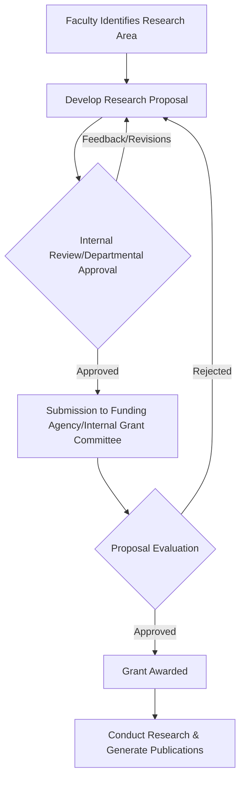

# Research Publications of NIT Calicut

## Overview

National Institute of Technology Calicut (NIT Calicut) is an institution of national importance committed to fostering research and innovation. Research publications form a core component of the academic and intellectual output of the institute, reflecting the scholarly activities undertaken by its faculty, research scholars (Ph.D. students), and postgraduate and undergraduate students. These publications contribute to the global body of knowledge, enhance the institute's academic standing, and facilitate knowledge transfer and societal impact.

The research output from NIT Calicut typically encompasses a range of formats, including peer-reviewed journal articles, conference papers, book chapters, and patents. Research activities are conducted across various engineering, science, and humanities departments, often involving interdisciplinary collaborations.

## Details

Research at NIT Calicut is primarily driven by individual faculty members and their research groups, supported by departmental and institutional infrastructure. The institute encourages research in emerging and interdisciplinary areas, alongside fundamental and applied research within traditional disciplines.

Specific details regarding the total volume of publications, citation metrics, or detailed breakdowns by department are not consistently published in a consolidated, publicly accessible format by the institute. However, individual departments and faculty profiles often list their respective publications.

The Dean (Research & Consultancy) office at NIT Calicut is generally responsible for overseeing and facilitating research activities, including promoting research culture, managing research projects, and potentially formulating policies related to research output and intellectual property.

## History

Specific historical data detailing the evolution of research publications at NIT Calicut as a distinct topic is not readily available in a consolidated public format. The institute, established in 1961 as Calicut Regional Engineering College (CREC) and upgraded to NIT in 2002, has a long-standing tradition of academic pursuits, which inherently includes scholarly contributions and publications by its faculty and students over the decades. The emphasis on research and publications has likely grown significantly following its upgrade to an NIT and its increasing focus on postgraduate and doctoral programs.

## Facilities

NIT Calicut provides various facilities to support research activities and the dissemination of research through publications:

*   **Central Library:** The Central Library provides access to a wide array of academic resources, including subscriptions to numerous online databases, e-journals, and e-books. These resources are crucial for literature review, research, and accessing published works.
    *   **Digital Resources:** Access to major scientific databases such as Scopus, Web of Science, IEEE Xplore, ACM Digital Library, ScienceDirect, SpringerLink, and others, which are essential for researchers to find relevant literature and publish their work.
*   **Departmental Research Laboratories:** Each academic department houses specialized laboratories equipped with instruments and software relevant to their respective fields of research, enabling experimental and computational work that forms the basis of many publications.
*   **High-Performance Computing (HPC) Facilities:** While specific details on a centralized HPC facility dedicated solely to research publication support are not publicly detailed, many departments may have computing resources to support complex simulations and data analysis.
*   **Plagiarism Detection Software:** Institutions typically provide access to plagiarism detection software (e.g., Turnitin, Urkund) to ensure academic integrity and originality of research work before submission for publication or thesis defense. Specific details on the software used and its mandatory application across all publications are not publicly detailed.

## Procedures

While a comprehensive, publicly documented institutional procedure specifically for "research publications" (e.g., an internal review board for all outgoing publications) is not readily available, general academic practices and requirements for research scholars and faculty typically involve several steps.

### PhD Publication Requirements

For Ph.D. scholars at NIT Calicut, publication of research work is a mandatory requirement for thesis submission and subsequent degree award. The specific number and type of publications (e.g., peer-reviewed journal articles, conference papers) are typically outlined in the institute's Ph.D. regulations.

```mermaid
graph TD
    A[PhD Scholar Conducts Research] --> B{Research Results Obtained};
    B --> C[Draft Manuscript Prepared];
    C --> D[Internal Review by Supervisor/Research Committee];
    D -- Feedback/Revisions --> C;
    D -- Approval for Submission --> E[Plagiarism Check (if mandated)];
    E -- Pass Check --> F[Submission to Peer-Reviewed Journal/Conference];
    F --> G{Peer Review Process};
    G -- Revisions/Acceptance --> H[Publication];
    H --> I[Fulfill PhD Publication Requirement];
    I --> J[Thesis Submission];
```

### Institutional Repository

NIT Calicut maintains an Institutional Repository (IR) to archive and disseminate the research output of the institute. This repository typically includes Ph.D. theses, faculty publications, and other scholarly works, making them openly accessible.

```mermaid
graph TD
    A[Faculty/Scholar Publishes Research] --> B[Publication Accepted/Published];
    B --> C{Deposit in Institutional Repository?};
    C -- Yes (as per policy) --> D[Submission of Publication Metadata & Full Text (if permissible)];
    D --> E[Verification by Library/IR Administrator];
    E --> F[Publication Available in NITC Institutional Repository];
    F --> G[Increased Visibility & Accessibility];
```

### Research Project Approval and Funding

Research leading to publications often originates from funded projects. The process for securing internal or external research funding typically involves proposal submission and review.



## References

*   National Institute of Technology Calicut Official Website: [https://www.nitc.ac.in/](https://www.nitc.ac.in/)
*   Dean (Research & Consultancy) Office, NIT Calicut: (Specific URL for Dean R&C office, if available, otherwise general NITC site)
*   Central Library, NIT Calicut: [https://library.nitc.ac.in/](https://library.nitc.ac.in/)
*   Ph.D. Regulations, NIT Calicut: (Specific URL for Ph.D. regulations, usually found under Academic or Admissions section, if publicly available)
*   NIT Calicut Institutional Repository: (Specific URL for the IR, if publicly available)

*(Note: Specific URLs for Ph.D. regulations and the Institutional Repository should be verified and inserted if publicly available on the NIT Calicut website. If not, the general NITC website link serves as the primary reference.)*

## Related Articles
- [Research at NIT Calicut](research.md)
- [Research Laboratories at NIT Calicut](research_laboratories.md)
- [Faculty Research at NIT Calicut](faculty_research.md)
