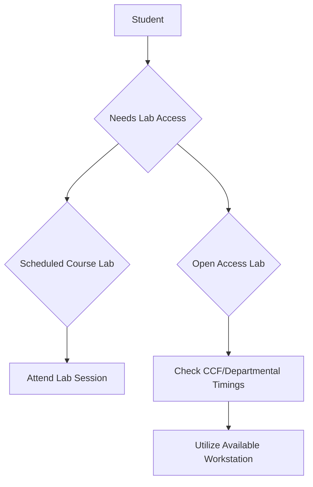
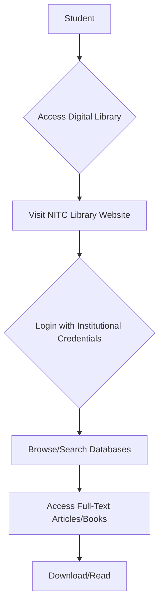

# Programming Resources for NIT Calicut Students

## Overview

NIT Calicut provides a range of resources to support students in their programming education and skill development. These resources encompass academic curricula, computing infrastructure, library services, and student-led initiatives. The aim is to facilitate learning, practice, and application of programming concepts across various disciplines.

## Details

### Academic Curriculum

Programming is integrated into the curriculum of several engineering disciplines at NIT Calicut, particularly within the Departments of Computer Science and Engineering (CSE), Information Technology (IT), and Electronics and Communication Engineering (ECE).

*   **Core Courses:** Fundamental programming concepts, data structures, and algorithms are typically covered in core courses during the initial years of undergraduate programs. Common programming languages taught include C, C++, and Python.
*   **Specialized Electives:** Advanced programming topics, such as web development, mobile application development, artificial intelligence, machine learning, competitive programming, and embedded systems, are offered as elective courses in later years.
*   **Laboratory Sessions:** Practical application of theoretical concepts is reinforced through dedicated laboratory sessions that accompany programming-related courses.

### Online Learning Platforms

Students have access to various online learning resources, which complement the in-class instruction:

*   **NPTEL (National Programme on Technology Enhanced Learning):** As a national initiative, NPTEL provides free online courses and video lectures from IITs and IISc, covering a wide array of computer science and programming topics. Students can utilize these resources for self-paced learning and certification.
*   **Institutional Subscriptions:** Specific institutional subscriptions to other online learning platforms or academic databases may be available, providing access to additional courses, tutorials, and research papers. Details regarding such subscriptions are typically communicated by the Central Library or relevant departments.

### Library Resources

The Central Library at NIT Calicut offers both physical and digital resources pertinent to programming:

*   **Physical Collection:** A collection of textbooks, reference books, and manuals on programming languages, algorithms, software engineering, and various computer science domains.
*   **Digital Resources:** Access to a range of online databases, e-journals, and e-books through the library's digital portal. These often include subscriptions to major academic publishers and technical societies like ACM Digital Library and IEEE Xplore, which host a vast repository of research papers and articles on computing.

## History

The development of programming resources at NIT Calicut is intrinsically linked to the establishment and evolution of its engineering departments, particularly Computer Science and Engineering and Information Technology. The Computer Science and Engineering Department was established in 1980, followed by the Information Technology Department. The Central Computing Facility (CCF) has also evolved over time to provide centralized computing infrastructure. Specific historical timelines for individual programming resources or student clubs are not extensively documented in public sources.

## Facilities

### Computer Laboratories

NIT Calicut maintains several computer laboratories equipped with hardware and software necessary for programming education and practice:

*   **Departmental Labs:** Each relevant department (CSE, IT, ECE) operates specialized labs catering to their specific curriculum needs. These labs are typically equipped with desktop computers, operating systems (commonly Linux distributions and Windows), compilers (e.g., GCC, Clang), Integrated Development Environments (IDEs) like VS Code, Eclipse, IntelliJ IDEA, and specialized software for various programming paradigms (e.g., MATLAB, CAD tools for ECE).
*   **Central Computing Facility (CCF):** The CCF provides general-purpose computing resources and high-speed internet access to all students. It serves as a common facility for academic work, project development, and accessing online resources.

### Internet Connectivity

Campus-wide Wi-Fi and wired internet connectivity are provided in academic blocks, hostels, and the library, enabling students to access online programming resources, collaborative platforms, and development tools.

## Procedures

### Accessing Computer Labs

Access to departmental computer labs is typically scheduled as part of course curricula. During non-class hours, some labs or the Central Computing Facility may offer open access for students to work on assignments and projects. Specific timings and access protocols are usually communicated by the respective departments or the CCF.

### Accessing Library Digital Resources

Students can access the Central Library's digital resources, including e-journals and online databases, through the library's official website. This typically requires institutional login credentials.

### Engaging with Student Clubs

Student-led clubs and technical associations play a significant role in fostering a programming culture. These organizations often conduct workshops, coding competitions, and peer-learning sessions.

*   **Examples of Student Clubs (subject to current active status):**
    *   **Computer Science & Engineering Association (CSEA):** Often organizes technical events, workshops, and competitive programming contests.
    *   **FOSS@NITC (Free and Open Source Software):** Promotes the use and development of open-source software, often hosting hackathons and collaborative projects.
    *   **IEEE Student Branch NITC:** May conduct workshops and events related to various technical domains, including programming and emerging technologies.

Students can typically join these clubs by participating in their recruitment drives or contacting club representatives. Information about active clubs and their events is usually available through student activity portals or departmental notices.

## References

*   National Institute of Technology Calicut Official Website. [https://www.nitc.ac.in/](https://www.nitc.ac.in/)
*   NIT Calicut Central Library. [https://library.nitc.ac.in/](https://library.nitc.ac.in/)
*   Department of Computer Science and Engineering, NIT Calicut. [https://www.nitc.ac.in/departments/computer-science-engineering](https://www.nitc.ac.in/departments/computer-science-engineering)
*   Department of Information Technology, NIT Calicut. [https://www.nitc.ac.in/departments/information-technology](https://www.nitc.ac.in/departments/information-technology)
*   NPTEL (National Programme on Technology Enhanced Learning). [https://nptel.ac.in/](https://nptel.ac.in/)

## Related Articles
- [Study Resources for NIT Calicut Students](study_resources.md)
- [Notes for NIT Calicut Courses](notes_for_nit_calicut_courses.md)
- [Books for NIT Calicut Courses](books_for_nit_calicut_courses.md)
