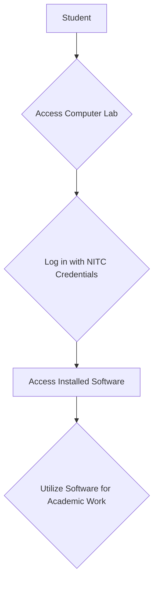
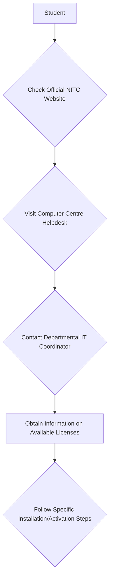

# Software Available to NIT Calicut Students

## Overview

Students at the National Institute of Technology Calicut (NITC) have access to a range of software resources primarily through the institute's computing facilities, including the Central Computer Centre and various departmental laboratories. These resources support academic coursework, research activities, and general productivity. Access typically includes operating systems, programming environments, specialized engineering and scientific applications, and productivity suites.

While a comprehensive, publicly available list detailing every software title and its licensing terms for individual student use on personal devices is not explicitly provided on the main NITC website, general access is facilitated through institutional infrastructure.

## Details

Software availability at NIT Calicut can be broadly categorized based on the mode of access:

### Software in Computer Laboratories

The Central Computer Centre and individual departmental laboratories are equipped with a variety of software necessary for academic curricula and research. This typically includes:

*   **Operating Systems:** Various distributions of Linux (e.g., Ubuntu, Fedora) and Microsoft Windows.
*   **Programming Languages and IDEs:** Compilers and interpreters for languages such as C, C++, Java, Python, R, along with Integrated Development Environments (IDEs) like Visual Studio Code, Eclipse, IntelliJ IDEA, and GNU Emacs/Vim.
*   **Mathematical and Scientific Software:** Tools for numerical computation, simulation, and data analysis. Specific titles may vary by department but commonly include software for CAD/CAM, CAE, circuit design, signal processing, and scientific visualization.
*   **Productivity Suites:** Office applications for word processing, spreadsheets, and presentations.
*   **Database Management Systems:** Software for database design and management.

Specific specialized software (e.g., MATLAB, ANSYS, AutoCAD, SolidWorks, LabVIEW, OrCAD, COMSOL Multiphysics) is generally available in the respective departmental labs relevant to the fields of study (e.g., Mechanical Engineering, Civil Engineering, Electronics & Communication Engineering, Computer Science & Engineering).

### Institutional Licenses for Personal Use

Information regarding specific institutional licenses that allow students to install commercial software (e.g., Microsoft Office 365 Education, MATLAB student licenses) on their personal devices for the duration of their studies is not explicitly detailed on the public sections of the NIT Calicut website. Students are advised to inquire with the Computer Centre or their respective departments for the most current information on such offerings.

### Open-Source Software

Students are encouraged to utilize and explore a wide array of free and open-source software (FOSS) tools, which are often available on lab machines and can be freely installed on personal devices. This includes various Linux distributions, LibreOffice, GIMP, Inkscape, Python with its extensive libraries, and numerous programming tools.

### Library Resources

The Central Library provides access to a vast collection of e-resources, including academic databases, journals, and potentially some software-related tools or platforms that support research and learning. Access to these resources is typically authenticated via the campus network or through a proxy service.

## History

Information regarding the historical evolution of software availability specifically for students at NIT Calicut is not readily available in public sources. The institute has continuously updated its computing infrastructure and software offerings to meet the evolving academic and research needs of its students and faculty.

## Facilities

The primary facilities providing software access to NIT Calicut students include:

*   **Central Computer Centre:** This facility houses general-purpose computer labs accessible to all students, equipped with a range of operating systems, programming tools, and productivity software. It also serves as a central point for IT support and network services.
*   **Departmental Computer Laboratories:** Each academic department maintains specialized computer labs equipped with software tailored to their specific disciplines, such as CAD/CAM software for Mechanical Engineering, circuit design tools for Electronics Engineering, and advanced programming environments for Computer Science.
*   **Central Library:** Provides access to online databases and e-resources, which may include web-based software tools or platforms.

## Procedures

Accessing software at NIT Calicut generally follows these procedures:

### Accessing Software in Labs

Students can access software installed on computers within the Central Computer Centre and departmental labs during designated operating hours. This typically involves logging in with their institutional credentials.

### Inquiring about Institutional Licenses

For information regarding the availability of institutional licenses for personal device installation, students are advised to:

### IT Support

For any issues related to software access, installation (if applicable for personal devices), or functionality within the campus network, students can typically contact the IT support staff at the Central Computer Centre.

## References

*   National Institute of Technology Calicut Official Website: [https://www.nitc.ac.in/](https://www.nitc.ac.in/)
*   NIT Calicut Computer Centre: (Specific URL for Computer Centre if available, otherwise link to main site and state section)
    *   *(Note: As of this writing, a direct public page specifically listing all software for students on the NITC website is not prominently linked or detailed. Students are advised to navigate the official website or contact the Computer Centre directly for the most up-to-date and comprehensive information.)*
*   NIT Calicut Central Library: [https://library.nitc.ac.in/](https://library.nitc.ac.in/)

## Related Articles
- [Study Resources for NIT Calicut Students](study_resources.md)
- [Notes for NIT Calicut Courses](notes_for_nit_calicut_courses.md)
- [Books for NIT Calicut Courses](books_for_nit_calicut_courses.md)
