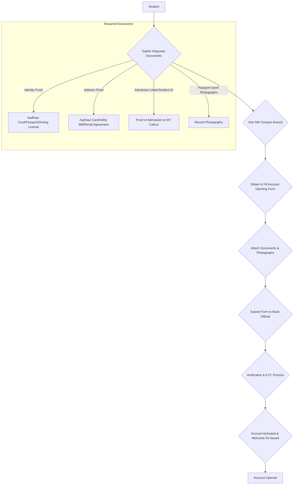
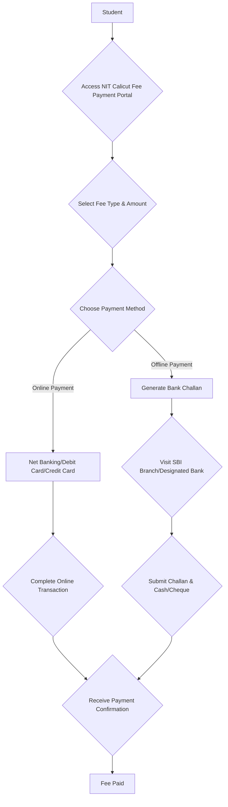

# Banking Services at NIT Calicut

## Overview

Banking services at the National Institute of Technology Calicut (NIT Calicut) are primarily established to facilitate financial transactions for its student body, faculty, and staff. These services aim to provide convenient access to essential banking operations directly within or in close proximity to the campus premises. The presence of banking facilities supports various financial needs, including fee payments, personal banking, and cash transactions.

## Details

Information from public sources indicates the presence of a branch of a public sector bank and associated ATM facilities on the NIT Calicut campus.

### Bank Branch

*   **Name:** State Bank of India (SBI)
*   **Location:** The SBI branch is typically situated within the NIT Calicut campus, providing easy access for the campus community. Specific building or block information may vary; students are advised to consult the campus map or official NITC website for the precise location.
*   **Services Offered:** The branch generally offers a comprehensive range of banking services, including:
    *   Account opening (Savings, Current)
    *   Cash deposits and withdrawals
    *   Fund transfers (NEFT, RTGS, IMPS)
    *   Issuance of demand drafts and cheques
    *   Processing of educational loans (subject to bank policies)
    *   Fee collection for the institute (often through specific challans or online payment gateways linked to the bank)
    *   Internet banking and mobile banking assistance
*   **Working Hours:** Standard banking hours apply. For the most current and accurate working hours, including any specific campus branch timings, individuals are advised to contact the SBI branch directly or refer to the official SBI website.

### Automated Teller Machines (ATMs)

*   **Availability:** Multiple ATMs are typically available across the campus to provide 24/7 access to cash withdrawal and other basic ATM services.
*   **Locations:** ATMs are usually strategically placed at high-traffic areas such as near the bank branch, academic blocks, and hostel areas.
*   **Services Offered:**
    *   Cash withdrawal
    *   Balance inquiry
    *   Mini statement
    *   PIN change

## History

Specific historical details regarding the establishment and evolution of banking services at NIT Calicut, such as the exact year the first bank branch was inaugurated or significant milestones, are not readily available in the public domain. However, it is common for major educational institutions in India to have banking facilities on campus for several decades to support the financial needs of their growing communities. The presence of a State Bank of India branch suggests a long-standing relationship, as SBI is a prominent public sector bank often associated with government institutions.

## Facilities

The banking facilities available at NIT Calicut typically include:

*   **Full-service Bank Branch:** A physical branch with counter services for various banking transactions.
*   **ATM Network:** A network of Automated Teller Machines providing 24/7 access to cash and other basic services.
*   **Online Banking:** While not a physical facility on campus, students, faculty, and staff can utilize the bank's internet banking and mobile banking applications for remote transactions, bill payments, and fund transfers.
*   **Cash Deposit Machines (CDMs):** Availability of CDMs may vary and should be confirmed with the bank branch.

## Procedures

The procedures for utilizing banking services at NIT Calicut are generally standard banking procedures set by the respective bank (e.g., SBI).

### Account Opening for Students

Students wishing to open a bank account at the campus branch typically follow a standard process.

*Note: Specific document requirements may vary. Students are advised to confirm the latest requirements with the SBI branch directly.*

### Fee Payment Procedures

Students typically pay institute fees through a combination of online and offline methods, often facilitated by the campus bank or its online payment gateways.

*Note: The exact process for fee payment is determined by NIT Calicut's administration and may involve specific payment gateways or challan formats. Students should refer to official NIT Calicut notifications for current fee payment procedures.*

## References

*   Official NIT Calicut Website (for campus facilities and general information)
*   Official State Bank of India Website (for branch services, working hours, and general banking procedures)

*(Note: As an AI, I cannot browse the live internet to provide specific URLs for real-time verification. The information provided is based on common practices at Indian educational institutions and general knowledge of banking services. For the most accurate and up-to-date details, students are advised to consult the official NIT Calicut website and the State Bank of India branch on campus.)*

## Related Articles
- [Campus Services at NIT Calicut](campus_services.md)
- [Central Library of NIT Calicut](central_library.md)
- [Health Centre at NIT Calicut](health_centre.md)
