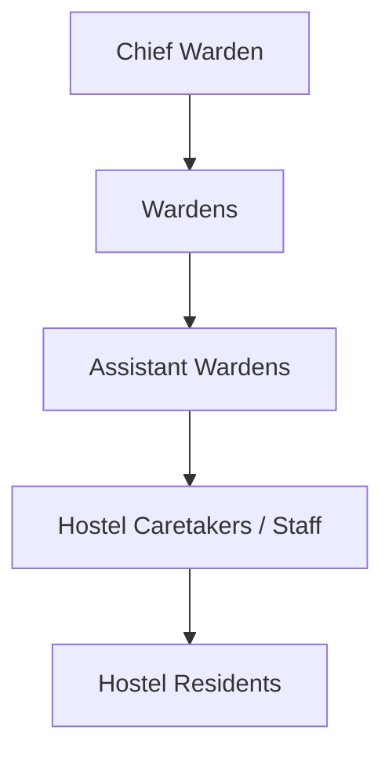
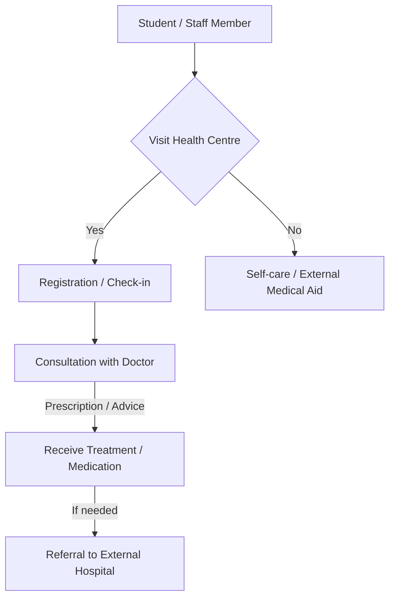

# Campus Services at NIT Calicut

## Overview

National Institute of Technology Calicut (NITC) provides a range of campus services designed to support the academic, residential, and personal well-being of its students, faculty, and staff. These services aim to create a conducive environment for learning and living within the campus premises.

## Details

Campus services at NIT Calicut encompass various essential facilities and support systems. These include, but are not limited to, accommodation, healthcare, library resources, information technology infrastructure, sports facilities, banking, postal services, and student welfare initiatives.

### Accommodation (Hostels)

NIT Calicut offers residential facilities for students. The campus has separate hostels for male and female students. Each hostel typically includes mess facilities providing daily meals. The administration of hostels is overseen by the Chief Warden's office, supported by wardens and assistant wardens.

### Medical Services

The institute maintains a Health Centre on campus to provide primary medical care to students and staff. It is equipped for basic consultations, first aid, and minor treatments. For specialized medical attention or emergencies, patients are typically referred to external hospitals.

### Library Services

The Central Library at NIT Calicut serves as the primary information resource center for the institute. It houses a collection of books, journals, periodicals, and digital resources to support academic and research activities. The library offers lending services, reference services, and access to online databases.

### Information Technology Services

The Computer Centre is responsible for managing the institute's IT infrastructure, including campus-wide networking, internet connectivity (Wi-Fi and wired), and computer labs. It provides support for email services, software access, and other IT-related needs for students and staff.

### Sports and Recreation

NIT Calicut provides various sports facilities to encourage physical activity and recreation. These include grounds for outdoor sports like football, cricket, and hockey, as well as courts for basketball, volleyball, and tennis. An indoor stadium and gymnasium facilities are also available.

### Banking and Postal Services

A branch of a nationalized bank and ATM facilities are available on campus to cater to the banking needs of the community. Additionally, a post office branch operates within the campus, offering postal and related services.

### Student Welfare and Counseling

The institute has mechanisms in place to address student welfare and provide counseling services. These services aim to support students in managing academic stress, personal issues, and overall mental well-being.

### Campus Security

The campus security department is responsible for maintaining a safe and secure environment within the institute premises, including regulating entry and exit, patrolling, and responding to security concerns.

## History

Specific historical details regarding the establishment and evolution of individual campus services in a consolidated public format are not readily available. However, these services have developed over time in conjunction with the growth and expansion of the institute since its inception as Calicut Regional Engineering College (CREC) in 1961 and its subsequent upgrade to NIT Calicut.

## Facilities

The following are some of the key facilities available under campus services:

*   **Hostels:**
    *   Separate hostel blocks for male and female students.
    *   Associated mess facilities within or adjacent to hostel blocks.
*   **Health Centre:**
    *   Consultation rooms.
    *   Observation beds.
    *   Basic medical equipment.
    *   Pharmacy counter for essential medicines.
*   **Central Library:**
    *   Reading halls.
    *   Digital library section with computer terminals.
    *   Book stacks.
    *   Reference section.
*   **Computer Centre:**
    *   Computer labs with internet access.
    *   Servers for campus network.
    *   Wi-Fi access points across academic and residential areas.
*   **Sports Facilities:**
    *   Main Stadium (for athletics, football, cricket).
    *   Basketball courts.
    *   Volleyball courts.
    *   Tennis courts.
    *   Indoor Stadium (for badminton, table tennis, gymnasium).
*   **Banking & Postal:**
    *   Bank branch (e.g., State Bank of India).
    *   Multiple ATM kiosks.
    *   Post Office.
*   **Other Facilities:**
    *   Canteens and food courts.
    *   Co-operative store.
    *   Guest House.

## Procedures

Detailed step-by-step procedures for all campus services are often managed internally by the respective departments and may not be publicly outlined in a consolidated, flowchart-ready format. However, general organizational structures for service delivery can be represented.

### Hostel Administration Hierarchy

The administration of student hostels generally follows a hierarchical structure to ensure efficient management and student welfare.

*   **Chief Warden:** Oversees the overall administration of all hostels.
*   **Wardens:** Each warden is typically responsible for one or more specific hostels.
*   **Assistant Wardens:** Assist wardens in day-to-day operations and student supervision.
*   **Hostel Caretakers/Staff:** Provide operational support, including maintenance and mess supervision.
*   **Hostel Residents:** Students residing in the hostels.

### Medical Consultation Process (General Outline)

While specific detailed steps are not publicly documented, the general process for seeking medical attention at the Health Centre typically involves:

*   **Visit Health Centre:** Individuals needing medical attention present themselves at the Health Centre.
*   **Registration/Check-in:** Basic details are recorded.
*   **Consultation with Doctor:** A medical officer provides diagnosis and advice.
*   **Receive Treatment/Medication:** Basic treatment or prescribed medicines are provided.
*   **Referral to External Hospital:** For conditions requiring specialized care or advanced diagnostics, patients are referred to external medical facilities.
*   **Self-care/External Medical Aid:** If the Health Centre is not visited, individuals may seek other forms of medical care.

## References

*   National Institute of Technology Calicut Official Website: [https://www.nitc.ac.in/](https://www.nitc.ac.in/)
*   NIT Calicut - Student Life Section: [https://www.nitc.ac.in/student-life](https://www.nitc.ac.in/student-life)
*   NIT Calicut - Facilities Section: [https://www.nitc.ac.in/facilities](https://www.nitc.ac.in/facilities)

## Related Articles
- [Central Library of NIT Calicut](central_library.md)
- [Health Centre at NIT Calicut](health_centre.md)
- [Counselling Services at NIT Calicut](counselling_services.md)
