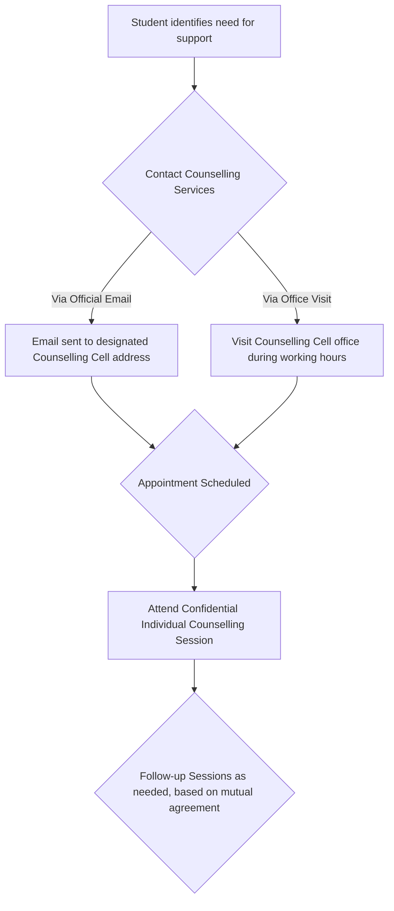

# Counselling Services at NIT Calicut

## Overview
The Counselling Services at the National Institute of Technology Calicut (NITC) are established to provide psychological and emotional support to the student community. Operating under the purview of Student Affairs, the service aims to assist students in managing academic pressures, personal challenges, emotional difficulties, and mental health concerns that may arise during their academic tenure at the institute.

## Details
The primary offering of the Counselling Services is individual counselling sessions. These sessions are conducted in a confidential environment, providing students a secure space to discuss their concerns with trained professionals. The scope of support typically addresses a range of issues, including but not limited to:
*   **Academic Stress:** Strategies for coping with academic demands, performance anxiety, examination stress, and study-related challenges.
*   **Personal and Emotional Issues:** Support for anxiety, depression, general stress, relationship difficulties, grief, homesickness, and adjustment to university life.
*   **Developmental Concerns:** Guidance on personal growth, self-esteem, and decision-making.

The service places a strong emphasis on confidentiality, ensuring that all discussions between students and counsellors remain private, thereby fostering trust and encouraging students to seek help without apprehension.

## History
Specific historical details regarding the establishment, evolution, and significant milestones of Counselling Services at NIT Calicut are not extensively documented in publicly accessible official sources. The service has likely developed over time as part of the institute's ongoing commitment to student welfare and holistic development.

## Facilities
The Counselling Services typically operate from designated offices located within the NIT Calicut campus. These offices are designed to provide a private and conducive environment for counselling sessions. The exact location is usually communicated through the Student Affairs section of the official website or upon initial contact. Specific details regarding the number of counselling rooms, specialized equipment, or other dedicated facilities are not publicly specified.

## Procedures
Students seeking counselling services at NIT Calicut generally initiate contact through official channels to schedule an appointment. The process is designed to be accessible and confidential.

*   **Initial Contact:** Students are typically advised to contact the Counselling Cell via their official email address or by visiting the office of the Counselling Cell Coordinator or the Dean (Student Affairs) during specified working hours.
*   **Appointment Scheduling:** Upon initial contact, an appointment is scheduled based on the availability of the counsellors and the student's convenience.
*   **Counselling Sessions:** Sessions are usually conducted one-on-one in a private setting. The frequency and duration of these sessions are determined collaboratively between the student and the counsellor, tailored to the student's specific needs and progress.

## References
*   [National Institute of Technology Calicut - Student Affairs: Counselling Cell](https://www.nitc.ac.in/student-affairs/counselling-cell)

## Related Articles
- [Campus Services at NIT Calicut](campus_services.md)
- [Central Library of NIT Calicut](central_library.md)
- [Health Centre at NIT Calicut](health_centre.md)
