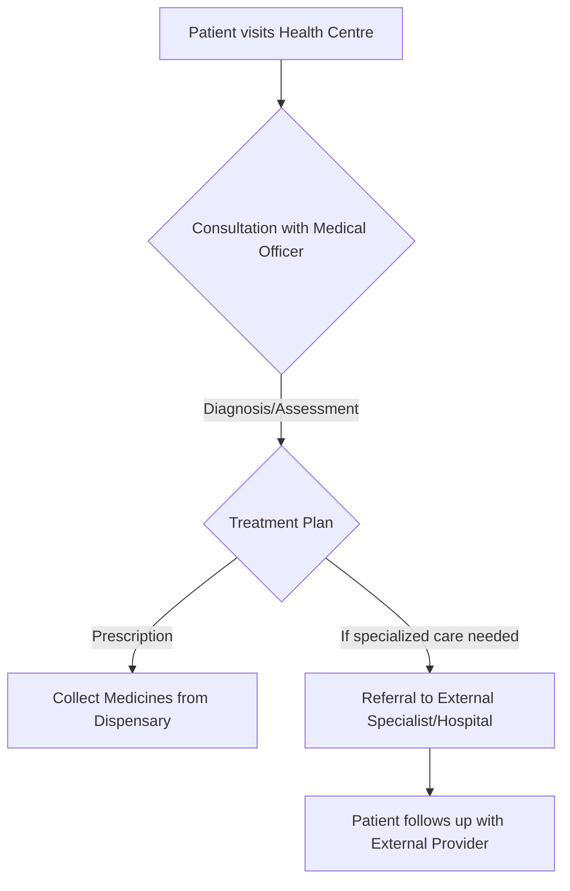

# Health Centre at NIT Calicut

## Overview
The Health Centre at the National Institute of Technology Calicut (NITC) functions as the primary healthcare facility for the institute's community. It aims to provide essential medical services to students, faculty, and staff members residing on campus or associated with the institute, addressing their general health and well-being needs.

## Details
The Health Centre is situated within the campus premises of NIT Calicut. It is staffed by medical professionals who offer general medical consultations and primary care services.

*   **Location:** The Health Centre is located within the NIT Calicut campus. Specific building names or precise coordinates are typically detailed on the official NIT Calicut website.
*   **Operating Hours:** Information regarding the specific operating hours for consultations, pharmacy services, and any emergency services is generally published on the official NIT Calicut website.
*   **Contact Information:** Official phone numbers or email addresses for the Health Centre are usually available through the NIT Calicut's official communication channels.

## History
The exact founding date and detailed historical milestones of the Health Centre at NIT Calicut are not extensively documented in publicly accessible sources. It has been established to cater to the medical requirements of the campus community, evolving alongside the institute's growth.

## Facilities
The Health Centre provides fundamental medical facilities to address common health concerns and offer immediate care. These typically include:

*   **Consultation Rooms:** Designated spaces for medical examinations and consultations with the resident Medical Officers.
*   **First Aid Services:** Provision for immediate care and management of minor injuries and common ailments.
*   **Pharmacy/Dispensary:** A facility for stocking and dispensing essential medicines as prescribed by the Medical Officers.

A comprehensive list of specialized medical equipment, diagnostic laboratories, or the number of beds for inpatient care is not publicly detailed on the official website.

## Procedures
Students, faculty, and staff can access the services of the Health Centre by visiting during its operational hours. The general procedure for obtaining medical assistance typically involves the following steps:

*   **Consultation:** Patients present their health concerns to the Medical Officer for examination, diagnosis, and medical advice.
*   **Medication:** Basic medicines prescribed during the consultation are dispensed from the Health Centre's pharmacy.
*   **Referral:** In instances requiring specialized medical treatment, advanced diagnostic procedures, or hospitalization, patients may be referred to external hospitals or specialist clinics.

## References
*   Official Website of National Institute of Technology Calicut - Health Centre Section. (Specific URL typically found on `www.nitc.ac.in` under "Facilities" or "Student Services")

## Related Articles
- [Campus Services at NIT Calicut](campus_services.md)
- [Central Library of NIT Calicut](central_library.md)
- [Counselling Services at NIT Calicut](counselling_services.md)
