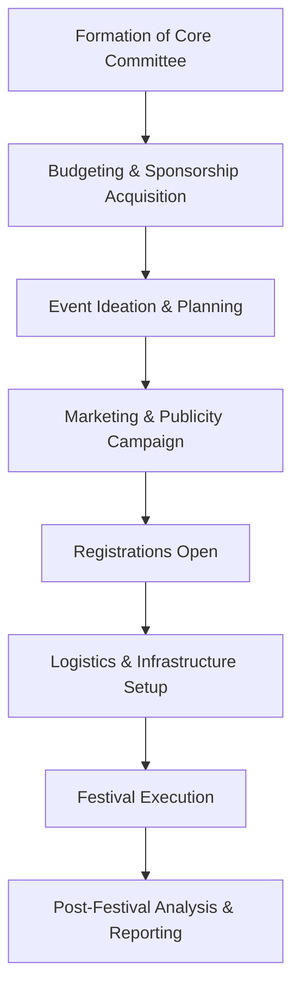

# Annual Festivals of NIT Calicut

## Overview

National Institute of Technology Calicut (NITC) hosts several annual festivals that serve as significant platforms for students to showcase and develop their cultural, technical, and organizational skills. These festivals attract participants from various educational institutions across India, contributing to the vibrant campus life and fostering a spirit of competition, collaboration, and learning. The two primary annual festivals are Ragam, the cultural festival, and Tathva, the technical festival.

## Details

### Ragam

Ragam is the annual inter-collegiate cultural festival of NIT Calicut. It is one of the largest cultural festivals in South India, known for its diverse range of events and large-scale participation.

*   **Type:** Cultural Festival
*   **Frequency:** Annually
*   **Typical Timing:** Usually held in the spring semester, often in March or April.
*   **Activities:** Ragam typically features a wide array of events including:
    *   **Pro-shows:** Concerts by renowned national and international artists, dance performances, and stand-up comedy acts.
    *   **Competitions:** Inter-collegiate competitions in various cultural domains such as music (classical, Western, rock), dance (classical, contemporary, street), literary arts (debates, quizzes, creative writing), dramatics, fashion, and fine arts.
    *   **Informal Events:** Numerous fun and engaging activities designed for general participation.
*   **Purpose:** To promote cultural exchange, provide a platform for artistic expression, and foster a sense of community among students.

### Tathva

Tathva is the annual inter-collegiate technical festival of NIT Calicut. It is designed to promote scientific temper, technical innovation, and practical application of engineering principles.

*   **Type:** Technical Festival
*   **Frequency:** Annually
*   **Typical Timing:** Usually held in the autumn semester, often in October or November.
*   **Activities:** Tathva typically includes:
    *   **Workshops:** Hands-on training sessions and workshops on emerging technologies, software, and hardware.
    *   **Competitions:** Technical competitions across various engineering disciplines, including robotics, coding, circuit design, paper presentations, and hackathons.
    *   **Guest Lectures:** Talks and interactive sessions by prominent personalities from academia, industry, and research.
    *   **Exhibitions:** Displays of innovative projects by students and external organizations.
*   **Purpose:** To encourage technical aptitude, foster innovation, bridge the gap between academic knowledge and industry practices, and provide a platform for students to apply their technical skills.

### Other Festivals/Events

While Ragam and Tathva are the primary large-scale annual festivals, NIT Calicut also hosts other significant events throughout the academic year, which may include:

*   **Sports Fest:** A dedicated sports festival or inter-departmental sports competitions, often organized by the Physical Education Department and student bodies. Specific details regarding its independent status or integration with other festivals may vary annually.
*   **Departmental Fests:** Individual academic departments may organize their own technical or cultural events specific to their disciplines.

## History

Both Ragam and Tathva have a long-standing history at NIT Calicut, evolving from smaller intra-collegiate events to large-scale inter-collegiate festivals. Specific founding years for both festivals are not widely published in easily verifiable public sources. However, they have been integral parts of the institute's calendar for several decades, growing in scale, participation, and reputation over the years. The evolution of these festivals reflects the changing interests and capabilities of the student body and the broader technological and cultural landscape.

## Facilities

The annual festivals utilize a range of facilities available on the NIT Calicut campus to accommodate the diverse events and large number of participants. These typically include:

*   **Auditoriums:** The A.R.C. (Academic & Research Centre) Auditorium and other lecture hall complexes are used for pro-shows, guest lectures, and major competitions.
*   **Open Grounds:** The main grounds and various sports fields are utilized for outdoor events, informal activities, and large gatherings.
*   **Departmental Laboratories and Classrooms:** Used for technical workshops, coding competitions, and smaller-scale events during Tathva.
*   **Hostel Facilities:** Accommodation is typically arranged for outstation participants in the institute's hostels.
*   **Food Courts and Canteens:** Existing campus food facilities are supplemented by temporary stalls to cater to the increased footfall.

Specific capacities or names of all facilities are not detailed here as they can vary or are not consistently published for public verification.

## Procedures

The organization and execution of Ragam and Tathva are primarily student-driven, with guidance and support from faculty advisors and the institute administration.

### Organizational Structure

The festivals are typically managed by a hierarchical student committee structure, overseen by faculty members.

```mermaid
graph TD
    A[Institute Administration & Faculty Advisors] --> B[Festival Core Committee]
    B --> C[Finance & Sponsorship Team]
    B --> D[Marketing & Public Relations Team]
    B --> E[Events & Operations Team]
    B --> F[Logistics & Hospitality Team]
    B --> G[Design & Web Team]
    E --> E1[Cultural Events Sub-committee (for Ragam)]
    E --> E2[Technical Events Sub-committee (for Tathva)]
    E --> E3[Workshops & Guest Lectures Sub-committee]
    E --> E4[Informal Events Sub-committee]
```

*   **Institute Administration & Faculty Advisors:** Provide overall guidance, approvals, and ensure adherence to institute policies.
*   **Festival Core Committee:** Comprises student conveners and general secretaries who lead the entire festival.
*   **Various Teams/Sub-committees:** Students volunteer and are selected to manage specific aspects like finances, marketing, event planning, logistics, design, and web development. Each team is responsible for its designated area under the supervision of the Core Committee.

### Student Participation

Students can participate in the festivals in several ways:

1.  **Organizing Committee:** Students can apply and be selected to join the various organizing committees, gaining valuable experience in event management, leadership, and teamwork.
2.  **Participants:** Students from NIT Calicut and other institutions can register for and compete in the numerous cultural and technical events.
3.  **Volunteers:** Many students volunteer to assist with various tasks during the festival, contributing to its smooth execution.
4.  **Audience:** All students are encouraged to attend and enjoy the performances, lectures, and exhibitions.

### Event Planning Cycle

The planning for each festival typically begins several months in advance, involving:



This cycle ensures comprehensive planning from conceptualization to execution and post-event review.

## References

Information regarding the annual festivals of NIT Calicut is typically available through:

*   Official websites of Ragam and Tathva (launched annually or maintained by student bodies).
*   NIT Calicut official website and student affairs sections.
*   Social media pages and channels maintained by the festival committees.
*   News archives and media reports covering the events.

Specific links are not provided here as they are subject to change annually or may require direct verification at the time of access.

## Related Articles
- [Student Life at NIT Calicut](student_life.md)
- [Student Clubs at NIT Calicut](student_clubs.md)
- [Technical Teams at NIT Calicut](technical_teams.md)
