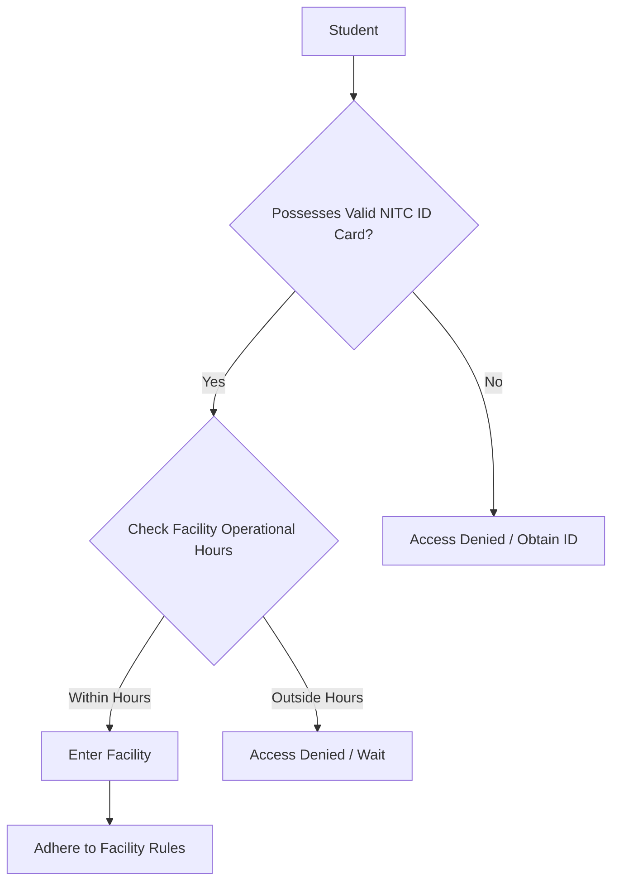
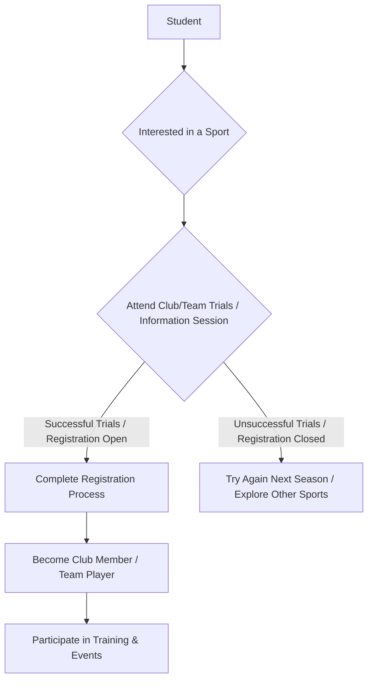

# Sports Facilities at NIT Calicut

## Overview

National Institute of Technology Calicut (NITC) provides a range of sports facilities to promote physical fitness, recreation, and competitive sports among its students, faculty, and staff. The facilities are managed and maintained primarily by the Department of Physical Education, aiming to foster a healthy campus environment and encourage participation in various indoor and outdoor sports.

## Details

The sports infrastructure at NIT Calicut is designed to cater to a diverse set of athletic interests. The Department of Physical Education oversees the scheduling, maintenance, and general administration of these facilities, as well as organizing inter-departmental, inter-collegiate, and inter-NIT sports events. The campus provides dedicated areas for major team sports, individual sports, and fitness activities.

## History

Detailed historical information regarding the specific construction dates or phased development of individual sports facilities at NIT Calicut is not extensively documented in publicly available official sources. However, the institute has consistently expanded and upgraded its sports infrastructure over the years to meet the growing needs of its student community.

## Facilities

NIT Calicut offers a comprehensive array of sports facilities, which typically include:

*   **Main Ground:** A large multi-purpose ground primarily used for Cricket and Football, often serving as the venue for major inter-collegiate tournaments and annual sports meets.
*   **Athletic Track:** An outdoor track suitable for various athletic events, encircling the main ground.
*   **Indoor Sports Complex:** This complex typically houses facilities for:
    *   **Badminton:** Multiple courts for practice and competitive play.
    *   **Table Tennis:** Several tables available for students.
    *   **Gymnasium:** Equipped with various fitness machines, weights, and training equipment for strength and cardiovascular workouts.
*   **Outdoor Courts:** Dedicated courts for:
    *   **Basketball:** Typically multiple courts.
    *   **Volleyball:** Multiple courts.
    *   **Tennis:** Courts available for tennis enthusiasts.
*   **Swimming Pool:** An outdoor swimming pool, generally available for use by students, faculty, and staff during specified hours.
*   **Other Facilities:** Depending on specific developments, facilities for sports like Chess, Carrom, and Yoga may also be available within various common areas or dedicated rooms.

## Procedures

Specific, detailed procedures for accessing every single facility, such as a centralized online booking system for individual courts or a precise hierarchy for facility allocation, are not extensively detailed in publicly available official documents. However, general access and usage typically follow these guidelines:

### General Facility Access

Students are generally granted access to the sports facilities during specified operational hours.



### Gymnasium Usage

Access to the gymnasium typically requires registration and adherence to specific timings and safety guidelines.

```mermaid
graph TD
    A[Student] --> B{Wants to use Gymnasium};
    B --> C{Complete Gym Registration (if required)};
    C -- Registered --> D{Check Gym Timings};
    D -- Within Timings --> E[Present ID Card];
    E --> F[Access Gym];
    F --> G[Follow Safety & Usage Rules];
    C -- Not Registered --> H[Register First];
    D -- Outside Timings --> I[Access Denied / Wait];
```

### Participation in Sports Clubs/Teams

Students interested in representing NIT Calicut in various sports or joining specific sports clubs typically follow a selection or registration process.



For precise and up-to-date information on facility timings, specific rules, and registration procedures, students are advised to contact the Department of Physical Education directly or refer to official notices published by the institute.

## References

*   National Institute of Technology Calicut Official Website (nitc.ac.in)
    *   *Specific sections such as "Student Life," "Facilities," or "Physical Education Department" are typically the primary sources for this information.*

## Related Articles
- [Student Life at NIT Calicut](student_life.md)
- [Student Clubs at NIT Calicut](student_clubs.md)
- [Technical Teams at NIT Calicut](technical_teams.md)
