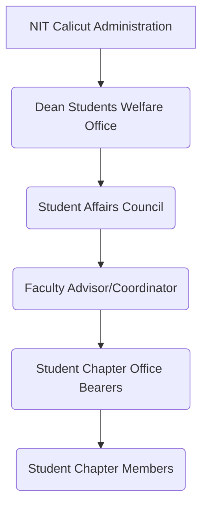
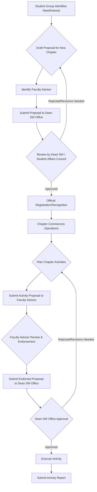

# Student Chapters at NIT Calicut

## Overview

Student Chapters at the National Institute of Technology Calicut (NIT Calicut) form a vital part of the institute's extracurricular and co-curricular landscape. These chapters provide platforms for students to pursue academic interests beyond the curriculum, develop professional skills, engage in community service, and foster personal growth. They typically operate under the guidance of the Dean (Students Welfare) office and are often advised by faculty members from relevant departments.

The primary objectives of student chapters at NIT Calicut generally include:
*   Enhancing technical and professional knowledge through workshops, seminars, and projects.
*   Facilitating networking opportunities with peers, faculty, and industry professionals.
*   Promoting leadership, teamwork, and organizational skills among students.
*   Encouraging participation in national and international competitions and events.
*   Contributing to the institute's academic and social environment.

## Details

NIT Calicut hosts a diverse range of student chapters, broadly categorized into professional body chapters and interest-based clubs. A comprehensive, officially verified list of all active student chapters with their specific mandates and current office bearers is typically maintained by the Dean (Students Welfare) office or the Student Affairs Council and may not be exhaustively detailed on the main public website.

However, based on common practices in technical institutions like NIT Calicut, student chapters often include affiliations with prominent professional organizations and various interest groups.

**Examples of common types of student chapters found at NIT Calicut (specific active chapters may vary and require direct verification from the institute):**

*   **Professional Body Chapters:** These chapters are typically affiliated with national or international professional organizations and focus on specific engineering disciplines or broader technical areas.
    *   **IEEE Student Branch:** Often focuses on electrical, electronics, computer science, and related fields, organizing technical talks, workshops, and project development.
    *   **ACM Student Chapter:** Primarily for computer science and information technology students, promoting computing education and professional development.
    *   **ISTE Student Chapter:** Associated with the Indian Society for Technical Education, focusing on overall technical education development.
    *   **SAEINDIA Collegiate Club:** For mechanical, automotive, and related engineering students, often involved in vehicle design and fabrication competitions.
    *   **CSI Student Chapter:** Affiliated with the Computer Society of India, promoting computer science and IT knowledge.
*   **Interest-Based Chapters/Clubs:** These chapters cater to a wide array of student interests, often spanning multiple disciplines.
    *   **Robotics Club:** Focuses on robotics design, programming, and competitions.
    *   **Entrepreneurship Cell (E-Cell):** Promotes entrepreneurial spirit and innovation among students.
    *   **Literary & Debating Club:** Encourages public speaking, creative writing, and critical thinking.
    *   **Photography Club:** Fosters interest and skills in photography and visual arts.
    *   **Music/Dance/Drama Clubs:** Promote cultural and artistic talents.
    *   **National Service Scheme (NSS) / National Cadet Corps (NCC):** Focus on community service, social responsibility, and disciplined training.

Specific details regarding the activities, membership criteria, and current leadership of individual chapters are usually available through the respective chapter's internal communications or dedicated social media channels.

## History

The precise founding dates and detailed historical trajectories for every individual student chapter at NIT Calicut are not centrally documented or publicly available on the main institute website. However, student clubs and chapters have been an integral part of the student experience at NIT Calicut (formerly Regional Engineering College Calicut) since its inception. Over the decades, the number and diversity of these chapters have grown, reflecting the evolving academic interests and professional aspirations of the student body. The establishment of new chapters and the continued operation of existing ones are typically driven by student initiative and faculty support, adapting to contemporary trends in technology and student engagement.

## Facilities

Dedicated, exclusive facilities for each individual student chapter are generally not provided by the institute. Student chapters at NIT Calicut typically utilize common institute resources and spaces for their activities. These may include:

*   **Classrooms and Lecture Halls:** For meetings, seminars, and workshops.
*   **Seminar Halls:** For larger events, guest lectures, and presentations.
*   **Laboratories:** Specific departmental labs may be used for technical projects and hands-on workshops, with prior permission.
*   **Student Activity Centre (if available):** A common facility designed to house various student clubs and organizations, providing shared office spaces, meeting rooms, and recreational areas.
*   **Open Grounds and Auditoriums:** For large-scale events, cultural programs, and outdoor activities.

Access to these facilities is usually coordinated through the Dean (Students Welfare) office or the respective departmental authorities, following established booking procedures.

## Procedures

The formation, operation, and governance of student chapters at NIT Calicut are overseen by the institute's administration, primarily through the Dean (Students Welfare) office and the Student Affairs Council. While specific detailed guidelines may be outlined in an internal student handbook or policy document, the general procedures involve a hierarchical structure and a defined process for establishment and activity approval.

### Operational Structure

The typical operational structure for student chapters involves a clear chain of responsibility and oversight:

*   **NIT Calicut Administration:** Provides overall institutional framework and support.
*   **Dean (Students Welfare) Office:** The primary administrative body responsible for student welfare, extracurricular activities, and oversight of student organizations.
*   **Student Affairs Council:** A body (often comprising faculty and student representatives) that assists the Dean (Students Welfare) in policy-making and decision-making regarding student activities.
*   **Faculty Advisor/Coordinator:** A faculty member assigned to each chapter, providing guidance, mentorship, and ensuring adherence to institute policies.
*   **Student Chapter Office Bearers:** Students elected or selected to lead the chapter (e.g., Chair/President, Vice-Chair, Secretary, Treasurer), responsible for planning and executing activities.
*   **Student Chapter Members:** The general student body who participate in the chapter's activities.

### Chapter Formation and Activity Approval

The process for forming a new student chapter or obtaining approval for chapter activities generally follows a structured approach, though specific steps and required documentation are governed by NIT Calicut's internal policies, which may not be publicly detailed.

*   **Student Group Identifies Need/Interest:** Students identify a gap or interest area for a new chapter.
*   **Draft Proposal for New Chapter:** A detailed proposal outlining objectives, proposed activities, and organizational structure is prepared.
*   **Identify Faculty Advisor:** A faculty member willing to advise the chapter is identified.
*   **Submit Proposal to Dean SW Office:** The proposal is formally submitted for consideration.
*   **Review by Dean SW / Student Affairs Council:** The proposal is evaluated against institute policies and feasibility.
*   **Official Registration/Recognition:** Upon approval, the chapter is officially recognized by the institute.
*   **Chapter Commences Operations:** The newly formed chapter begins its activities.
*   **Plan Chapter Activities:** For any event or initiative, the chapter plans its details.
*   **Submit Activity Proposal to Faculty Advisor:** The plan is submitted to the faculty advisor for initial review.
*   **Faculty Advisor Review & Endorsement:** The advisor reviews the proposal for alignment with objectives and institute policies.
*   **Submit Endorsed Proposal to Dean SW Office:** The advisor-endorsed proposal is sent for final administrative approval.
*   **Dean SW Office Approval:** The office grants final permission for the activity.
*   **Execute Activity:** The chapter carries out the approved event.
*   **Submit Activity Report:** A post-event report is submitted for record-keeping and accountability.

## References

*   National Institute of Technology Calicut Official Website: [https://www.nitc.ac.in/](https://www.nitc.ac.in/)
    *   (Specific pages related to Student Affairs, Student Life, or Clubs & Organizations would be linked here if available and verified.)

## Related Articles
- [Student Life at NIT Calicut](student_life.md)
- [Student Clubs at NIT Calicut](student_clubs.md)
- [Technical Teams at NIT Calicut](technical_teams.md)
