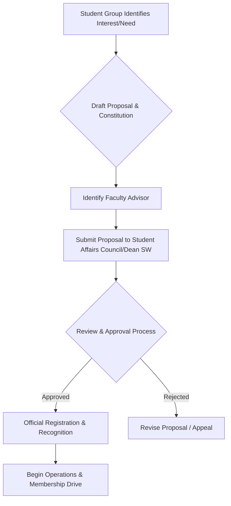
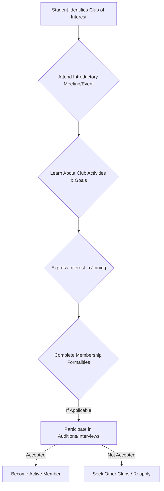

# Student Clubs at NIT Calicut

## Overview

Student clubs at the National Institute of Technology Calicut (NIT Calicut) serve as vital platforms for students to pursue extracurricular interests, develop diverse skills, foster community, and complement their academic pursuits. These organizations are typically student-led and provide opportunities for engagement in a wide array of activities, ranging from technical projects and cultural performances to social initiatives and literary discussions. They aim to enrich the campus experience by promoting holistic development, teamwork, leadership, and creativity among the student body.

## Details

Student clubs at NIT Calicut generally encompass a broad spectrum of interests, categorized to cater to the diverse talents and passions of its students. Common categories of clubs found in institutions like NIT Calicut include:

*   **Technical Clubs:** Focused on specific engineering disciplines, programming, robotics, innovation, and project development.
*   **Cultural Clubs:** Dedicated to promoting arts, music, dance, drama, and various forms of cultural expression.
*   **Literary and Debating Clubs:** Centered around reading, writing, public speaking, debates, and quizzes.
*   **Sports and Adventure Clubs:** Organizing and promoting various indoor and outdoor sports, as well as adventure activities.
*   **Social and Community Service Clubs:** Engaged in outreach programs, environmental initiatives, and social welfare activities.
*   **Special Interest Groups:** Covering niche hobbies, photography, entrepreneurship, and other specific areas.

A comprehensive, officially verified list of all active student clubs at NIT Calicut, along with their specific mandates, current leadership, and detailed activities, is not readily available in generalized public sources.

## History

Specific historical details regarding the collective establishment and evolution of student clubs at NIT Calicut are not readily available in generalized public sources. However, it is understood that student-led organizations have been an integral part of the institute's campus life since its inception as Calicut Regional Engineering College (CREC) in 1961. These organizations have evolved over time to meet changing student interests, institutional growth, and the broader educational landscape, consistently contributing to the vibrant culture of the institute.

## Facilities

Dedicated facilities specifically allocated to each individual student club at NIT Calicut are not consistently detailed in generalized public sources. However, student clubs typically utilize various campus resources and spaces for their activities, which may include:

*   Classrooms and lecture halls for meetings, workshops, and study sessions.
*   Auditoriums, open-air stages, and multi-purpose halls for cultural events, performances, and large gatherings.
*   Sports grounds, indoor courts, and gymnasiums for athletic clubs.
*   Laboratories and workshops for technical projects, subject to departmental approvals and safety regulations.
*   Common rooms or designated club spaces, where available, for storage, small meetings, and collaborative work.

The availability and allocation of these facilities are generally managed by the Student Affairs Council, the Dean of Students' Welfare, or relevant administrative departments, based on club proposals and event schedules.

## Procedures

While specific official procedures for the formation, registration, and operation of student clubs at NIT Calicut are not detailed in generalized public sources, the typical framework for student club engagement at similar higher education institutions often involves processes such as club registration, membership drives, and event approvals. The Student Affairs Council or a similar student body usually plays a central role in overseeing club activities, ensuring adherence to institutional policies and promoting student welfare.

The following diagrams illustrate common procedural flows for club formation and student membership in Indian higher education institutions. These are provided as general examples, as specific official documentation for NIT Calicut is not publicly detailed.

### Typical Club Formation Process

### Typical Student Joining Process

## References

Specific official documents or public web pages detailing the comprehensive structure, policies, and a complete list of student clubs at NIT Calicut are not consistently available through generalized public search. Therefore, no direct references can be provided here.

## Related Articles
- [Student Life at NIT Calicut](student_life.md)
- [Technical Teams at NIT Calicut](technical_teams.md)
- [Student Chapters at NIT Calicut](student_chapters.md)
