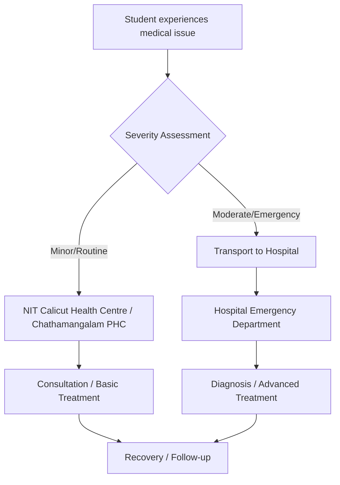

# Hospitals Near NIT Calicut

## Overview

Students at the National Institute of Technology Calicut (NIT Calicut), located in Chathamangalam, Kozhikode district, Kerala, have access to a range of healthcare facilities. These include local primary health centers for immediate and minor medical needs, as well as larger multi-specialty hospitals in the nearby towns and the city of Kozhikode for more complex medical conditions, emergencies, and specialized treatments. The choice of hospital often depends on the urgency of the situation, the required specialty, and the preferred mode of transport.

## Details

The following are some of the notable hospitals accessible from NIT Calicut, listed with approximate distances and general characteristics. Travel times can vary significantly based on traffic conditions.

### 1. Mukkam Co-operative Hospital
*   **Location:** Mukkam, Kozhikode District.
*   **Approximate Distance from NIT Calicut:** 8-10 km.
*   **Travel Time:** Approximately 20-30 minutes.
*   **Type:** General hospital, operating under a co-operative model.
*   **Services:** Offers general medical consultations, basic diagnostic services, and inpatient facilities for common ailments. It serves as a closer option for non-emergency medical attention.

### 2. Government Medical College, Kozhikode
*   **Location:** Medical College Road, Kozhikode.
*   **Approximate Distance from NIT Calicut:** 18-20 km.
*   **Travel Time:** Approximately 40-50 minutes.
*   **Type:** Public sector, tertiary care, teaching hospital.
*   **Services:** One of the largest government hospitals in Kerala, offering a comprehensive range of specialties, emergency and trauma care, advanced diagnostics, and surgical services across almost all medical disciplines. It is a primary referral center for the region.

### 3. Aster MIMS, Kozhikode
*   **Location:** Mini Bypass Road, Govindapuram, Kozhikode.
*   **Approximate Distance from NIT Calicut:** 20-25 km.
*   **Travel Time:** Approximately 45-60 minutes.
*   **Type:** Private sector, multi-specialty, tertiary care hospital.
*   **Services:** Known for its wide array of super-specialty departments, advanced medical technology, comprehensive emergency services, critical care units, and specialized surgical procedures.

### 4. Baby Memorial Hospital (BMH), Kozhikode
*   **Location:** Indira Gandhi Road, Kozhikode.
*   **Approximate Distance from NIT Calicut:** 20-25 km.
*   **Travel Time:** Approximately 45-60 minutes.
*   **Type:** Private sector, multi-specialty, tertiary care hospital.
*   **Services:** Offers extensive medical and surgical services across various specialties, including cardiology, neurology, oncology, orthopedics, and emergency medicine. It is equipped with modern diagnostic and treatment facilities.

### Local Health Centre
*   **Chathamangalam Primary Health Centre (PHC):** Located very close to NIT Calicut, this government facility provides basic healthcare services, first aid, vaccinations, and consultations for minor ailments. It is not a full-fledged hospital but serves as an immediate point of contact for primary healthcare needs.

### Patient Pathway for Seeking Medical Attention

Students seeking medical attention typically follow a pathway depending on the nature and severity of their health concern:

## History

Information regarding the specific historical development of individual hospitals, particularly their founding dates and key milestones, is generally available on their respective official websites or through public records. However, a comprehensive, comparative historical overview for all hospitals near NIT Calicut is not consistently available in a concise, verifiable format suitable for this general wiki page.

*   **Government Medical College, Kozhikode:** Established in 1957, it is one of the oldest and most prominent medical colleges and hospitals in Kerala, playing a significant role in public healthcare and medical education in the region.
*   **Private Hospitals (e.g., Aster MIMS, BMH):** These institutions were established in the late 20th or early 21st century, growing to become major healthcare providers in the private sector, contributing to the development of advanced medical facilities in Kozhikode.

## Facilities

The facilities available vary significantly between primary health centers and tertiary care hospitals.

*   **Primary Health Centres (e.g., Chathamangalam PHC):** Typically offer outpatient consultation rooms, basic laboratory services, vaccination centers, and facilities for minor procedures and first aid.
*   **General Hospitals (e.g., Mukkam Co-operative Hospital):** Provide outpatient departments (OPD), inpatient wards, basic diagnostic imaging (X-ray, ultrasound), a general laboratory, and often a basic emergency room.
*   **Multi-specialty Tertiary Care Hospitals (e.g., Government Medical College, Aster MIMS, BMH):** These hospitals are equipped with extensive facilities including:
    *   **Outpatient Departments (OPD):** For various specialties.
    *   **Inpatient Wards:** General, semi-private, and private rooms.
    *   **Emergency and Trauma Care Units:** Staffed 24/7.
    *   **Intensive Care Units (ICU), Coronary Care Units (CCU), Neonatal Intensive Care Units (NICU):** For critical patients.
    *   **Operation Theatres:** For a wide range of surgical procedures.
    *   **Diagnostic Imaging:** MRI, CT Scan, Ultrasound, X-ray, Mammography.
    *   **Pathology and Microbiology Laboratories:** For comprehensive testing.
    *   **Blood Banks.**
    *   **Pharmacies.**
    *   **Specialized Clinics:** For various medical and surgical sub-specialties.

Specific details on the full range of facilities for each hospital are best obtained from their official websites or by direct inquiry.

## Procedures

The range of medical procedures available is directly correlated with the type and size of the healthcare facility.

*   **Primary Health Centres:** Focus on preventive care, basic curative services, and minor procedures such as wound dressing, vaccinations, and basic health screenings.
*   **General Hospitals:** Offer common medical and surgical procedures, including treatment for infectious diseases, management of chronic conditions, minor surgeries, and obstetric services.
*   **Multi-specialty Tertiary Care Hospitals:** Provide a comprehensive array of advanced medical and surgical procedures across all major specialties, including:
    *   **Complex Surgeries:** Cardiac, neuro, orthopedic, general, laparoscopic, and robotic surgeries.
    *   **Interventional Procedures:** Cardiology (angiography, angioplasty), radiology, gastroenterology.
    *   **Critical Care Management:** For various life-threatening conditions.
    *   **Dialysis.**
    *   **Chemotherapy and Radiation Therapy.**
    *   **Advanced Diagnostic Procedures:** Endoscopies, colonoscopies, biopsies.
    *   **Maternity and Neonatal Care.**

Detailed information on specific procedures offered by each hospital can be found on their official websites or by contacting their patient services departments.

## References

*   Publicly available hospital websites (e.g., Aster MIMS, Baby Memorial Hospital, Government Medical College Kozhikode).
*   Local government health directories and portals (e.g., Kerala Health Department).
*   Online mapping services for location and approximate distance calculations.

## Related Articles
- [Living Near NIT Calicut](living.md)
- [Transportation to NIT Calicut](transportation_to_nit_calicut.md)
- [Railway Station Near NIT Calicut](railway_station.md)
