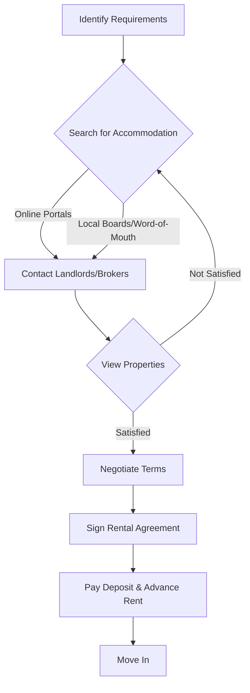

# Living Near NIT Calicut

## Overview

National Institute of Technology Calicut (NIT Calicut) is situated in Kunnamangalam, a semi-urban area approximately 22 kilometers northeast of Kozhikode city center in the state of Kerala, India. The campus is located amidst a green, undulating landscape, characteristic of the Malabar region. Living near NIT Calicut typically involves residing in the surrounding localities such as Kunnamangalam, Chathamangalam, and other nearby villages, which cater to the needs of the student and faculty population. The area balances proximity to the academic institution with access to essential services and connectivity to the larger urban center of Kozhikode.

## Details

### Geography and Location
NIT Calicut is located in the Chathamangalam Grama Panchayat, within the Kunnamangalam block of Kozhikode district. The campus is accessible via the Kozhikode-Mukkam road. The immediate vicinity is characterized by a mix of residential areas, small businesses, and agricultural land.

### Connectivity
The area is well-connected by road.
*   **Road:** State-run KSRTC buses and private buses operate frequently between Kozhikode city and Mukkam, passing through Kunnamangalam and the NIT Calicut junction. Auto-rickshaws are also readily available for local travel.
*   **Rail:** The nearest major railway station is Kozhikode Railway Station (CLT), approximately 22 km away, offering connections to major cities across India.
*   **Air:** Calicut International Airport (CCJ), also known as Karipur Airport, is the nearest airport, located approximately 40 km from NIT Calicut.

### Climate
The region experiences a tropical monsoon climate.
*   **Summer (March to May):** Hot and humid, with temperatures often exceeding 30°C.
*   **Monsoon (June to September):** Heavy rainfall, particularly during the Southwest Monsoon.
*   **Winter (October to February):** Relatively milder and pleasant, with lower humidity.

### Demographics
The population in the areas surrounding NIT Calicut comprises local residents, including agricultural workers and small business owners, alongside a significant transient population of students, faculty, and staff associated with the institute.

## History

The area around NIT Calicut, particularly Kunnamangalam, has historically been a rural and agricultural region. The establishment of the Calicut Regional Engineering College (CREC) in 1961, which was later upgraded to NIT Calicut in 2002, significantly influenced the development of the surrounding localities. The presence of the institution led to the growth of infrastructure, services, and residential options to cater to the academic community. While specific historical details of "living near NIT Calicut" are not extensively documented as a distinct historical subject, the evolution of Kunnamangalam and Chathamangalam has been intrinsically linked to the growth and expansion of the institute.

## Facilities

### Accommodation
*   **On-Campus:** NIT Calicut provides hostel facilities for its students.
*   **Off-Campus:** Private hostels, rented houses, and apartments are available in areas such as Kunnamangalam, Chathamangalam, and nearby villages. These options cater to students seeking independent living arrangements or those who prefer to reside outside the campus.

### Food and Dining
*   **On-Campus:** The institute has canteens and mess facilities.
*   **Off-Campus:** A variety of eateries, including small restaurants, bakeries, and tea shops, are present in Kunnamangalam and along the Kozhikode-Mukkam road, offering local Kerala cuisine and other Indian dishes. Grocery stores and supermarkets are also available for daily needs.

### Healthcare
*   **On-Campus:** NIT Calicut has a Health Centre providing basic medical services.
*   **Off-Campus:** Private clinics and pharmacies are available in Kunnamangalam. For more specialized medical care, multi-specialty hospitals are located in Kozhikode city, approximately 20-25 km away.

### Banking and ATMs
*   **On-Campus:** A branch of the State Bank of India (SBI) and ATM facilities are available within the NIT Calicut campus.
*   **Off-Campus:** Several nationalized and private banks, along with ATM networks, are present in Kunnamangalam town.

### Shopping
*   **Local:** Kunnamangalam offers local markets and shops for daily necessities, groceries, stationery, and basic apparel.
*   **Urban:** For broader shopping needs, including branded stores, malls, and specialized retail outlets, Kozhikode city provides extensive options.

### Recreation and Leisure
*   **On-Campus:** NIT Calicut offers various sports facilities, a gymnasium, and cultural clubs.
*   **Off-Campus:** The surrounding area is primarily residential and semi-rural, offering opportunities for walks and experiencing local life. For organized entertainment, cinemas, beaches (e.g., Kozhikode Beach), and other recreational venues are available in Kozhikode city. Places of worship (temples, mosques, churches) are present in the vicinity.

### Internet and Mobile Connectivity
Major telecommunication providers offer mobile network coverage and broadband internet services in the areas surrounding NIT Calicut.

## Procedures

### Renting Off-Campus Accommodation
The process for renting off-campus accommodation typically involves the following steps:



*   **Search:** Students typically search for accommodation through local real estate brokers, online rental platforms, or by inquiring within the student community.
*   **Agreement:** A rental agreement is usually signed between the tenant and the landlord, outlining terms such as rent, duration, notice period, and responsibilities.
*   **Deposit:** A security deposit, often equivalent to 2-3 months' rent, is common practice.

### Commuting to NIT Calicut
Commuting to NIT Calicut from nearby areas primarily relies on public and private road transport.

```mermaid
graph TD
    A[Student's Residence] --> B{Commuting Options};
    B -- Short Distance --> C[Walk/Cycle];
    B -- Medium Distance --> D[Auto-rickshaw];
    B -- Longer Distance --> E[Bus (KSRTC/Private)];
    E -- From Kozhikode City --> F[NIT Calicut Junction];
    F --> G[NIT Calicut Campus];
    D --> G;
    C --> G;
```

*   **Buses:** Regular bus services connect Kunnamangalam and Kozhikode city to the NIT Calicut junction. From the junction, the campus is a short walk or auto-rickshaw ride away.
*   **Auto-rickshaws:** Available for point-to-point travel, especially useful for shorter distances or when carrying luggage.
*   **Personal Vehicles:** Some students may use personal two-wheelers or bicycles.

### Emergency Services
In case of emergencies, the following general procedures apply:

```mermaid
graph TD
    A[Emergency Situation] --> B{Assess Type of Emergency};
    B -- Medical --> C[Call Ambulance (112/108) / Go to Health Centre/Hospital];
    B -- Police --> D[Call Police (112/100) / Report to Nearest Station];
    B -- Fire --> E[Call Fire Services (112/101)];
    C --> F[Receive Assistance];
    D --> F;
    E --> F;
```

*   **General Emergency Number (India):** 112
*   **Police:** 100
*   **Fire:** 101
*   **Ambulance:** 108
*   The NIT Calicut Health Centre can provide immediate first aid and refer to larger hospitals if necessary.

## References

*   National Institute of Technology Calicut Official Website. (Accessed: [Current Date])
*   Kerala State Road Transport Corporation (KSRTC) Official Website. (Accessed: [Current Date])
*   Kozhikode District Administration Official Website. (Accessed: [Current Date])
*   Geographical and demographic data for Kerala and Kozhikode district from government census reports and official tourism websites.

## Related Articles
- [Transportation to NIT Calicut](transportation_to_nit_calicut.md)
- [Railway Station Near NIT Calicut](railway_station.md)
- [Airport Near NIT Calicut](airport.md)
