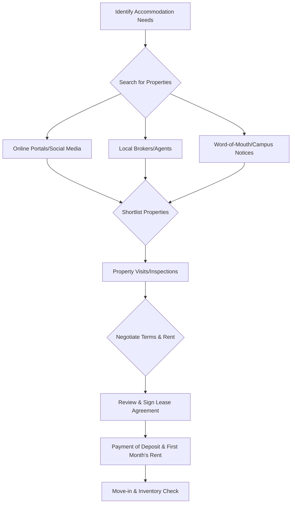

# Rentals Near NIT Calicut

## Overview

National Institute of Technology Calicut (NIT Calicut) is located in Chathamangalam, Kozhikode district, Kerala, India. As an institution attracting students from various regions, off-campus accommodation options are often sought by students for various reasons, including personal preference, availability, or specific requirements not met by on-campus housing. The rental market near NIT Calicut caters primarily to students and faculty, offering a range of housing types in the surrounding localities.

## Details

The primary areas where students typically seek rental accommodation are those in close proximity to the NIT Calicut campus, including parts of Chathamangalam, Kettangal, and areas along the Mukkam road.

Common types of off-campus accommodation available in the region generally include:
*   **Paying Guest (PG) accommodations:** These typically offer furnished rooms, often with meals and basic amenities, on a per-person basis.
*   **Independent rooms/apartments:** Single rooms or multi-room apartments that can be rented by individuals or groups of students. These may be furnished, semi-furnished, or unfurnished.
*   **Shared houses/flats:** Larger residential units rented by multiple students who share common facilities and expenses.

Specific details regarding current availability, precise rental rates, and included amenities are highly dynamic and vary based on factors such as property type, size, furnishing, distance from campus, and market demand. This information is not consistently available from static, public sources and typically requires direct inquiry with landlords, brokers, or through local rental platforms.

## History

Information regarding the specific historical development of the rental market exclusively catering to NIT Calicut students is not readily available in public, verifiable sources. The growth of rental options in the area is generally linked to the expansion of the institute and the increasing student population over time, leading to a natural demand for off-campus housing.

## Facilities

Facilities offered in rental accommodations near NIT Calicut are highly variable. Common facilities that may be available include:
*   **Basic furnishings:** Bed, table, chair, wardrobe (in furnished or semi-furnished units).
*   **Attached/shared bathrooms:** Depending on the type of accommodation.
*   **Kitchen access:** Often available in independent apartments or shared houses, sometimes with basic cooking appliances.
*   **Internet connectivity:** Increasingly common, either included in rent or available as an add-on service.
*   **Water and electricity supply:** Standard utilities, often charged separately or included up to a certain limit.
*   **Security:** Varies from basic locks to more comprehensive security systems in larger complexes.

The presence and quality of these facilities depend entirely on the individual property and the terms agreed upon with the landlord.

## Procedures

The general procedure for students seeking off-campus rental accommodation typically involves several steps. This process is a common guideline and may vary based on individual circumstances and local practices.

**Explanation of Steps:**
*   **Identify Accommodation Needs:** Students determine their budget, preferred location, type of accommodation (PG, apartment), required facilities, and number of occupants.
*   **Search for Properties:** This can be done through various channels:
    *   **Online Portals/Social Media:** Websites or groups dedicated to rentals in the Kozhikode area.
    *   **Local Brokers/Agents:** Professionals who facilitate rental transactions for a fee.
    *   **Word-of-Mouth/Campus Notices:** Recommendations from senior students, faculty, or notices posted within the campus community.
*   **Shortlist Properties:** Based on initial inquiries, students select properties that meet their criteria for further consideration.
*   **Property Visits/Inspections:** Prospective tenants visit the shortlisted properties to assess their condition, facilities, and suitability.
*   **Negotiate Terms & Rent:** Discussions with the landlord or agent regarding rent, deposit, lease duration, included utilities, and other terms.
*   **Review & Sign Lease Agreement:** A formal document outlining the rights and responsibilities of both the tenant and the landlord. It is crucial to read and understand all clauses before signing.
*   **Payment of Deposit & First Month's Rent:** Security deposits (often equivalent to several months' rent) and the first month's rent are typically paid upon signing the agreement.
*   **Move-in & Inventory Check:** Upon moving in, it is advisable to conduct a thorough inventory check of the property's condition and contents to avoid disputes later.

## References

*   National Institute of Technology Calicut Official Website: [https://www.nitc.ac.in/](https://www.nitc.ac.in/) (For institutional location and context)

## Related Articles
- [Living Near NIT Calicut](living.md)
- [Transportation to NIT Calicut](transportation_to_nit_calicut.md)
- [Railway Station Near NIT Calicut](railway_station.md)
