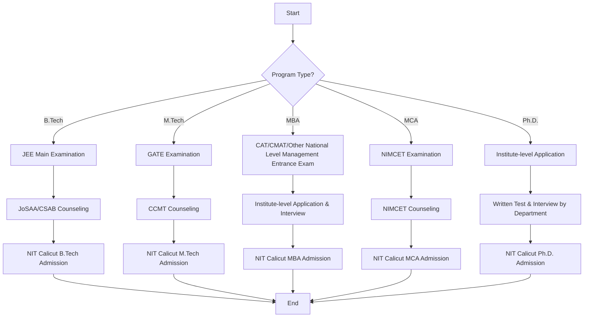

# About NIT Calicut

## Overview

National Institute of Technology Calicut (NIT Calicut or NITC) is a public technical university and an Institute of National Importance located in Kozhikode (Calicut), Kerala, India. Established by the Government of India, it operates under the Ministry of Education. NIT Calicut is one of the 31 National Institutes of Technology in India, recognized for its contributions to engineering, technology, and research.

## Details

NIT Calicut offers a range of academic programs at undergraduate, postgraduate, and doctoral levels. These include Bachelor of Technology (B.Tech), Master of Technology (M.Tech), Master of Business Administration (MBA), Master of Computer Applications (MCA), and Doctor of Philosophy (Ph.D.) degrees. The institute comprises various departments across engineering, architecture, science, and humanities disciplines.

The academic structure typically follows a semester system with continuous evaluation, mid-semester examinations, and end-semester examinations. The curriculum is designed to provide a strong foundation in fundamental principles, practical skills, and research methodologies.

## History

NIT Calicut was established in 1961 as Calicut Regional Engineering College (CREC), making it one of the earliest Regional Engineering Colleges (RECs) in India. The institution was founded with the objective of providing quality technical education and contributing to the industrial development of the region.

In 2002, the Government of India upgraded CREC to a National Institute of Technology (NIT) and granted it the status of an Institute of National Importance under the National Institutes of Technology Act. This transformation marked a significant milestone, enhancing its autonomy, funding, and national recognition.

## Facilities

NIT Calicut provides a comprehensive range of facilities to support academic, research, and residential needs of its students and faculty.

*   **Academic Infrastructure:** This includes departmental buildings, lecture hall complexes, specialized laboratories, workshops, and drawing halls equipped for various engineering and scientific disciplines.
*   **Central Library:** The institute houses a central library with a vast collection of books, journals, periodicals, and digital resources, including access to online databases and e-journals.
*   **Hostels:** Separate hostel facilities are available for male and female students, offering accommodation, dining services, and common recreational areas.
*   **Sports Complex:** Facilities for various indoor and outdoor sports are available, including playgrounds for cricket, football, and basketball, as well as indoor courts for badminton and table tennis, and a gymnasium.
*   **Health Centre:** A health centre with medical staff is available on campus to provide primary healthcare services to students and staff.
*   **Other Amenities:** The campus also includes facilities such as a student activity centre, canteens, a post office, a bank with ATM services, and general stores.

## Procedures

### Admission Process

Admission to various programs at NIT Calicut follows national-level entrance examinations and centralized counseling processes.

*   **B.Tech Admissions:** Based on the rank secured in the Joint Entrance Examination (JEE) Main, followed by centralized counseling conducted by the Joint Seat Allocation Authority (JoSAA) and Central Seat Allocation Board (CSAB).
*   **M.Tech Admissions:** Primarily based on valid Graduate Aptitude Test in Engineering (GATE) scores, followed by centralized counseling through the Centralized Counselling for M.Tech./M.Arch./M.Plan./M.Des. (CCMT).
*   **MBA Admissions:** Typically requires a valid score in national-level management entrance examinations such as CAT or CMAT, followed by an institute-level application, group discussion, and personal interview.
*   **MCA Admissions:** Based on the rank obtained in the National Institute of Technology Master of Computer Applications Common Entrance Test (NIMCET), followed by centralized counseling.
*   **Ph.D. Admissions:** Involves an institute-level application process, followed by a departmental written test and/or interview, based on academic record and research potential.

Specific eligibility criteria, application deadlines, and detailed procedures are published annually on the official NIT Calicut website and respective counseling portals.

## References

*   National Institute of Technology Calicut Official Website: [https://www.nitc.ac.in/](https://www.nitc.ac.in/)
*   Ministry of Education, Government of India
*   Joint Seat Allocation Authority (JoSAA)
*   Centralized Counselling for M.Tech./M.Arch./M.Plan./M.Des. (CCMT)

## Related Articles
- [Getting Started at NIT Calicut](getting_started.md)
- [Campus Map of NIT Calicut](campus_map.md)
- [Important Contacts at NIT Calicut](important_contacts.md)
