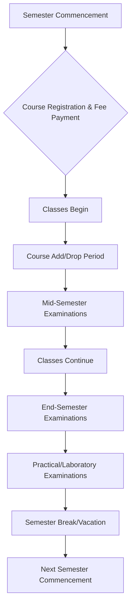

# Academic Calendar of NIT Calicut

## Overview

The Academic Calendar of the National Institute of Technology Calicut (NIT Calicut) is an official schedule outlining all significant academic activities and events for a given academic year or semester. It serves as a crucial guide for students, faculty, and administrative staff, ensuring the smooth and organized progression of academic programs.

The calendar typically details key dates for:
*   Commencement and conclusion of semesters.
*   Course registration and add/drop periods.
*   Mid-semester and end-semester examinations.
*   Practical and laboratory examination schedules.
*   Vacation periods and public holidays.
*   Deadlines for academic submissions (e.g., project reports, thesis submissions for postgraduate students).
*   Other important academic events such as convocation, if scheduled within the academic year.

The academic calendar applies to all programs offered by the institute, including undergraduate (B.Tech, B.Arch), postgraduate (M.Tech, MBA, MCA, M.Plan, M.Sc), and doctoral (Ph.D) programs, though specific dates or deadlines may vary slightly depending on the program and academic year.

## Details

The specific contents of the academic calendar are dynamic and are published annually or semiannually by the institute's academic section. While the exact dates change each year, the structure generally follows a pattern designed to accommodate the curriculum and examination cycles.

A typical semester's progression as outlined in the academic calendar includes:



Key components typically found in the calendar:
*   **Registration:** Dates for new student registration, course registration for continuing students, and fee payment deadlines.
*   **Instructional Period:** The duration of classes for each semester, often divided by mid-semester examinations.
*   **Examinations:** Clearly defined windows for mid-semester (internal assessments) and end-semester examinations, including theory and practical components.
*   **Breaks and Holidays:** Scheduled breaks (e.g., winter vacation, summer vacation) and observed public holidays.
*   **Academic Deadlines:** Specific dates for thesis/dissertation submission, project report submission, and other academic milestones relevant to various programs.

## History

The concept of an academic calendar has been integral to the functioning of NIT Calicut (formerly Regional Engineering College Calicut) since its establishment. While specific historical calendars are not typically archived for public access in a consolidated manner, the institute has consistently published an academic schedule to guide its educational activities. The structure and components of the calendar have evolved over time to align with national educational policies, regulatory body guidelines (such as AICTE and UGC), and the institute's own academic reforms and growth.

## Facilities

The academic calendar itself is a document and not a physical facility. However, its management and dissemination rely on the institute's administrative and digital infrastructure.
*   **Academic Section:** The Dean (Academic) office and the Academic Section are primarily responsible for the preparation, approval, and publication of the academic calendar.
*   **Official Website:** The most common and accessible "facility" for students to view the current academic calendar is the official NIT Calicut website, typically found under the "Academics" or "Student" sections.
*   **Student Portal:** Some details or personalized schedules might be accessible through the institute's student information system or portal.
*   **Notice Boards:** Traditional notice boards across academic departments and administrative blocks may also display printed versions of the calendar.

## Procedures

The preparation, approval, and dissemination of the academic calendar follow a structured procedure to ensure accuracy, compliance, and timely communication to all stakeholders.

```mermaid
graph TD
    A[Dean (Academic) Office Initiates Draft] --> B{Consultation with Departments & Faculty};
    B --> C[Draft Academic Calendar Prepared];
    C --> D[Review by Academic Council/Senate];
    D -- Approval/Revisions --> E[Finalized Academic Calendar];
    E --> F[Publication on Official NITC Website];
    E --> G[Dissemination via Student Portal & Notice Boards];
    G --> H[Implementation & Monitoring];
```

1.  **Initiation:** The Dean (Academic) office, in consultation with various departments and faculty, initiates the drafting process for the upcoming academic year's calendar.
2.  **Drafting:** A preliminary calendar is prepared, taking into account national holidays, examination schedules, and the duration required for instructional periods and academic activities.
3.  **Review and Approval:** The draft calendar is presented to the Academic Council or the Senate of the institute for review, discussion, and approval. This body ensures that the calendar aligns with academic regulations and institutional policies.
4.  **Finalization:** Upon approval, any necessary revisions are incorporated, and the calendar is finalized.
5.  **Publication:** The finalized academic calendar is officially published on the NIT Calicut website, making it publicly accessible to students, faculty, and other interested parties.
6.  **Dissemination:** Further dissemination occurs through the student portal, departmental notice boards, and internal communication channels to ensure all students are aware of the schedule.
7.  **Implementation and Monitoring:** The academic section monitors adherence to the calendar throughout the academic year, making minor adjustments if unforeseen circumstances necessitate changes (e.g., due to natural calamities or government directives). Any such changes are communicated promptly through official channels.

## References

*   Official NIT Calicut Website (www.nitc.ac.in)
*   NIT Calicut Academic Regulations
*   NIT Calicut Student Handbook (if available)
*   Notices and Circulars issued by the Dean (Academic) office.

*(Note: Specific URLs for dynamic documents like the current academic calendar are subject to change and are best accessed directly from the official NIT Calicut website's "Academics" or "Student" sections.)*

## Related Articles
- [Getting Started at NIT Calicut](getting_started.md)
- [About NIT Calicut](about_nit_calicut.md)
- [Campus Map of NIT Calicut](campus_map.md)
