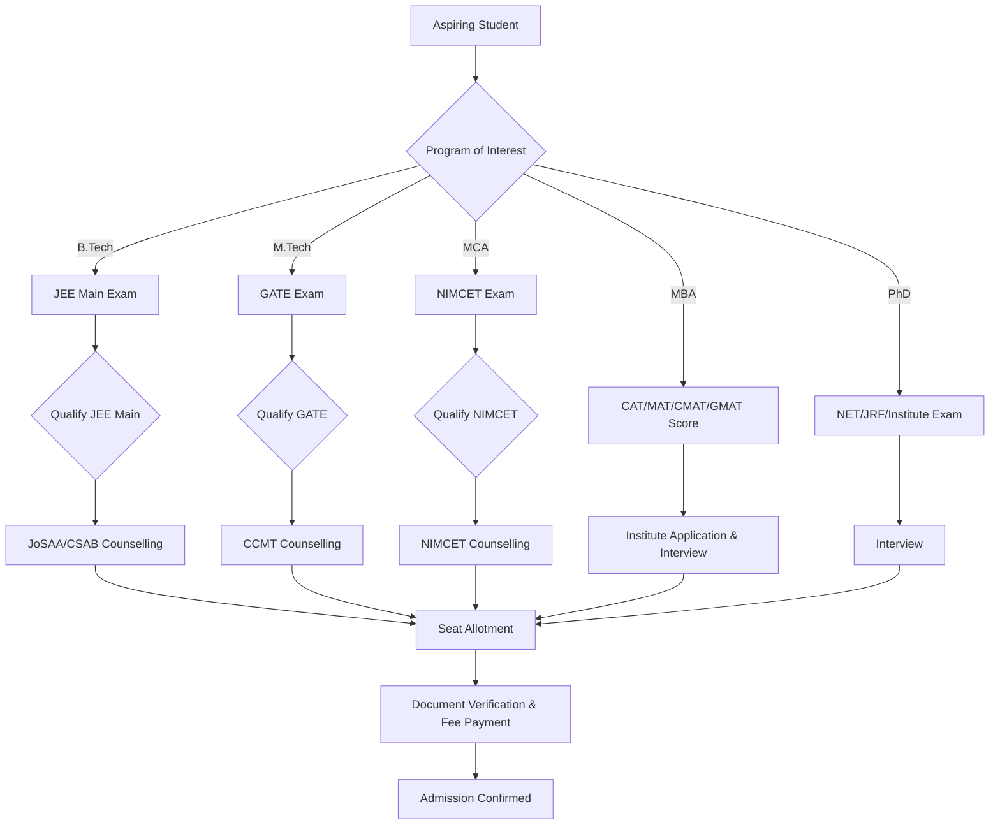

# Frequently Asked Questions about NIT Calicut

## Overview

National Institute of Technology Calicut (NIT Calicut or NITC) is a public technical university located in Kozhikode (Calicut), Kerala, India. It is one of the 31 National Institutes of Technology established by the Government of India and is recognized as an Institute of National Importance under the National Institutes of Technology Act, 2007.

NIT Calicut's primary objective is to provide education and conduct research in engineering, technology, science, and management. It offers undergraduate, postgraduate, and doctoral programs across various disciplines.

## Details

### Academic Programs
NIT Calicut offers a range of academic programs, including:
*   **Undergraduate (B.Tech):** Bachelor of Technology in various engineering disciplines.
*   **Postgraduate (M.Tech, MCA, MBA):** Master of Technology, Master of Computer Applications, and Master of Business Administration.
*   **Doctoral (Ph.D.):** Doctor of Philosophy in engineering, science, and humanities.

Specific departments and specializations are detailed on the institute's official website.

### Admission Process
Admission to NIT Calicut's various programs follows national-level entrance examinations and centralized counselling processes.



### Academic Calendar
The academic year at NIT Calicut is typically divided into two semesters: an Autumn (Odd) Semester and a Spring (Even) Semester. Each semester includes a period of instruction, mid-semester examinations, and end-semester examinations. Specific dates for registration, classes, and examinations are published annually by the academic section.

### Grading System
NIT Calicut employs a credit-based grading system. Students are awarded letter grades (e.g., A+, A, B+, B, etc.) for each course, which correspond to grade points. A Semester Grade Point Average (SGPA) and Cumulative Grade Point Average (CGPA) are calculated based on these grade points and course credits.

### Student Life
NIT Calicut has a vibrant student community with various student-run clubs, technical societies, and cultural organizations. The institute hosts annual technical and cultural festivals, which are major events on the campus calendar. Specific names and details of these events and organizations can be found on the institute's student activity portals.

## History

NIT Calicut was established in 1961 as Calicut Regional Engineering College (CREC), one of the first Regional Engineering Colleges (RECs) in India. It was a joint venture between the Government of India and the Government of Kerala.

In 2002, the institution was upgraded to a National Institute of Technology (NIT) and was granted the status of a Deemed University. Subsequently, in 2007, it was declared an Institute of National Importance under the National Institutes of Technology Act.

## Facilities

### Campus
NIT Calicut is situated on a sprawling campus in Kunnamangalam, approximately 22 kilometers northeast of Kozhikode city. The campus houses academic buildings, administrative blocks, residential facilities, and recreational areas.

### Academic Infrastructure
*   **Department Blocks:** Dedicated buildings for various engineering, science, and humanities departments.
*   **Lecture Hall Complexes:** Modern lecture halls equipped with audio-visual aids.
*   **Laboratories:** Well-equipped laboratories for practical training and research across all disciplines.
*   **Central Library:** A multi-storeyed library building with a vast collection of books, journals, e-resources, and digital facilities.

### Residential Facilities
NIT Calicut provides hostel accommodation for both male and female students. The hostels are equipped with basic amenities, including mess facilities. Specific details regarding hostel capacity and allocation are managed by the Dean (Students' Welfare) office.

### Sports and Recreation
The campus features various sports facilities, including:
*   Outdoor grounds for cricket, football, and athletics.
*   Courts for basketball, volleyball, and tennis.
*   Indoor sports facilities for badminton, table tennis, and other activities.
*   A gymnasium.

### Health Centre
A health centre with medical staff is available on campus to provide primary healthcare services to students and staff.

### Other Facilities
*   **Dining:** Multiple canteens and food outlets are available on campus in addition to hostel messes.
*   **Connectivity:** The campus is equipped with Wi-Fi connectivity for academic and residential areas.
*   **Banking & Postal Services:** ATM facilities and a post office branch are available on campus.

## Procedures

### Student Registration
Upon admission, new students are required to complete a registration process.

```mermaid
graph TD
    A[Admission Offer Accepted] --> B[Initial Fee Payment]
    B --> C[Report to Campus on Specified Date]
    C --> D[Document Verification (Originals & Copies)]
    D --> E[Biometric Registration]
    E --> F[Hostel Allotment & Mess Registration (if applicable)]
    F --> G[Academic Registration (Course Enrollment)]
    G --> H[Student ID Card Issuance]
    H --> I[Orientation Program]
    I --> J[Commence Classes]
```

### Course Registration
Students typically register for courses at the beginning of each semester through an online academic portal. This process usually involves selecting courses in consultation with an academic advisor and adhering to credit limits and prerequisite requirements.

### Leave Policy
Students requiring leave from academic activities must apply through the prescribed procedure, which usually involves obtaining approval from the Head of Department and/or Dean (Academic). Specific rules regarding medical leave, casual leave, and attendance requirements are outlined in the academic regulations.

### Grievance Redressal
NIT Calicut has established mechanisms for addressing student grievances. This typically involves a multi-tier system, including departmental grievance committees, a student grievance redressal committee, and an ombudsman, to ensure fair and timely resolution of issues.

## References

*   National Institute of Technology Calicut Official Website: [https://www.nitc.ac.in/](https://www.nitc.ac.in/)
*   Ministry of Education (MoE), Government of India: [https://www.education.gov.in/](https://www.education.gov.in/)
*   Joint Seat Allocation Authority (JoSAA): [https://josaa.nic.in/](https://josaa.nic.in/)
*   Centralized Counselling for M.Tech./M.Arch./M.Plan. (CCMT): [https://ccmt.nic.in/](https://ccmt.nic.in/)
*   National Institute of Technology Master of Computer Applications Common Entrance Test (NIMCET): [https://nimcet.nic.in/](https://nimcet.nic.in/)

## Related Articles
- [Getting Started at NIT Calicut](getting_started.md)
- [About NIT Calicut](about_nit_calicut.md)
- [Campus Map of NIT Calicut](campus_map.md)
